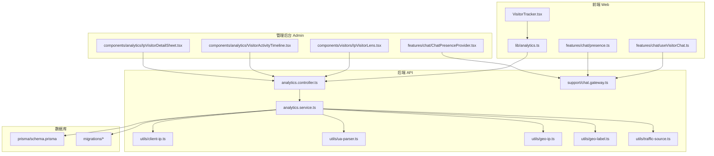
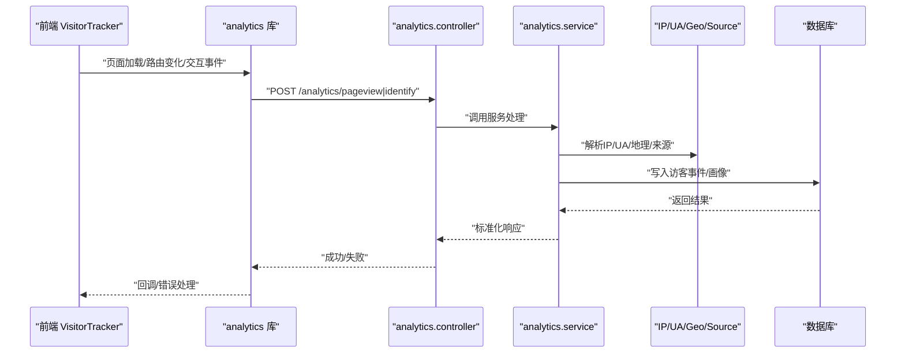
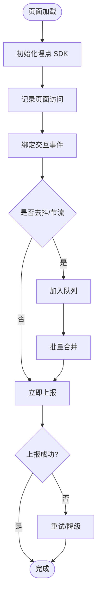
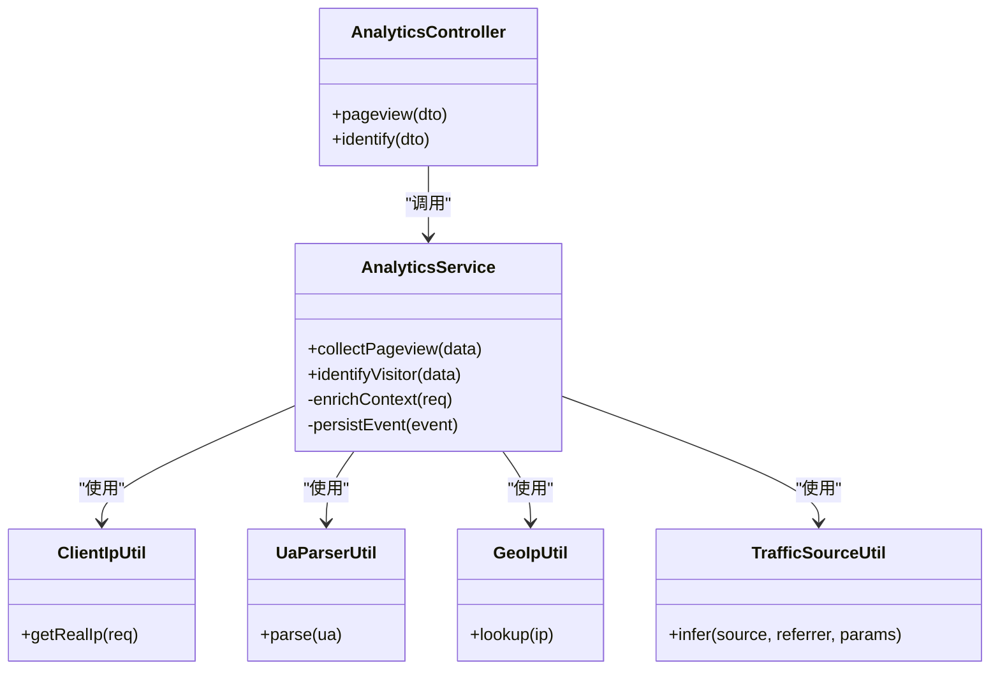
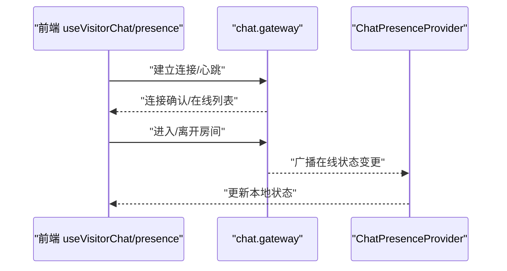
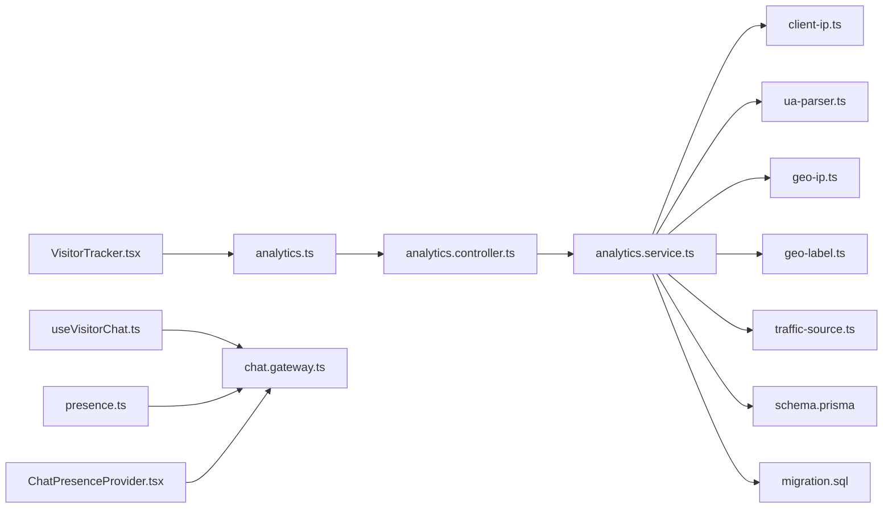

# 访客行为追踪

<cite>
**本文引用的文件**   
- [VisitorTracker.tsx](file://apps/web/src/components/analytics/VisitorTracker.tsx)
- [analytics.ts](file://apps/web/src/lib/analytics.ts)
- [analytics.controller.ts](file://apps/api/src/analytics/analytics.controller.ts)
- [analytics.service.ts](file://apps/api/src/analytics/analytics.service.ts)
- [collect-pageview.dto.ts](file://apps/api/src/analytics/dto/collect-pageview.dto.ts)
- [identify.dto.ts](file://apps/api/src/analytics/dto/identify.dto.ts)
- [client-ip.ts](file://apps/api/src/analytics/utils/client-ip.ts)
- [ua-parser.ts](file://apps/api/src/analytics/utils/ua-parser.ts)
- [geo-ip.ts](file://apps/api/src/analytics/utils/geo-ip.ts)
- [geo-label.ts](file://apps/api/src/analytics/utils/geo-label.ts)
- [traffic-source.ts](file://apps/api/src/analytics/utils/traffic-source.ts)
- [schema.prisma](file://apps/api/prisma/schema.prisma)
- [20260723110621_add_device_details/migration.sql](file://apps/api/prisma/migrations/20260723110621_add_device_details/migration.sql)
- [IpVisitorLens.tsx](file://apps/admin/src/components/visitors/IpVisitorLens.tsx)
- [VisitorActivityTimeline.tsx](file://apps/admin/src/components/analytics/VisitorActivityTimeline.tsx)
- [IpVisitorDetailSheet.tsx](file://apps/admin/src/components/analytics/IpVisitorDetailSheet.tsx)
- [ChatPresenceProvider.tsx](file://apps/admin/src/features/chat/ChatPresenceProvider.tsx)
- [useVisitorChat.ts](file://apps/web/src/features/chat/useVisitorChat.ts)
- [presence.ts](file://apps/web/src/features/chat/presence.ts)
- [chat.gateway.ts](file://apps/api/src/support/chat.gateway.ts)
- [visitor-presence.spec.ts](file://apps/api/src/support/visitor-presence.spec.ts)
</cite>

## 目录
1. [简介](#简介)
2. [项目结构](#项目结构)
3. [核心组件](#核心组件)
4. [架构总览](#架构总览)
5. [详细组件分析](#详细组件分析)
6. [依赖关系分析](#依赖关系分析)
7. [性能考量](#性能考量)
8. [故障排查指南](#故障排查指南)
9. [结论](#结论)
10. [附录](#附录)

## 简介
本文件面向“访客行为追踪系统”的实现与使用，覆盖前端埋点、页面访问记录、用户交互事件捕获、会话管理、IP识别、设备信息收集、浏览器指纹技术、隐私保护、实时访客监控、在线状态管理与访客画像构建。文档同时给出数据脱敏、GDPR合规性与性能优化策略，并提供代码示例路径与配置项说明，帮助读者快速理解并落地该能力。

## 项目结构
本项目采用前后端分离的模块化架构：
- 前端（Next.js）负责埋点采集、事件上报、实时在线状态展示与访客画像可视化。
- 后端（NestJS）提供分析接口、IP定位、UA解析、流量来源推断、数据存储与查询。
- 数据库通过 Prisma 管理实体与迁移，包含访客相关字段扩展。
- 管理后台提供按 IP 维度查看访客活动、时间线与详情面板。

图表来源 
- [VisitorTracker.tsx](file://apps/web/src/components/analytics/VisitorTracker.tsx)
- [analytics.ts](file://apps/web/src/lib/analytics.ts)
- [analytics.controller.ts](file://apps/api/src/analytics/analytics.controller.ts)
- [analytics.service.ts](file://apps/api/src/analytics/analytics.service.ts)
- [client-ip.ts](file://apps/api/src/analytics/utils/client-ip.ts)
- [ua-parser.ts](file://apps/api/src/analytics/utils/ua-parser.ts)
- [geo-ip.ts](file://apps/api/src/analytics/utils/geo-ip.ts)
- [geo-label.ts](file://apps/api/src/analytics/utils/geo-label.ts)
- [traffic-source.ts](file://apps/api/src/analytics/utils/traffic-source.ts)
- [schema.prisma](file://apps/api/prisma/schema.prisma)
- [20260723110621_add_device_details/migration.sql](file://apps/api/prisma/migrations/20260723110621_add_device_details/migration.sql)
- [IpVisitorLens.tsx](file://apps/admin/src/components/visitors/IpVisitorLens.tsx)
- [VisitorActivityTimeline.tsx](file://apps/admin/src/components/analytics/VisitorActivityTimeline.tsx)
- [IpVisitorDetailSheet.tsx](file://apps/admin/src/components/analytics/IpVisitorDetailSheet.tsx)
- [ChatPresenceProvider.tsx](file://apps/admin/src/features/chat/ChatPresenceProvider.tsx)
- [useVisitorChat.ts](file://apps/web/src/features/chat/useVisitorChat.ts)
- [presence.ts](file://apps/web/src/features/chat/presence.ts)
- [chat.gateway.ts](file://apps/api/src/support/chat.gateway.ts)

章节来源
- [VisitorTracker.tsx](file://apps/web/src/components/analytics/VisitorTracker.tsx)
- [analytics.ts](file://apps/web/src/lib/analytics.ts)
- [analytics.controller.ts](file://apps/api/src/analytics/analytics.controller.ts)
- [analytics.service.ts](file://apps/api/src/analytics/analytics.service.ts)
- [schema.prisma](file://apps/api/prisma/schema.prisma)
- [20260723110621_add_device_details/migration.sql](file://apps/api/prisma/migrations/20260723110621_add_device_details/migration.sql)

## 核心组件
- 前端埋点与上报
  - VisitorTracker：页面级埋点入口，负责初始化、路由变化监听、关键交互事件捕获与批量上报。
  - analytics 库：封装请求发送、去抖/节流、重试、错误处理与隐私开关控制。
- 后端分析与存储
  - analytics.controller：接收页面访问与识别事件，参数校验与响应。
  - analytics.service：聚合 IP、UA、地理位置、流量来源等上下文，写入持久化层。
  - utils：client-ip、ua-parser、geo-ip、geo-label、traffic-source 等工具模块。
- 实时在线与聊天存在性
  - chat.gateway：基于 WebSocket 的在线状态广播与会话生命周期管理。
  - useVisitorChat / presence：前端接入在线状态订阅与心跳保活。
- 管理后台可视化
  - IpVisitorLens：按 IP 维度聚合与筛选访客。
  - VisitorActivityTimeline：时间线视图展示访客活动轨迹。
  - IpVisitorDetailSheet：IP 维度的访客详情面板。

章节来源
- [VisitorTracker.tsx](file://apps/web/src/components/analytics/VisitorTracker.tsx)
- [analytics.ts](file://apps/web/src/lib/analytics.ts)
- [analytics.controller.ts](file://apps/api/src/analytics/analytics.controller.ts)
- [analytics.service.ts](file://apps/api/src/analytics/analytics.service.ts)
- [client-ip.ts](file://apps/api/src/analytics/utils/client-ip.ts)
- [ua-parser.ts](file://apps/api/src/analytics/utils/ua-parser.ts)
- [geo-ip.ts](file://apps/api/src/analytics/utils/geo-ip.ts)
- [geo-label.ts](file://apps/api/src/analytics/utils/geo-label.ts)
- [traffic-source.ts](file://apps/api/src/analytics/utils/traffic-source.ts)
- [chat.gateway.ts](file://apps/api/src/support/chat.gateway.ts)
- [useVisitorChat.ts](file://apps/web/src/features/chat/useVisitorChat.ts)
- [presence.ts](file://apps/web/src/features/chat/presence.ts)
- [IpVisitorLens.tsx](file://apps/admin/src/components/visitors/IpVisitorLens.tsx)
- [VisitorActivityTimeline.tsx](file://apps/admin/src/components/analytics/VisitorActivityTimeline.tsx)
- [IpVisitorDetailSheet.tsx](file://apps/admin/src/components/analytics/IpVisitorDetailSheet.tsx)

## 架构总览
整体流程分为“采集—传输—处理—存储—可视化”五步：
- 采集：前端在页面加载与路由切换时触发埋点，捕获点击、滚动、表单输入等交互事件。
- 传输：通过轻量 HTTP 或 WebSocket 上报，支持去抖、批量与离线缓存。
- 处理：后端解析 IP、UA、地理位置、流量来源，生成访客画像标签。
- 存储：持久化到数据库，保留必要字段以满足分析需求。
- 可视化：管理后台提供多维筛选、时间线与详情面板，支撑运营与客服场景。

图表来源 
- [VisitorTracker.tsx](file://apps/web/src/components/analytics/VisitorTracker.tsx)
- [analytics.ts](file://apps/web/src/lib/analytics.ts)
- [analytics.controller.ts](file://apps/api/src/analytics/analytics.controller.ts)
- [analytics.service.ts](file://apps/api/src/analytics/analytics.service.ts)
- [client-ip.ts](file://apps/api/src/analytics/utils/client-ip.ts)
- [ua-parser.ts](file://apps/api/src/analytics/utils/ua-parser.ts)
- [geo-ip.ts](file://apps/api/src/analytics/utils/geo-ip.ts)
- [geo-label.ts](file://apps/api/src/analytics/utils/geo-label.ts)
- [traffic-source.ts](file://apps/api/src/analytics/utils/traffic-source.ts)
- [schema.prisma](file://apps/api/prisma/schema.prisma)

## 详细组件分析

### 前端埋点与页面访问记录
- 页面访问记录
  - 在页面挂载与路由变化时记录页面标题、URL、来源页、时间戳等基础信息。
  - 支持多语言与国际化路由，确保 URL 与标题准确。
- 用户交互事件捕获
  - 捕获点击、滚动、表单输入、下载等行为，进行去抖与采样，避免高频上报。
  - 对敏感字段进行脱敏（如邮箱、手机号），仅上传必要维度。
- 会话管理
  - 使用本地存储维护会话 ID 与首次访问时间，跨路由保持会话连续性。
  - 会话超时自动结束，新访问重新建立会话。

图表来源 
- [VisitorTracker.tsx](file://apps/web/src/components/analytics/VisitorTracker.tsx)
- [analytics.ts](file://apps/web/src/lib/analytics.ts)

章节来源
- [VisitorTracker.tsx](file://apps/web/src/components/analytics/VisitorTracker.tsx)
- [analytics.ts](file://apps/web/src/lib/analytics.ts)

### 后端分析接口与数据处理
- 接口设计
  - pageview：接收页面访问事件，包含 URL、标题、来源、时间戳等。
  - identify：用于识别访客身份（可选），可携带匿名标识或登录态。
- 数据处理
  - client-ip：从请求头获取真实 IP，考虑代理与 CDN 场景。
  - ua-parser：解析 UA 字符串，提取浏览器、操作系统、设备类型。
  - geo-ip：根据 IP 反查地理位置（国家、省份、城市）。
  - traffic-source：结合来源页与渠道参数推断流量来源。
- 数据写入
  - 将事件与画像标签写入数据库，便于后续聚合与分析。

图表来源 
- [analytics.controller.ts](file://apps/api/src/analytics/analytics.controller.ts)
- [analytics.service.ts](file://apps/api/src/analytics/analytics.service.ts)
- [client-ip.ts](file://apps/api/src/analytics/utils/client-ip.ts)
- [ua-parser.ts](file://apps/api/src/analytics/utils/ua-parser.ts)
- [geo-ip.ts](file://apps/api/src/analytics/utils/geo-ip.ts)
- [traffic-source.ts](file://apps/api/src/analytics/utils/traffic-source.ts)

章节来源
- [analytics.controller.ts](file://apps/api/src/analytics/analytics.controller.ts)
- [analytics.service.ts](file://apps/api/src/analytics/analytics.service.ts)
- [client-ip.ts](file://apps/api/src/analytics/utils/client-ip.ts)
- [ua-parser.ts](file://apps/api/src/analytics/utils/ua-parser.ts)
- [geo-ip.ts](file://apps/api/src/analytics/utils/geo-ip.ts)
- [geo-label.ts](file://apps/api/src/analytics/utils/geo-label.ts)
- [traffic-source.ts](file://apps/api/src/analytics/utils/traffic-source.ts)

### 数据模型与迁移
- 访客事件与画像字段
  - 包含 IP、UA、地理位置、设备信息、页面访问、交互事件、时间戳等。
  - 通过迁移脚本扩展设备细节字段，提升画像精度。
- 约束与索引
  - 为常用查询字段建立索引，提高聚合与过滤性能。
  - 对敏感字段进行默认脱敏策略，避免明文存储。

章节来源
- [schema.prisma](file://apps/api/prisma/schema.prisma)
- [20260723110621_add_device_details/migration.sql](file://apps/api/prisma/migrations/20260723110621_add_device_details/migration.sql)

### 实时访客监控与在线状态管理
- WebSocket 通道
  - 使用 chat.gateway 建立实时连接，支持心跳保活与断线重连。
- 前端接入
  - useVisitorChat 与 presence 提供订阅、发布与状态同步能力。
- 管理后台
  - ChatPresenceProvider 聚合在线状态，供仪表盘与客服面板使用。

图表来源 
- [chat.gateway.ts](file://apps/api/src/support/chat.gateway.ts)
- [useVisitorChat.ts](file://apps/web/src/features/chat/useVisitorChat.ts)
- [presence.ts](file://apps/web/src/features/chat/presence.ts)
- [ChatPresenceProvider.tsx](file://apps/admin/src/features/chat/ChatPresenceProvider.tsx)

章节来源
- [chat.gateway.ts](file://apps/api/src/support/chat.gateway.ts)
- [useVisitorChat.ts](file://apps/web/src/features/chat/useVisitorChat.ts)
- [presence.ts](file://apps/web/src/features/chat/presence.ts)
- [ChatPresenceProvider.tsx](file://apps/admin/src/features/chat/ChatPresenceProvider.tsx)

### 管理后台可视化
- IP 维度分析
  - IpVisitorLens 提供按 IP 聚合、筛选与导出功能。
- 时间线视图
  - VisitorActivityTimeline 展示访客活动轨迹，支持按时间范围筛选。
- 详情面板
  - IpVisitorDetailSheet 展示 IP 维度的详细信息与关联事件。

章节来源
- [IpVisitorLens.tsx](file://apps/admin/src/components/visitors/IpVisitorLens.tsx)
- [VisitorActivityTimeline.tsx](file://apps/admin/src/components/analytics/VisitorActivityTimeline.tsx)
- [IpVisitorDetailSheet.tsx](file://apps/admin/src/components/analytics/IpVisitorDetailSheet.tsx)

## 依赖关系分析
- 前端依赖
  - VisitorTracker 依赖 analytics 库进行统一上报与错误处理。
  - 聊天与在线状态依赖 WebSocket 客户端与状态管理。
- 后端依赖
  - analytics.controller 依赖 service 层进行业务处理。
  - service 层依赖多个工具模块进行上下文增强。
- 数据库依赖
  - schema.prisma 定义实体与关系，迁移脚本保证结构演进。

图表来源 
- [VisitorTracker.tsx](file://apps/web/src/components/analytics/VisitorTracker.tsx)
- [analytics.ts](file://apps/web/src/lib/analytics.ts)
- [analytics.controller.ts](file://apps/api/src/analytics/analytics.controller.ts)
- [analytics.service.ts](file://apps/api/src/analytics/analytics.service.ts)
- [client-ip.ts](file://apps/api/src/analytics/utils/client-ip.ts)
- [ua-parser.ts](file://apps/api/src/analytics/utils/ua-parser.ts)
- [geo-ip.ts](file://apps/api/src/analytics/utils/geo-ip.ts)
- [geo-label.ts](file://apps/api/src/analytics/utils/geo-label.ts)
- [traffic-source.ts](file://apps/api/src/analytics/utils/traffic-source.ts)
- [schema.prisma](file://apps/api/prisma/schema.prisma)
- [20260723110621_add_device_details/migration.sql](file://apps/api/prisma/migrations/20260723110621_add_device_details/migration.sql)
- [useVisitorChat.ts](file://apps/web/src/features/chat/useVisitorChat.ts)
- [presence.ts](file://apps/web/src/features/chat/presence.ts)
- [ChatPresenceProvider.tsx](file://apps/admin/src/features/chat/ChatPresenceProvider.tsx)
- [chat.gateway.ts](file://apps/api/src/support/chat.gateway.ts)

章节来源
- [analytics.controller.ts](file://apps/api/src/analytics/analytics.controller.ts)
- [analytics.service.ts](file://apps/api/src/analytics/analytics.service.ts)
- [schema.prisma](file://apps/api/prisma/schema.prisma)

## 性能考量
- 前端优化
  - 去抖与节流：对高频事件进行合并与限流，减少网络请求。
  - 批量上报：将多次事件合并为一次请求，降低带宽占用。
  - 离线缓存：在网络不可用时缓存事件，恢复后补发。
  - 资源懒加载：仅在需要时加载埋点 SDK，缩短首屏时间。
- 后端优化
  - 异步写入：使用消息队列或批处理写入数据库，降低请求延迟。
  - 缓存热点：对地理位置与 UA 解析结果进行短期缓存。
  - 索引优化：为常用查询字段建立复合索引，提升聚合效率。
- 网络与传输
  - 压缩与分页：对大体积数据进行压缩与分页传输。
  - 重试与退避：实现指数退避与最大重试次数，保障稳定性。

[本节为通用指导，不直接分析具体文件]

## 故障排查指南
- 常见问题
  - 埋点未上报：检查隐私开关、网络权限与 CORS 配置。
  - IP 识别不准：确认代理与 CDN 头部设置，核对 client-ip 逻辑。
  - 地理位置缺失：检查 geo-ip 服务可用性与配额限制。
  - 在线状态不同步：检查 WebSocket 连接与心跳间隔。
- 调试建议
  - 前端控制台输出关键事件与请求日志。
  - 后端启用分析接口访问日志与错误堆栈。
  - 数据库慢查询分析，优化热点查询。

章节来源
- [analytics.controller.ts](file://apps/api/src/analytics/analytics.controller.ts)
- [analytics.service.ts](file://apps/api/src/analytics/analytics.service.ts)
- [client-ip.ts](file://apps/api/src/analytics/utils/client-ip.ts)
- [geo-ip.ts](file://apps/api/src/analytics/utils/geo-ip.ts)
- [chat.gateway.ts](file://apps/api/src/support/chat.gateway.ts)

## 结论
本访客行为追踪系统通过前端埋点与后端分析相结合，实现了页面访问记录、交互事件捕获、会话管理与实时在线监控。借助 IP 识别、UA 解析、地理位置与流量来源推断，构建了完整的访客画像。系统在隐私保护、数据脱敏与 GDPR 合规方面提供了基础能力，并通过性能优化策略保障高并发下的稳定运行。管理后台的多维可视化进一步提升了运营与客服效率。

[本节为总结性内容，不直接分析具体文件]

## 附录
- 配置选项说明
  - 前端埋点开关：控制是否启用埋点与事件采集。
  - 上报频率与批量大小：调整去抖阈值与批量上限。
  - 隐私模式：开启后禁用敏感字段与第三方集成。
  - 后端环境变量：IP 解析服务、地理位置库与数据库连接。
- 代码示例路径
  - 页面访问记录：参考 [analytics.controller.ts](file://apps/api/src/analytics/analytics.controller.ts) 与 [analytics.service.ts](file://apps/api/src/analytics/analytics.service.ts)。
  - 访客识别：参考 [identify.dto.ts](file://apps/api/src/analytics/dto/identify.dto.ts)。
  - IP 识别：参考 [client-ip.ts](file://apps/api/src/analytics/utils/client-ip.ts)。
  - UA 解析：参考 [ua-parser.ts](file://apps/api/src/analytics/utils/ua-parser.ts)。
  - 地理位置：参考 [geo-ip.ts](file://apps/api/src/analytics/utils/geo-ip.ts) 与 [geo-label.ts](file://apps/api/src/analytics/utils/geo-label.ts)。
  - 流量来源：参考 [traffic-source.ts](file://apps/api/src/analytics/utils/traffic-source.ts)。
  - 实时在线：参考 [chat.gateway.ts](file://apps/api/src/support/chat.gateway.ts)、[useVisitorChat.ts](file://apps/web/src/features/chat/useVisitorChat.ts) 与 [presence.ts](file://apps/web/src/features/chat/presence.ts)。
  - 管理后台：参考 [IpVisitorLens.tsx](file://apps/admin/src/components/visitors/IpVisitorLens.tsx)、[VisitorActivityTimeline.tsx](file://apps/admin/src/components/analytics/VisitorActivityTimeline.tsx) 与 [IpVisitorDetailSheet.tsx](file://apps/admin/src/components/analytics/IpVisitorDetailSheet.tsx)。

章节来源
- [collect-pageview.dto.ts](file://apps/api/src/analytics/dto/collect-pageview.dto.ts)
- [identify.dto.ts](file://apps/api/src/analytics/dto/identify.dto.ts)
- [client-ip.ts](file://apps/api/src/analytics/utils/client-ip.ts)
- [ua-parser.ts](file://apps/api/src/analytics/utils/ua-parser.ts)
- [geo-ip.ts](file://apps/api/src/analytics/utils/geo-ip.ts)
- [geo-label.ts](file://apps/api/src/analytics/utils/geo-label.ts)
- [traffic-source.ts](file://apps/api/src/analytics/utils/traffic-source.ts)
- [chat.gateway.ts](file://apps/api/src/support/chat.gateway.ts)
- [useVisitorChat.ts](file://apps/web/src/features/chat/useVisitorChat.ts)
- [presence.ts](file://apps/web/src/features/chat/presence.ts)
- [IpVisitorLens.tsx](file://apps/admin/src/components/visitors/IpVisitorLens.tsx)
- [VisitorActivityTimeline.tsx](file://apps/admin/src/components/analytics/VisitorActivityTimeline.tsx)
- [IpVisitorDetailSheet.tsx](file://apps/admin/src/components/analytics/IpVisitorDetailSheet.tsx)