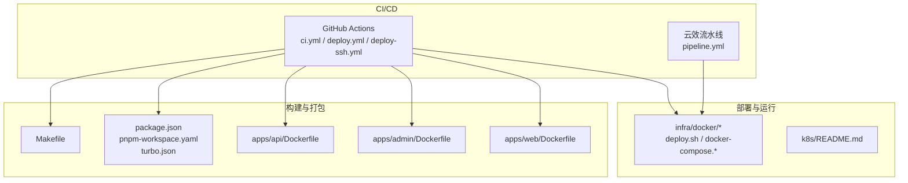
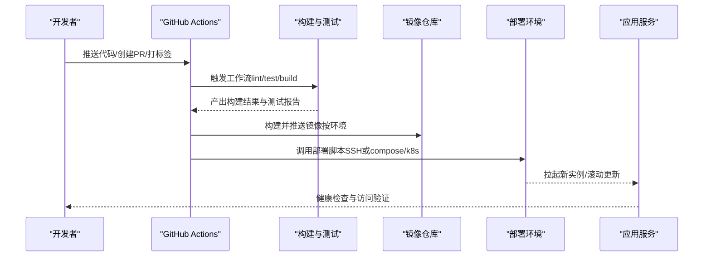

# CI/CD流水线

<cite>
**本文引用的文件**   
- [.github/workflows/ci.yml](file://.github/workflows/ci.yml)
- [.github/workflows/deploy-ssh.yml](file://.github/workflows/deploy-ssh.yml)
- [.github/workflows/deploy.yml](file://.github/workflows/deploy.yml)
- [Makefile](file://Makefile)
- [package.json](file://package.json)
- [pnpm-workspace.yaml](file://pnpm-workspace.yaml)
- [turbo.json](file://turbo.json)
- [apps/api/Dockerfile](file://apps/api/Dockerfile)
- [apps/admin/Dockerfile](file://apps/admin/Dockerfile)
- [apps/web/Dockerfile](file://apps/web/Dockerfile)
- [infra/docker/deploy.sh](file://infra/docker/deploy.sh)
- [infra/docker/deploy-local.sh](file://infra/docker/deploy-local.sh)
- [infra/docker/docker-compose.dev.yml](file://infra/docker/docker-compose.dev.yml)
- [infra/docker/docker-compose.prod.yml](file://infra/docker/docker-compose.prod.yml)
- [infra/yunxiao/pipeline.yml](file://infra/yunxiao/pipeline.yml)
</cite>

## 目录
1. [简介](#简介)
2. [项目结构](#项目结构)
3. [核心组件](#核心组件)
4. [架构总览](#架构总览)
5. [详细组件分析](#详细组件分析)
6. [依赖关系分析](#依赖关系分析)
7. [性能考虑](#性能考虑)
8. [故障排查指南](#故障排查指南)
9. [结论](#结论)
10. [附录](#附录)

## 简介
本文件面向CI/CD流水线的整体设计与落地实践，覆盖GitHub Actions工作流配置、代码检查、单元测试、构建与测试、多环境部署策略（开发、测试、生产）、分支管理策略、Makefile命令封装、构建脚本优化与依赖管理、回滚机制、蓝绿部署与金丝雀发布策略，以及流水线监控、失败告警与性能优化的最佳实践。文档以仓库中的实际配置文件为依据，并结合通用工程实践给出可操作建议。

## 项目结构
本项目采用多应用（apps）+ 共享包（packages）的Monorepo组织方式，使用pnpm workspace与Turbo进行任务编排与缓存加速。CI/CD相关的关键位置如下：
- GitHub Actions工作流：.github/workflows/
- 构建与运行脚本：Makefile、各应用的Dockerfile、infra/docker下的部署脚本
- 依赖与工作区配置：package.json、pnpm-workspace.yaml、turbo.json
- 云效流水线（可选）：infra/yunxiao/pipeline.yml

图表来源
- [.github/workflows/ci.yml](file://.github/workflows/ci.yml)
- [.github/workflows/deploy.yml](file://.github/workflows/deploy.yml)
- [.github/workflows/deploy-ssh.yml](file://.github/workflows/deploy-ssh.yml)
- [Makefile](file://Makefile)
- [package.json](file://package.json)
- [pnpm-workspace.yaml](file://pnpm-workspace.yaml)
- [turbo.json](file://turbo.json)
- [apps/api/Dockerfile](file://apps/api/Dockerfile)
- [apps/admin/Dockerfile](file://apps/admin/Dockerfile)
- [apps/web/Dockerfile](file://apps/web/Dockerfile)
- [infra/docker/deploy.sh](file://infra/docker/deploy.sh)
- [infra/docker/docker-compose.dev.yml](file://infra/docker/docker-compose.dev.yml)
- [infra/docker/docker-compose.prod.yml](file://infra/docker/docker-compose.prod.yml)
- [infra/yunxiao/pipeline.yml](file://infra/yunxiao/pipeline.yml)

章节来源
- [.github/workflows/ci.yml](file://.github/workflows/ci.yml)
- [.github/workflows/deploy.yml](file://.github/workflows/deploy.yml)
- [.github/workflows/deploy-ssh.yml](file://.github/workflows/deploy-ssh.yml)
- [Makefile](file://Makefile)
- [package.json](file://package.json)
- [pnpm-workspace.yaml](file://pnpm-workspace.yaml)
- [turbo.json](file://turbo.json)
- [apps/api/Dockerfile](file://apps/api/Dockerfile)
- [apps/admin/Dockerfile](file://apps/admin/Dockerfile)
- [apps/web/Dockerfile](file://apps/web/Dockerfile)
- [infra/docker/deploy.sh](file://infra/docker/deploy.sh)
- [infra/docker/docker-compose.dev.yml](file://infra/docker/docker-compose.dev.yml)
- [infra/docker/docker-compose.prod.yml](file://infra/docker/docker-compose.prod.yml)
- [infra/yunxiao/pipeline.yml](file://infra/yunxiao/pipeline.yml)

## 核心组件
- GitHub Actions工作流
  - ci.yml：触发条件、代码检查、单元测试、构建产物生成、缓存与并行化
  - deploy.yml：基于分支/标签的环境部署（开发/测试/生产），镜像构建与推送、环境变量注入
  - deploy-ssh.yml：通过SSH直连目标主机执行部署脚本（适用于无容器或混合环境）
- Makefile：统一入口命令，封装pnpm/turbo/构建/测试/清理等常用操作
- Dockerfile：为api、admin、web三个应用分别定义构建阶段、依赖安装、静态资源编译与运行时镜像
- 部署脚本：deploy.sh与docker-compose.*用于编排服务启动、网络与数据卷挂载、证书与反向代理配置
- 依赖与工作区：pnpm-workspace.yaml与turbo.json实现跨包依赖解析与任务图调度；package.json集中声明脚本与依赖

章节来源
- [.github/workflows/ci.yml](file://.github/workflows/ci.yml)
- [.github/workflows/deploy.yml](file://.github/workflows/deploy.yml)
- [.github/workflows/deploy-ssh.yml](file://.github/workflows/deploy-ssh.yml)
- [Makefile](file://Makefile)
- [apps/api/Dockerfile](file://apps/api/Dockerfile)
- [apps/admin/Dockerfile](file://apps/admin/Dockerfile)
- [apps/web/Dockerfile](file://apps/web/Dockerfile)
- [infra/docker/deploy.sh](file://infra/docker/deploy.sh)
- [infra/docker/docker-compose.dev.yml](file://infra/docker/docker-compose.dev.yml)
- [infra/docker/docker-compose.prod.yml](file://infra/docker/docker-compose.prod.yml)
- [package.json](file://package.json)
- [pnpm-workspace.yaml](file://pnpm-workspace.yaml)
- [turbo.json](file://turbo.json)

## 架构总览
下图展示从代码提交到部署上线的整体流程，包括CI检查、构建、测试、镜像打包、推送与多环境部署。

图表来源
- [.github/workflows/ci.yml](file://.github/workflows/ci.yml)
- [.github/workflows/deploy.yml](file://.github/workflows/deploy.yml)
- [.github/workflows/deploy-ssh.yml](file://.github/workflows/deploy-ssh.yml)
- [infra/docker/deploy.sh](file://infra/docker/deploy.sh)

## 详细组件分析

### GitHub Actions工作流（ci.yml）
- 触发条件：支持push、pull_request、workflow_dispatch等事件
- 步骤概览：
  - 设置Node.js与pnpm环境
  - 恢复缓存（node_modules、turbo缓存）
  - 安装依赖（workspace-aware）
  - 代码检查（lint/format）
  - 单元测试（并行执行）
  - 构建产物（按应用构建，输出至dist或构建目录）
  - 上传构建产物（便于后续部署或归档）
- 优化点：
  - 使用actions/cache或pnpm缓存提升速度
  - 使用turbo并行执行任务，减少重复计算
  - 分阶段构建，避免在CI中执行耗时过长的任务

章节来源
- [.github/workflows/ci.yml](file://.github/workflows/ci.yml)
- [turbo.json](file://turbo.json)
- [pnpm-workspace.yaml](file://pnpm-workspace.yaml)

### GitHub Actions工作流（deploy.yml）
- 触发条件：基于分支（如main、develop）或标签（v*）触发不同环境部署
- 步骤概览：
  - 选择环境与变量（DEV/TEST/PROD）
  - 构建镜像（多阶段构建，最小化运行时镜像）
  - 推送镜像到仓库（按环境命名规范）
  - 拉取镜像并部署（compose或SSH远程执行）
  - 健康检查与回滚策略（失败自动回滚）
- 安全与权限：
  - 使用GitHub Secrets管理密钥（数据库连接、镜像仓库凭据、SSH私钥等）
  - 限制部署权限（仅特定分支/角色可触发）

章节来源
- [.github/workflows/deploy.yml](file://.github/workflows/deploy.yml)
- [apps/api/Dockerfile](file://apps/api/Dockerfile)
- [apps/admin/Dockerfile](file://apps/admin/Dockerfile)
- [apps/web/Dockerfile](file://apps/web/Dockerfile)

### GitHub Actions工作流（deploy-ssh.yml）
- 适用场景：无容器或混合环境，直接通过SSH登录目标服务器执行部署脚本
- 步骤概览：
  - 配置SSH密钥与主机白名单
  - 将部署脚本与必要参数下发到目标主机
  - 执行部署脚本（拉取最新代码、构建、迁移、重启服务）
  - 健康检查与回滚（根据返回码决定继续或回滚）

章节来源
- [.github/workflows/deploy-ssh.yml](file://.github/workflows/deploy-ssh.yml)
- [infra/docker/deploy.sh](file://infra/docker/deploy.sh)

### Makefile命令封装
- 常见命令：
  - make install：安装依赖（pnpm install）
  - make lint：代码检查（biome/eslint等）
  - make test：运行单元测试（并行）
  - make build：构建所有应用（turbo run build）
  - make dev：本地开发（turbo dev）
  - make clean：清理构建产物与缓存
- 优势：
  - 统一入口，降低学习成本
  - 屏蔽平台差异（Windows/macOS/Linux）
  - 便于在CI中复用相同命令

章节来源
- [Makefile](file://Makefile)
- [package.json](file://package.json)
- [turbo.json](file://turbo.json)

### Dockerfile与镜像构建
- apps/api/Dockerfile：
  - 构建阶段：安装依赖、编译TypeScript、生成Prisma客户端
  - 运行阶段：仅包含运行时依赖，暴露端口，设置环境变量
- apps/admin/Dockerfile：
  - Next.js服务端渲染构建，静态资源预渲染
- apps/web/Dockerfile：
  - 面向公网的前端站点，启用CDN与缓存策略
- 优化建议：
  - 多阶段构建减小镜像体积
  - 分层缓存（依赖层与应用层分离）
  - 使用.dockerignore排除无关文件

章节来源
- [apps/api/Dockerfile](file://apps/api/Dockerfile)
- [apps/admin/Dockerfile](file://apps/admin/Dockerfile)
- [apps/web/Dockerfile](file://apps/web/Dockerfile)

### 部署脚本与编排（deploy.sh与docker-compose）
- deploy.sh：
  - 接收参数（环境、版本、是否回滚）
  - 拉取镜像、执行数据库迁移、重启服务
  - 健康检查与日志收集
- docker-compose.*：
  - dev：本地开发环境（热重载、调试端口）
  - prod：生产环境（只读卷、限流、日志轮转）
- 多环境策略：
  - 通过环境变量区分配置（DB_URL、REDIS_URL、JWT_SECRET等）
  - 使用.env文件与Secrets管理敏感信息

章节来源
- [infra/docker/deploy.sh](file://infra/docker/deploy.sh)
- [infra/docker/docker-compose.dev.yml](file://infra/docker/docker-compose.dev.yml)
- [infra/docker/docker-compose.prod.yml](file://infra/docker/docker-compose.prod.yml)

### 云效流水线（pipeline.yml）
- 作用：作为企业级CI/CD补充，支持私有仓库、内部制品库与审批流
- 典型步骤：代码扫描、单元测试、构建镜像、发布到内网仓库、灰度发布与回滚

章节来源
- [infra/yunxiao/pipeline.yml](file://infra/yunxiao/pipeline.yml)

## 依赖关系分析
- Monorepo依赖：
  - pnpm-workspace.yaml定义包间依赖关系
  - turbo.json定义任务图与缓存策略
- 外部依赖：
  - Node.js、pnpm、Docker、PostgreSQL、Redis、MinIO/OSS等
- 部署依赖：
  - SSH密钥、镜像仓库凭据、域名与证书、负载均衡器配置

图表来源
- [pnpm-workspace.yaml](file://pnpm-workspace.yaml)
- [turbo.json](file://turbo.json)
- [Makefile](file://Makefile)
- [.github/workflows/ci.yml](file://.github/workflows/ci.yml)
- [.github/workflows/deploy.yml](file://.github/workflows/deploy.yml)
- [apps/api/Dockerfile](file://apps/api/Dockerfile)
- [apps/admin/Dockerfile](file://apps/admin/Dockerfile)
- [apps/web/Dockerfile](file://apps/web/Dockerfile)
- [infra/docker/deploy.sh](file://infra/docker/deploy.sh)
- [infra/docker/docker-compose.dev.yml](file://infra/docker/docker-compose.dev.yml)
- [infra/docker/docker-compose.prod.yml](file://infra/docker/docker-compose.prod.yml)

章节来源
- [pnpm-workspace.yaml](file://pnpm-workspace.yaml)
- [turbo.json](file://turbo.json)
- [Makefile](file://Makefile)
- [.github/workflows/ci.yml](file://.github/workflows/ci.yml)
- [.github/workflows/deploy.yml](file://.github/workflows/deploy.yml)
- [apps/api/Dockerfile](file://apps/api/Dockerfile)
- [apps/admin/Dockerfile](file://apps/admin/Dockerfile)
- [apps/web/Dockerfile](file://apps/web/Dockerfile)
- [infra/docker/deploy.sh](file://infra/docker/deploy.sh)
- [infra/docker/docker-compose.dev.yml](file://infra/docker/docker-compose.dev.yml)
- [infra/docker/docker-compose.prod.yml](file://infra/docker/docker-compose.prod.yml)

## 性能考虑
- 构建加速：
  - 使用pnpm与turbo缓存，避免重复安装与编译
  - 并行执行lint与test，缩短流水线时间
- 镜像优化：
  - 多阶段构建，仅保留运行时依赖
  - 使用.dockerignore排除测试与文档
- 部署优化：
  - 滚动更新与蓝绿部署结合，减少停机时间
  - 健康检查与快速失败，避免无效部署

[本节为通用指导，不直接分析具体文件]

## 故障排查指南
- 常见问题：
  - 依赖安装失败：检查网络镜像源与pnpm缓存
  - 构建失败：确认Node版本与依赖兼容性
  - 部署失败：核对环境变量与权限（SSH/镜像仓库）
- 定位方法：
  - 查看GitHub Actions日志与Artifacts
  - 使用docker logs与kubectl describe获取运行时信息
  - 通过健康检查接口验证服务状态
- 回滚策略：
  - 自动回滚：部署脚本检测健康检查失败时回退到上一版本
  - 手动回滚：通过Makefile或CLI快速切换镜像标签

章节来源
- [.github/workflows/ci.yml](file://.github/workflows/ci.yml)
- [.github/workflows/deploy.yml](file://.github/workflows/deploy.yml)
- [.github/workflows/deploy-ssh.yml](file://.github/workflows/deploy-ssh.yml)
- [infra/docker/deploy.sh](file://infra/docker/deploy.sh)

## 结论
本项目的CI/CD流水线以GitHub Actions为核心，结合Makefile与Docker实现标准化构建与部署。通过多环境策略、分支管理与回滚机制，保障交付质量与稳定性。建议持续优化缓存与并行化，完善监控与告警，逐步引入蓝绿与金丝雀发布，进一步提升发布效率与风险控制能力。

[本节为总结性内容，不直接分析具体文件]

## 附录
- 分支管理策略建议：
  - main：生产稳定分支，仅接受合并请求
  - develop：集成分支，日常开发合并
  - feature/*：功能分支，独立开发与测试
  - hotfix/*：紧急修复分支，快速发布
- 多环境部署策略：
  - 开发：本地docker-compose或minikube
  - 测试：自动化测试通过后自动部署
  - 生产：灰度发布与人工审批结合
- 监控与告警：
  - 使用Prometheus/Grafana监控指标
  - 配置钉钉/邮件/Slack告警通知
  - 记录关键指标（构建时长、成功率、部署耗时）

[本节为概念性内容，不直接分析具体文件]