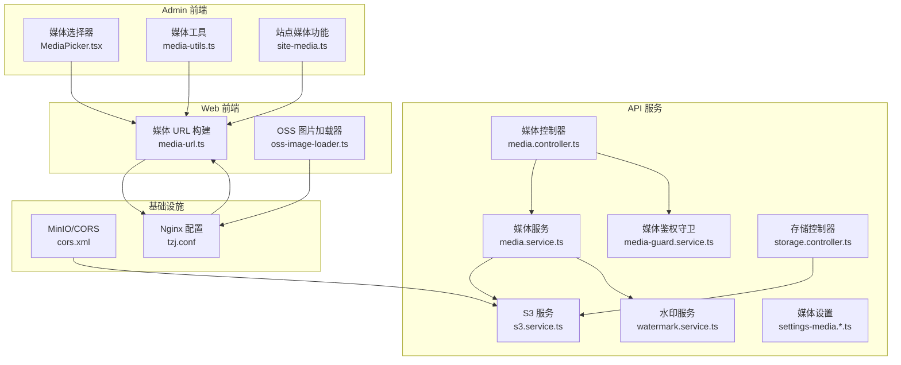
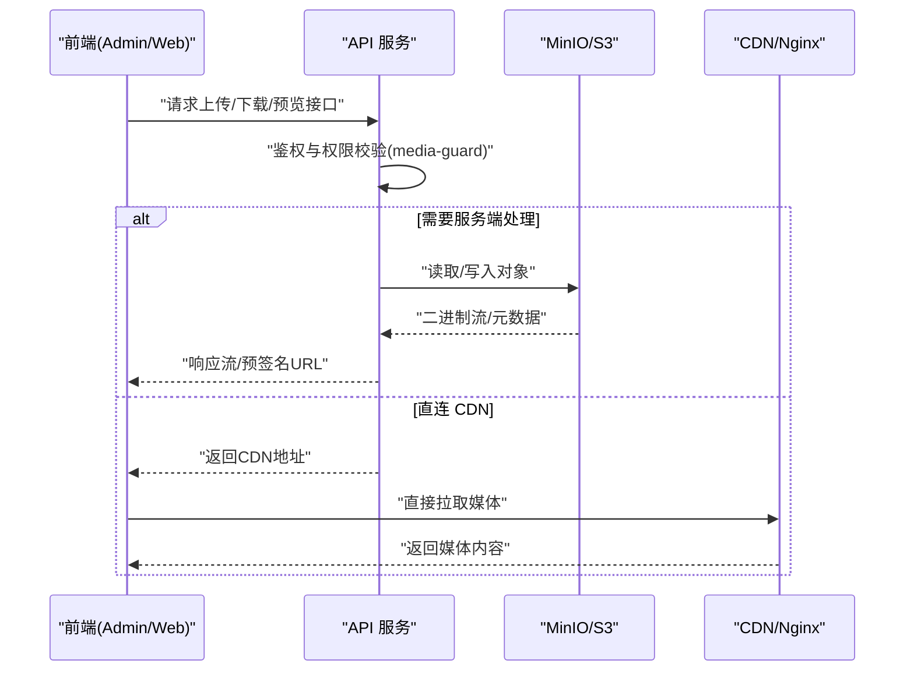
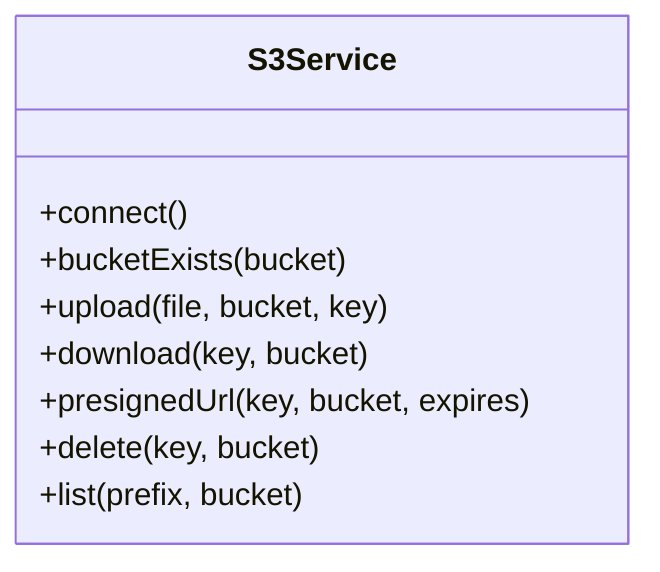
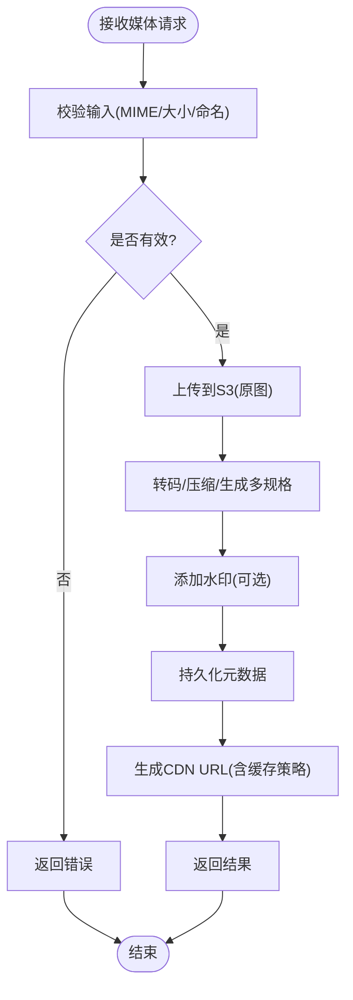
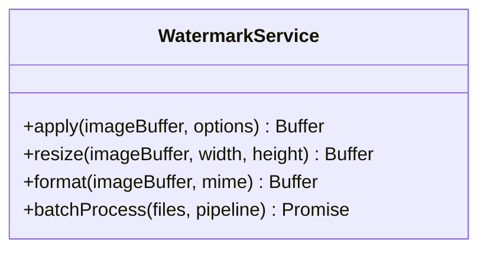
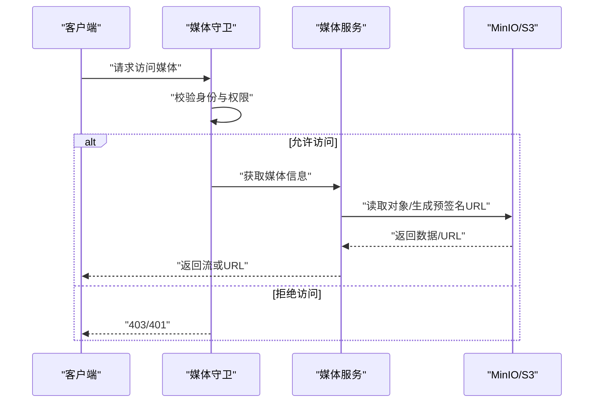
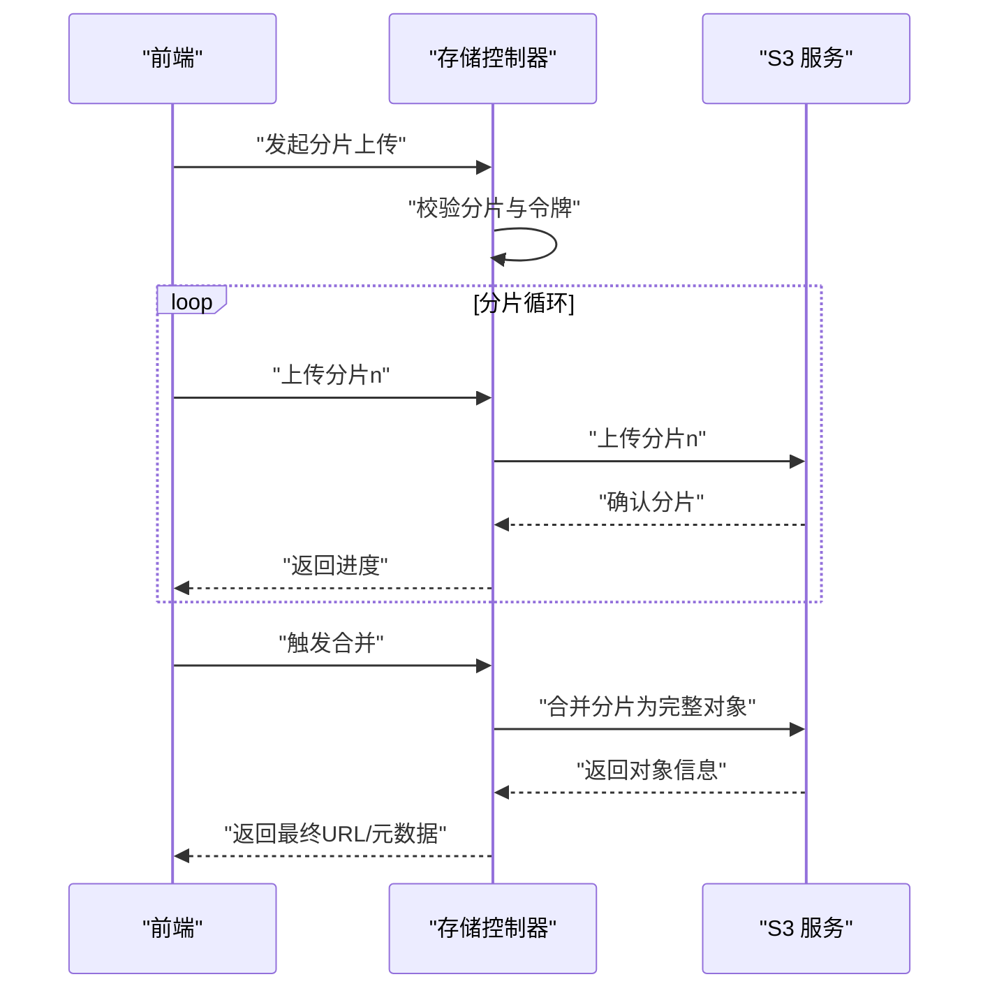
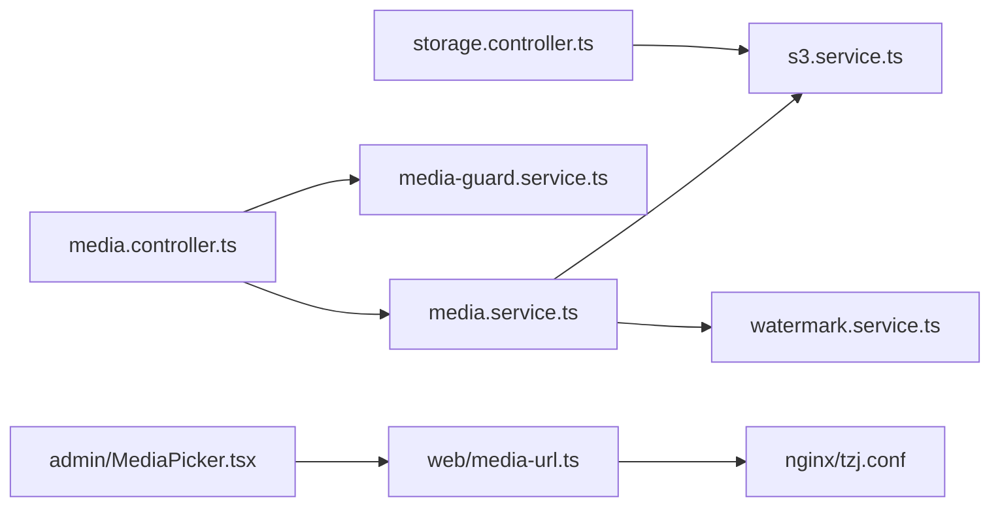

# 存储与媒体管理

<cite>
**本文引用的文件**   
- [apps/api/src/storage/s3.service.ts](file://apps/api/src/storage/s3.service.ts)
- [apps/api/src/storage/storage.controller.ts](file://apps/api/src/storage/storage.controller.ts)
- [apps/api/src/storage/storage.module.ts](file://apps/api/src/storage/storage.module.ts)
- [apps/api/src/media/media.controller.ts](file://apps/api/src/media/media.controller.ts)
- [apps/api/src/media/media.service.ts](file://apps/api/src/media/media.service.ts)
- [apps/api/src/media/watermark.service.ts](file://apps/api/src/media/watermark.service.ts)
- [apps/api/src/media/media-guard.service.ts](file://apps/api/src/media/media-guard.service.ts)
- [apps/api/src/media/site-static-paths.ts](file://apps/api/src/media/site-static-paths.ts)
- [apps/api/src/settings/settings-media.defaults.ts](file://apps/api/src/settings/settings-media.defaults.ts)
- [apps/api/src/settings/settings-media.schema.ts](file://apps/api/src/settings/settings-media.schema.ts)
- [apps/api/scripts/restore-media-to-minio.mjs](file://apps/api/scripts/restore-media-to-minio.mjs)
- [infra/docker/minio/cors.xml](file://infra/docker/minio/cors.xml)
- [infra/docker/nginx/tzj.conf](file://infra/docker/nginx/tzj.conf)
- [apps/web/src/lib/media-url.ts](file://apps/web/src/lib/media-url.ts)
- [apps/web/src/lib/oss-image-loader.ts](file://apps/web/src/lib/oss-image-loader.ts)
- [apps/admin/src/features/site-media.ts](file://apps/admin/src/features/site-media.ts)
- [apps/admin/src/components/crud/MediaPicker.tsx](file://apps/admin/src/components/crud/MediaPicker.tsx)
- [apps/admin/src/components/media/media-utils.ts](file://apps/admin/src/components/media/media-utils.ts)
</cite>

## 目录
1. [简介](#简介)
2. [项目结构](#项目结构)
3. [核心组件](#核心组件)
4. [架构总览](#架构总览)
5. [详细组件分析](#详细组件分析)
6. [依赖关系分析](#依赖关系分析)
7. [性能考虑](#性能考虑)
8. [故障排查指南](#故障排查指南)
9. [结论](#结论)
10. [附录](#附录)

## 简介
本文件围绕对象存储服务（MinIO/S3）配置、文件上传下载与权限控制，以及媒体文件的处理流程（图片压缩、格式转换、水印添加）、CDN 集成与缓存策略、静态资源优化、文件生命周期管理、存储空间监控与成本优化，以及大文件分片上传、断点续传和错误重试机制进行系统化说明。文档面向不同技术背景的读者，提供从概览到代码级实现的渐进式解读，并给出可操作的实践建议与排错指引。

## 项目结构
本项目采用多应用（admin、api、web）+ 基础设施（docker、nginx、minio）的模块化组织方式。与存储与媒体相关的核心位置如下：
- API 层：storage（S3 客户端封装）、media（媒体控制器与服务）、settings（媒体设置默认值与校验）。
- Web 前端：媒体 URL 构建与图片加载器（适配 OSS/CDN）。
- Admin 前端：媒体选择器与工具函数。
- 基础设施：MinIO CORS 配置、Nginx 反向代理与静态路径转发。

图表来源
- [apps/api/src/storage/s3.service.ts](file://apps/api/src/storage/s3.service.ts)
- [apps/api/src/media/media.controller.ts](file://apps/api/src/media/media.controller.ts)
- [apps/api/src/media/media.service.ts](file://apps/api/src/media/media.service.ts)
- [apps/api/src/media/watermark.service.ts](file://apps/api/src/media/watermark.service.ts)
- [apps/api/src/media/media-guard.service.ts](file://apps/api/src/media/media-guard.service.ts)
- [apps/api/src/storage/storage.controller.ts](file://apps/api/src/storage/storage.controller.ts)
- [apps/api/src/settings/settings-media.defaults.ts](file://apps/api/src/settings/settings-media.defaults.ts)
- [apps/api/src/settings/settings-media.schema.ts](file://apps/api/src/settings/settings-media.schema.ts)
- [apps/web/src/lib/media-url.ts](file://apps/web/src/lib/media-url.ts)
- [apps/web/src/lib/oss-image-loader.ts](file://apps/web/src/lib/oss-image-loader.ts)
- [apps/admin/src/components/crud/MediaPicker.tsx](file://apps/admin/src/components/crud/MediaPicker.tsx)
- [apps/admin/src/components/media/media-utils.ts](file://apps/admin/src/components/media/media-utils.ts)
- [apps/admin/src/features/site-media.ts](file://apps/admin/src/features/site-media.ts)
- [infra/docker/minio/cors.xml](file://infra/docker/minio/cors.xml)
- [infra/docker/nginx/tzj.conf](file://infra/docker/nginx/tzj.conf)

章节来源
- [apps/api/src/storage/s3.service.ts](file://apps/api/src/storage/s3.service.ts)
- [apps/api/src/media/media.controller.ts](file://apps/api/src/media/media.controller.ts)
- [apps/api/src/media/media.service.ts](file://apps/api/src/media/media.service.ts)
- [apps/api/src/media/watermark.service.ts](file://apps/api/src/media/watermark.service.ts)
- [apps/api/src/media/media-guard.service.ts](file://apps/api/src/media/media-guard.service.ts)
- [apps/api/src/storage/storage.controller.ts](file://apps/api/src/storage/storage.controller.ts)
- [apps/api/src/settings/settings-media.defaults.ts](file://apps/api/src/settings/settings-media.defaults.ts)
- [apps/api/src/settings/settings-media.schema.ts](file://apps/api/src/settings/settings-media.schema.ts)
- [apps/web/src/lib/media-url.ts](file://apps/web/src/lib/media-url.ts)
- [apps/web/src/lib/oss-image-loader.ts](file://apps/web/src/lib/oss-image-loader.ts)
- [apps/admin/src/components/crud/MediaPicker.tsx](file://apps/admin/src/components/crud/MediaPicker.tsx)
- [apps/admin/src/components/media/media-utils.ts](file://apps/admin/src/components/media/media-utils.ts)
- [apps/admin/src/features/site-media.ts](file://apps/admin/src/features/site-media.ts)
- [infra/docker/minio/cors.xml](file://infra/docker/minio/cors.xml)
- [infra/docker/nginx/tzj.conf](file://infra/docker/nginx/tzj.conf)

## 核心组件
- S3 服务：封装 MinIO/S3 客户端连接、桶操作、对象读写、预签名 URL 生成等能力，为上层媒体与存储模块提供统一抽象。
- 媒体服务：负责媒体文件的元数据管理、转码/压缩/水印等处理编排、访问控制与 CDN 链接生成。
- 水印服务：实现图片水印合成、尺寸调整、格式转换等图像处理逻辑。
- 媒体守卫：对媒体访问请求进行鉴权与权限校验，确保仅授权用户或角色可访问敏感资源。
- 存储控制器：暴露上传、下载、列表、删除等 REST 接口，供前端调用。
- 媒体控制器：暴露媒体相关接口（如预览、转码、水印、安全访问等）。
- 媒体设置：集中管理媒体相关默认值与校验规则（如允许的 MIME、大小限制、CDN 域名、压缩参数等）。
- Web 媒体 URL 与图片加载器：根据环境动态构建媒体访问 URL，适配 OSS/CDN 的图片处理参数。
- Admin 媒体工具：提供媒体选择、预览、URL 处理等前端能力。

章节来源
- [apps/api/src/storage/s3.service.ts](file://apps/api/src/storage/s3.service.ts)
- [apps/api/src/media/media.service.ts](file://apps/api/src/media/media.service.ts)
- [apps/api/src/media/watermark.service.ts](file://apps/api/src/media/watermark.service.ts)
- [apps/api/src/media/media-guard.service.ts](file://apps/api/src/media/media-guard.service.ts)
- [apps/api/src/storage/storage.controller.ts](file://apps/api/src/storage/storage.controller.ts)
- [apps/api/src/media/media.controller.ts](file://apps/api/src/media/media.controller.ts)
- [apps/api/src/settings/settings-media.defaults.ts](file://apps/api/src/settings/settings-media.defaults.ts)
- [apps/api/src/settings/settings-media.schema.ts](file://apps/api/src/settings/settings-media.schema.ts)
- [apps/web/src/lib/media-url.ts](file://apps/web/src/lib/media-url.ts)
- [apps/web/src/lib/oss-image-loader.ts](file://apps/web/src/lib/oss-image-loader.ts)
- [apps/admin/src/components/crud/MediaPicker.tsx](file://apps/admin/src/components/crud/MediaPicker.tsx)
- [apps/admin/src/components/media/media-utils.ts](file://apps/admin/src/components/media/media-utils.ts)

## 架构总览
整体架构遵循“前端通过 API 获取元数据与访问令牌，直接走 CDN 拉取媒体；敏感或受控资源经后端鉴权后返回流或预签名 URL”的模式。Nginx 作为边缘网关，将媒体请求路由至 CDN 或直接回源到 MinIO；MinIO 提供对象存储能力；API 层负责业务编排与权限控制。

图表来源
- [apps/api/src/media/media.controller.ts](file://apps/api/src/media/media.controller.ts)
- [apps/api/src/media/media.service.ts](file://apps/api/src/media/media.service.ts)
- [apps/api/src/storage/s3.service.ts](file://apps/api/src/storage/s3.service.ts)
- [apps/api/src/media/media-guard.service.ts](file://apps/api/src/media/media-guard.service.ts)
- [apps/web/src/lib/media-url.ts](file://apps/web/src/lib/media-url.ts)
- [infra/docker/nginx/tzj.conf](file://infra/docker/nginx/tzj.conf)

## 详细组件分析

### S3 服务（MinIO/S3 客户端封装）
- 职责：初始化客户端、桶存在性检查、对象上传/下载、预签名 URL 生成、批量操作与错误处理。
- 关键点：
  - 端点与凭据：通过环境变量或配置中心注入，支持 MinIO 兼容协议。
  - 桶策略：按业务域划分桶或前缀隔离，结合 ACL 或策略限制访问。
  - 预签名：用于临时访问令牌，避免后端成为瓶颈。
  - 错误处理：区分网络异常、权限不足、对象不存在等场景，便于前端提示与重试。

图表来源
- [apps/api/src/storage/s3.service.ts](file://apps/api/src/storage/s3.service.ts)

章节来源
- [apps/api/src/storage/s3.service.ts](file://apps/api/src/storage/s3.service.ts)

### 媒体服务（媒体处理编排）
- 职责：协调上传、转码、压缩、水印、元数据持久化、CDN URL 生成与缓存控制。
- 关键点：
  - 输入校验：MIME、大小、分辨率、命名规范。
  - 处理流水线：原图保存 -> 缩略图/中间格式 -> 水印合成 -> 输出多规格。
  - 元数据：记录原始路径、处理后路径、哈希、尺寸、格式、创建时间等。
  - 缓存头：合理设置 Cache-Control、ETag、Expires，配合 CDN 提升命中率。

图表来源
- [apps/api/src/media/media.service.ts](file://apps/api/src/media/media.service.ts)
- [apps/api/src/media/watermark.service.ts](file://apps/api/src/media/watermark.service.ts)
- [apps/api/src/settings/settings-media.defaults.ts](file://apps/api/src/settings/settings-media.defaults.ts)
- [apps/api/src/settings/settings-media.schema.ts](file://apps/api/src/settings/settings-media.schema.ts)

章节来源
- [apps/api/src/media/media.service.ts](file://apps/api/src/media/media.service.ts)
- [apps/api/src/media/watermark.service.ts](file://apps/api/src/media/watermark.service.ts)
- [apps/api/src/settings/settings-media.defaults.ts](file://apps/api/src/settings/settings-media.defaults.ts)
- [apps/api/src/settings/settings-media.schema.ts](file://apps/api/src/settings/settings-media.schema.ts)

### 水印服务（图像处理）
- 职责：在指定位置叠加文字/图片水印，支持透明度、缩放、边距等参数。
- 关键点：
  - 图像库：使用高性能图像处理库（如 sharp），保证并发与内存占用可控。
  - 质量与尺寸：根据用途（缩略图/详情页）输出不同尺寸与质量。
  - 失败回退：若水印失败，保留原图或降级为无水印版本。

图表来源
- [apps/api/src/media/watermark.service.ts](file://apps/api/src/media/watermark.service.ts)

章节来源
- [apps/api/src/media/watermark.service.ts](file://apps/api/src/media/watermark.service.ts)

### 媒体守卫（权限控制）
- 职责：对媒体访问请求进行鉴权，基于角色/资源归属决定允许访问。
- 关键点：
  - 鉴权策略：支持基于用户角色、资源标签、白名单域名等维度。
  - 访问模式：返回预签名 URL 或流式传输，避免泄露源站地址。
  - 审计日志：记录访问者、时间、资源路径与结果，便于追踪。

图表来源
- [apps/api/src/media/media-guard.service.ts](file://apps/api/src/media/media-guard.service.ts)
- [apps/api/src/media/media.service.ts](file://apps/api/src/media/media.service.ts)
- [apps/api/src/storage/s3.service.ts](file://apps/api/src/storage/s3.service.ts)

章节来源
- [apps/api/src/media/media-guard.service.ts](file://apps/api/src/media/media-guard.service.ts)

### 存储控制器（上传/下载/管理）
- 职责：提供统一的 REST 接口，处理文件上传、下载、列表、删除等操作。
- 关键点：
  - 分片上传：支持大文件分片、合并、断点续传（需结合前端状态与后端会话）。
  - 并发控制：限制并发上传数量，避免后端过载。
  - 错误重试：对网络抖动与瞬时失败进行指数退避重试。

图表来源
- [apps/api/src/storage/storage.controller.ts](file://apps/api/src/storage/storage.controller.ts)
- [apps/api/src/storage/s3.service.ts](file://apps/api/src/storage/s3.service.ts)

章节来源
- [apps/api/src/storage/storage.controller.ts](file://apps/api/src/storage/storage.controller.ts)
- [apps/api/src/storage/s3.service.ts](file://apps/api/src/storage/s3.service.ts)

### 媒体控制器（预览/转码/水印）
- 职责：对外暴露媒体预览、转码、加水印等接口，通常由后台任务异步执行。
- 关键点：
  - 异步处理：长耗时任务放入队列，避免阻塞请求。
  - 回调通知：任务完成后通知前端更新状态。
  - 缓存策略：对热门媒体设置较长 TTL，减少重复处理。

章节来源
- [apps/api/src/media/media.controller.ts](file://apps/api/src/media/media.controller.ts)
- [apps/api/src/media/media.service.ts](file://apps/api/src/media/media.service.ts)

### 媒体设置（默认值与校验）
- 职责：集中管理媒体相关配置，包括允许格式、大小上限、CDN 域名、压缩参数、水印模板等。
- 关键点：
  - 默认值：提供合理的默认配置，便于快速上线。
  - 校验：运行时校验配置合法性，防止非法参数导致崩溃。
  - 热更新：支持运行时调整部分参数（如压缩质量、水印透明度）。

章节来源
- [apps/api/src/settings/settings-media.defaults.ts](file://apps/api/src/settings/settings-media.defaults.ts)
- [apps/api/src/settings/settings-media.schema.ts](file://apps/api/src/settings/settings-media.schema.ts)

### Web 媒体 URL 与图片加载器
- 职责：根据环境与配置动态构建媒体访问 URL，适配 CDN/OSS 的图片处理参数（尺寸、格式、质量）。
- 关键点：
  - 多环境：开发/测试/生产分别指向不同 CDN 或源站。
  - 参数化：通过 URL 参数控制输出格式与尺寸，减少后端压力。
  - 降级：当 CDN 不可用时自动回源到 API 或 MinIO。

章节来源
- [apps/web/src/lib/media-url.ts](file://apps/web/src/lib/media-url.ts)
- [apps/web/src/lib/oss-image-loader.ts](file://apps/web/src/lib/oss-image-loader.ts)

### Admin 媒体工具与选择器
- 职责：提供媒体选择、预览、URL 处理等前端能力，提升编辑体验。
- 关键点：
  - 拖拽上传：支持拖拽与批量上传，显示进度与错误。
  - 预览：在线预览图片/视频，支持缩放与旋转。
  - URL 处理：自动拼接 CDN 参数，生成最优访问地址。

章节来源
- [apps/admin/src/components/crud/MediaPicker.tsx](file://apps/admin/src/components/crud/MediaPicker.tsx)
- [apps/admin/src/components/media/media-utils.ts](file://apps/admin/src/components/media/media-utils.ts)
- [apps/admin/src/features/site-media.ts](file://apps/admin/src/features/site-media.ts)

## 依赖关系分析
- API 内部依赖：
  - media.controller.ts 依赖 media.service.ts 与 media-guard.service.ts。
  - media.service.ts 依赖 s3.service.ts 与 watermark.service.ts。
  - storage.controller.ts 依赖 s3.service.ts。
- 前端依赖：
  - web 的 media-url.ts 与 oss-image-loader.ts 依赖 Nginx/CDN 配置。
  - admin 的 MediaPicker.tsx 与 media-utils.ts 依赖 media-url.ts。
- 基础设施依赖：
  - MinIO CORS 配置影响跨域访问。
  - Nginx 反向代理与缓存策略影响媒体分发效率。

图表来源
- [apps/api/src/media/media.controller.ts](file://apps/api/src/media/media.controller.ts)
- [apps/api/src/media/media.service.ts](file://apps/api/src/media/media.service.ts)
- [apps/api/src/storage/s3.service.ts](file://apps/api/src/storage/s3.service.ts)
- [apps/api/src/media/watermark.service.ts](file://apps/api/src/media/watermark.service.ts)
- [apps/api/src/media/media-guard.service.ts](file://apps/api/src/media/media-guard.service.ts)
- [apps/api/src/storage/storage.controller.ts](file://apps/api/src/storage/storage.controller.ts)
- [apps/web/src/lib/media-url.ts](file://apps/web/src/lib/media-url.ts)
- [infra/docker/nginx/tzj.conf](file://infra/docker/nginx/tzj.conf)
- [apps/admin/src/components/crud/MediaPicker.tsx](file://apps/admin/src/components/crud/MediaPicker.tsx)

章节来源
- [apps/api/src/media/media.controller.ts](file://apps/api/src/media/media.controller.ts)
- [apps/api/src/media/media.service.ts](file://apps/api/src/media/media.service.ts)
- [apps/api/src/storage/s3.service.ts](file://apps/api/src/storage/s3.service.ts)
- [apps/api/src/media/watermark.service.ts](file://apps/api/src/media/watermark.service.ts)
- [apps/api/src/media/media-guard.service.ts](file://apps/api/src/media/media-guard.service.ts)
- [apps/api/src/storage/storage.controller.ts](file://apps/api/src/storage/storage.controller.ts)
- [apps/web/src/lib/media-url.ts](file://apps/web/src/lib/media-url.ts)
- [infra/docker/nginx/tzj.conf](file://infra/docker/nginx/tzj.conf)
- [apps/admin/src/components/crud/MediaPicker.tsx](file://apps/admin/src/components/crud/MediaPicker.tsx)

## 性能考虑
- 图片处理：
  - 使用高效图像处理库（如 sharp），开启多线程与内存池。
  - 按需生成多规格，避免一次性全量处理。
  - 对热门图片启用 CDN 缓存与 ETag 校验。
- 上传下载：
  - 大文件分片上传，降低单次请求体积与超时风险。
  - 断点续传：记录已上传分片索引，支持中断恢复。
  - 并发控制：限制同时上传的分片数，避免后端过载。
- 缓存策略：
  - 静态资源设置长期缓存（Cache-Control: max-age=31536000）。
  - 动态媒体设置短期缓存（如 5-15 分钟），平衡一致性与性能。
  - 利用 CDN 边缘缓存与源站回源策略。
- 存储优化：
  - 冷热分层：热数据近线存储，冷数据归档到低成本存储。
  - 生命周期管理：自动清理临时文件、过期缩略图与未引用资源。
  - 压缩与去重：对重复内容进行去重，减少冗余存储。

[本节为通用指导，不直接分析具体文件]

## 故障排查指南
- 常见问题：
  - CORS 错误：检查 MinIO CORS 配置是否允许前端域名与方法。
  - 权限不足：确认用户角色与资源 ACL 设置是否正确。
  - 上传失败：检查网络稳定性、分片大小与合并顺序。
  - 水印失败：验证图像库依赖与输入格式兼容性。
  - CDN 命中率低：检查缓存头与 URL 参数是否被正确设置。
- 定位方法：
  - 查看 API 日志与审计日志，定位请求链路。
  - 使用预签名 URL 直接访问 MinIO，排除前端问题。
  - 检查 Nginx 与 CDN 缓存命中情况。
- 恢复手段：
  - 重新上传失败分片，或使用脚本恢复媒体到 MinIO。
  - 清理无效缓存与临时文件，释放存储空间。

章节来源
- [apps/api/scripts/restore-media-to-minio.mjs](file://apps/api/scripts/restore-media-to-minio.mjs)
- [infra/docker/minio/cors.xml](file://infra/docker/minio/cors.xml)
- [infra/docker/nginx/tzj.conf](file://infra/docker/nginx/tzj.conf)

## 结论
本系统通过清晰的层次划分与模块化设计，实现了对象存储与媒体管理的完整闭环。S3 服务提供稳定的底层能力，媒体服务编排处理流程，水印服务专注图像处理，媒体守卫保障访问安全。前端通过灵活的 URL 构建与图片加载器，适配多种分发渠道。结合 CDN、缓存策略与生命周期管理，系统在性能、成本与安全之间取得良好平衡。未来可进一步引入异步队列、分布式锁与更细粒度的权限模型，以支撑更大规模与更高并发场景。

[本节为总结性内容，不直接分析具体文件]

## 附录
- 配置清单：
  - MinIO/S3 端点、密钥、桶名、CORS 规则。
  - CDN 域名、缓存策略、回源配置。
  - 媒体默认值：允许格式、大小限制、压缩参数、水印模板。
- 最佳实践：
  - 使用预签名 URL 替代后端中转，降低带宽与延迟。
  - 对热门媒体启用 CDN 预热与灰度发布。
  - 定期巡检存储空间与访问热点，优化存储层级。
  - 建立完善的错误监控与告警机制，快速定位与恢复。

[本节为补充信息，不直接分析具体文件]