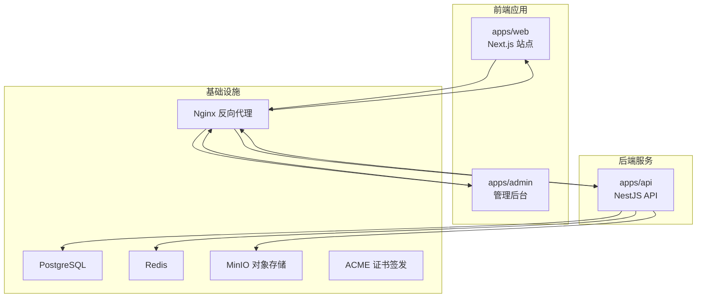
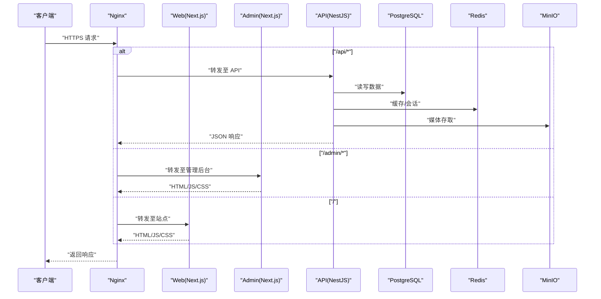
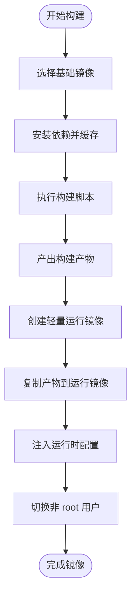
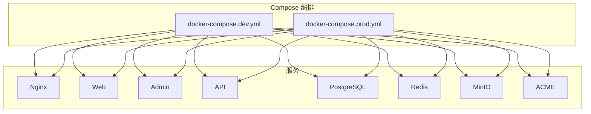
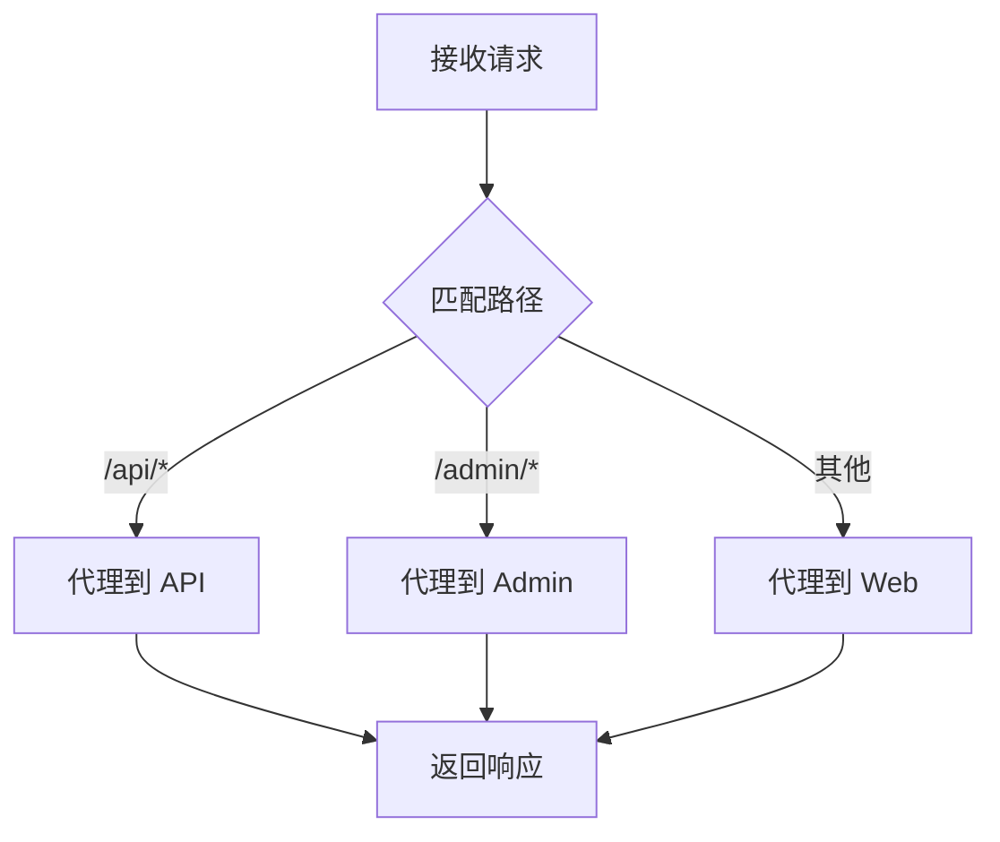
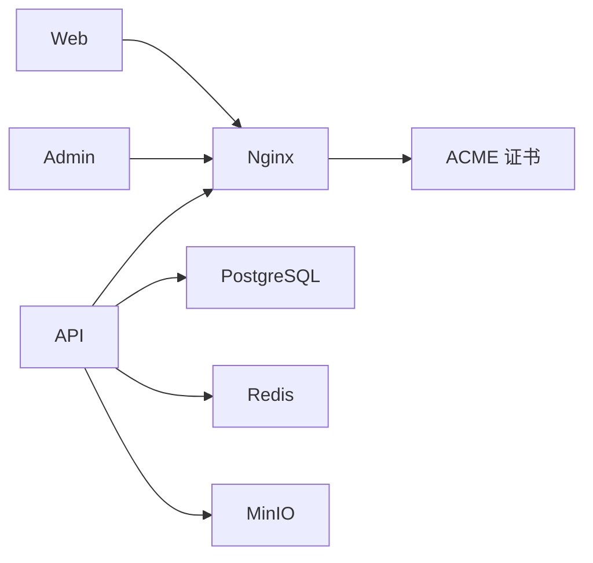

# 容器化部署

<cite>
**本文引用的文件**   
- [apps/admin/Dockerfile](file://apps/admin/Dockerfile)
- [apps/api/Dockerfile](file://apps/api/Dockerfile)
- [apps/web/Dockerfile](file://apps/web/Dockerfile)
- [infra/docker/docker-compose.dev.yml](file://infra/docker/docker-compose.dev.yml)
- [infra/docker/docker-compose.prod.yml](file://infra/docker/docker-compose.prod.yml)
- [infra/docker/nginx/tzj.conf](file://infra/docker/nginx/tzj.conf)
- [infra/docker/nginx/templates/tzj.conf.template](file://infra/docker/nginx/templates/tzj.conf.template)
- [infra/docker/nginx/snippets/proxy-docker.conf](file://infra/docker/nginx/snippets/proxy-docker.conf)
- [infra/docker/nginx/entrypoint.d/90-periodic-reload.sh](file://infra/docker/nginx/entrypoint.d/90-periodic-reload.sh)
- [infra/docker/acme/Dockerfile](file://infra/docker/acme/Dockerfile)
- [infra/docker/minio/cors.xml](file://infra/docker/minio/cors.xml)
- [infra/docker/postgres/init.sql](file://infra/docker/postgres/init.sql)
- [infra/docker/redis/redis.conf](file://infra/docker/redis/redis.conf)
- [.github/workflows/deploy.yml](file://.github/workflows/deploy.yml)
- [.github/workflows/ci.yml](file://.github/workflows/ci.yml)
- [Makefile](file://Makefile)
</cite>

## 目录
1. [简介](#简介)
2. [项目结构](#项目结构)
3. [核心组件](#核心组件)
4. [架构总览](#架构总览)
5. [详细组件分析](#详细组件分析)
6. [依赖关系分析](#依赖关系分析)
7. [性能考量](#性能考量)
8. [故障排查指南](#故障排查指南)
9. [结论](#结论)
10. [附录](#附录)

## 简介
本文件面向容器化部署，覆盖镜像构建、多阶段优化与分层策略；Docker Compose 服务编排（依赖、网络、数据卷、环境变量）；Nginx 反向代理、负载均衡与静态资源缓存；健康检查、日志收集、资源限制与安全最佳实践；以及开发环境与生产环境的差异化配置。文档基于仓库中实际存在的 Dockerfile、Compose 文件与 Nginx 配置进行说明，并提供可视化图示帮助理解。

## 项目结构
仓库采用多应用（admin、api、web）+ 基础设施（nginx、postgres、redis、minio、acme）的模块化组织方式。每个应用均提供独立的 Dockerfile，便于独立构建与部署。基础设施通过 Compose 编排，统一管理服务依赖、网络与数据持久化。

**图表来源** 
- [apps/web/Dockerfile](file://apps/web/Dockerfile)
- [apps/admin/Dockerfile](file://apps/admin/Dockerfile)
- [apps/api/Dockerfile](file://apps/api/Dockerfile)
- [infra/docker/nginx/tzj.conf](file://infra/docker/nginx/tzj.conf)
- [infra/docker/docker-compose.dev.yml](file://infra/docker/docker-compose.dev.yml)
- [infra/docker/docker-compose.prod.yml](file://infra/docker/docker-compose.prod.yml)

**章节来源**
- [apps/web/Dockerfile](file://apps/web/Dockerfile)
- [apps/admin/Dockerfile](file://apps/admin/Dockerfile)
- [apps/api/Dockerfile](file://apps/api/Dockerfile)
- [infra/docker/docker-compose.dev.yml](file://infra/docker/docker-compose.dev.yml)
- [infra/docker/docker-compose.prod.yml](file://infra/docker/docker-compose.prod.yml)

## 核心组件
- 应用镜像
  - web：Next.js 站点，生产环境以 Node 运行或静态导出运行。
  - admin：Next.js 管理后台，构建产物由运行时 Node 服务提供。
  - api：NestJS 后端，编译后由 Node 运行，连接数据库、缓存与对象存储。
- 反向代理
  - Nginx：统一入口，按路径路由到各服务，启用 SSL、缓存与代理头处理。
- 数据与缓存
  - PostgreSQL：业务数据存储。
  - Redis：会话、缓存与实时能力支撑。
  - MinIO：媒体与静态资源对象存储。
- 证书自动化
  - ACME：自动申请与续期 HTTPS 证书。

**章节来源**
- [apps/web/Dockerfile](file://apps/web/Dockerfile)
- [apps/admin/Dockerfile](file://apps/admin/Dockerfile)
- [apps/api/Dockerfile](file://apps/api/Dockerfile)
- [infra/docker/nginx/tzj.conf](file://infra/docker/nginx/tzj.conf)
- [infra/docker/postgres/init.sql](file://infra/docker/postgres/init.sql)
- [infra/docker/redis/redis.conf](file://infra/docker/redis/redis.conf)
- [infra/docker/minio/cors.xml](file://infra/docker/minio/cors.xml)
- [infra/docker/acme/Dockerfile](file://infra/docker/acme/Dockerfile)

## 架构总览
下图展示请求从客户端经 Nginx 进入系统的路径，以及各服务之间的依赖关系。

**图表来源** 
- [infra/docker/nginx/tzj.conf](file://infra/docker/nginx/tzj.conf)
- [infra/docker/nginx/templates/tzj.conf.template](file://infra/docker/nginx/templates/tzj.conf.template)
- [infra/docker/nginx/snippets/proxy-docker.conf](file://infra/docker/nginx/snippets/proxy-docker.conf)

**章节来源**
- [infra/docker/nginx/tzj.conf](file://infra/docker/nginx/tzj.conf)
- [infra/docker/nginx/templates/tzj.conf.template](file://infra/docker/nginx/templates/tzj.conf.template)
- [infra/docker/nginx/snippets/proxy-docker.conf](file://infra/docker/nginx/snippets/proxy-docker.conf)

## 详细组件分析

### 镜像构建与多阶段优化
- 构建阶段
  - 安装依赖并执行构建命令，利用缓存层加速重复构建。
  - 将构建产物输出到独立目录，避免将源码与依赖带入最终镜像。
- 运行阶段
  - 使用精简基础镜像，仅包含运行时所需组件。
  - 设置非 root 用户运行，降低安全风险。
- 分层策略
  - 依赖层与代码层分离，提升缓存命中率。
  - 环境变量与配置在运行时注入，不固化进镜像。

**图表来源** 
- [apps/web/Dockerfile](file://apps/web/Dockerfile)
- [apps/admin/Dockerfile](file://apps/admin/Dockerfile)
- [apps/api/Dockerfile](file://apps/api/Dockerfile)

**章节来源**
- [apps/web/Dockerfile](file://apps/web/Dockerfile)
- [apps/admin/Dockerfile](file://apps/admin/Dockerfile)
- [apps/api/Dockerfile](file://apps/api/Dockerfile)

### Docker Compose 服务编排
- 服务依赖管理
  - 通过 depends_on 声明启动顺序，确保数据库、缓存先于应用启动。
  - 结合健康检查，避免应用提前启动导致初始化失败。
- 网络配置
  - 默认桥接网络隔离服务间通信，暴露必要端口给宿主机或反向代理。
  - 通过自定义网络实现服务发现与内部访问。
- 数据卷挂载
  - 持久化数据库与对象存储数据，避免容器重启丢失。
  - 挂载配置文件与证书，支持热更新与外部化管理。
- 环境变量管理
  - 使用 .env 文件或 Compose 变量注入敏感信息。
  - 区分开发与生产环境，避免硬编码。

**图表来源** 
- [infra/docker/docker-compose.dev.yml](file://infra/docker/docker-compose.dev.yml)
- [infra/docker/docker-compose.prod.yml](file://infra/docker/docker-compose.prod.yml)

**章节来源**
- [infra/docker/docker-compose.dev.yml](file://infra/docker/docker-compose.dev.yml)
- [infra/docker/docker-compose.prod.yml](file://infra/docker/docker-compose.prod.yml)

### Nginx 反向代理与缓存策略
- 路由规则
  - /api/* 转发至 API 服务。
  - /admin/* 转发至管理后台。
  - 其余请求转发至站点服务。
- 负载均衡
  - 可配置 upstream 多实例轮询，提高可用性。
- 静态资源缓存
  - 对 JS/CSS/图片等设置较长的缓存时间。
  - 版本化文件名或查询参数控制缓存失效。
- SSL 与安全
  - 启用 HTTPS，强制重定向。
  - 安全头与限流策略。

**图表来源** 
- [infra/docker/nginx/tzj.conf](file://infra/docker/nginx/tzj.conf)
- [infra/docker/nginx/templates/tzj.conf.template](file://infra/docker/nginx/templates/tzj.conf.template)
- [infra/docker/nginx/snippets/proxy-docker.conf](file://infra/docker/nginx/snippets/proxy-docker.conf)

**章节来源**
- [infra/docker/nginx/tzj.conf](file://infra/docker/nginx/tzj.conf)
- [infra/docker/nginx/templates/tzj.conf.template](file://infra/docker/nginx/templates/tzj.conf.template)
- [infra/docker/nginx/snippets/proxy-docker.conf](file://infra/docker/nginx/snippets/proxy-docker.conf)

### 健康检查、日志与资源限制
- 健康检查
  - 为关键服务定义健康检查端点，确保依赖就绪后再启动上游服务。
- 日志收集
  - 统一输出 JSON 格式日志，便于集中采集与分析。
  - 限制日志大小与保留周期，避免磁盘占用过高。
- 资源限制
  - 为容器设置 CPU 与内存上限，防止资源争用。
  - 合理配置堆大小与线程数，提升稳定性。

**章节来源**
- [infra/docker/docker-compose.dev.yml](file://infra/docker/docker-compose.dev.yml)
- [infra/docker/docker-compose.prod.yml](file://infra/docker/docker-compose.prod.yml)

### 安全最佳实践
- 最小权限原则
  - 以非 root 用户运行容器。
  - 只暴露必要端口。
- 密钥管理
  - 使用环境变量或外部密钥管理服务，避免写入镜像。
- 网络安全
  - 启用 TLS，禁用不安全协议。
  - 限制跨域与来源白名单。

**章节来源**
- [apps/api/Dockerfile](file://apps/api/Dockerfile)
- [apps/web/Dockerfile](file://apps/web/Dockerfile)
- [apps/admin/Dockerfile](file://apps/admin/Dockerfile)
- [infra/docker/nginx/tzj.conf](file://infra/docker/nginx/tzj.conf)

### 开发环境与生产环境差异化配置
- 开发环境
  - 开启调试模式与详细日志。
  - 使用本地数据库与缓存，减少外部依赖。
  - 热重载与快速迭代。
- 生产环境
  - 关闭调试，启用严格错误处理。
  - 使用高性能运行时与优化构建。
  - 启用监控、告警与备份策略。

**章节来源**
- [infra/docker/docker-compose.dev.yml](file://infra/docker/docker-compose.dev.yml)
- [infra/docker/docker-compose.prod.yml](file://infra/docker/docker-compose.prod.yml)

## 依赖关系分析
- 应用依赖
  - API 依赖 PostgreSQL、Redis、MinIO。
  - Web/Admin 依赖 Nginx 反向代理。
- 基础设施依赖
  - ACME 依赖外部 DNS 与 HTTP 验证。
  - MinIO 需要持久化卷。
- 编排依赖
  - Compose 通过 depends_on 与健康检查协调启动顺序。

**图表来源** 
- [infra/docker/docker-compose.dev.yml](file://infra/docker/docker-compose.dev.yml)
- [infra/docker/docker-compose.prod.yml](file://infra/docker/docker-compose.prod.yml)
- [infra/docker/nginx/tzj.conf](file://infra/docker/nginx/tzj.conf)

**章节来源**
- [infra/docker/docker-compose.dev.yml](file://infra/docker/docker-compose.dev.yml)
- [infra/docker/docker-compose.prod.yml](file://infra/docker/docker-compose.prod.yml)
- [infra/docker/nginx/tzj.conf](file://infra/docker/nginx/tzj.conf)

## 性能考量
- 构建优化
  - 使用多阶段构建，减小镜像体积。
  - 合理拆分依赖层与代码层，提升缓存命中率。
- 运行时优化
  - 调整 Node 堆大小与线程池。
  - 启用 HTTP/2 与 gzip/brotli 压缩。
- 缓存策略
  - 静态资源长缓存，动态内容短缓存。
  - 使用 CDN 与边缘缓存。

[本节为通用指导，无需特定文件引用]

## 故障排查指南
- 常见问题
  - 启动顺序错误：检查 depends_on 与健康检查配置。
  - 端口冲突：确认宿主机端口映射与服务端口。
  - 证书问题：验证 ACME 域名解析与 HTTP 验证路径。
  - 数据库连接失败：检查环境变量与网络连通性。
- 日志定位
  - 查看容器日志与聚合日志平台。
  - 启用详细日志级别临时诊断。

**章节来源**
- [infra/docker/nginx/entrypoint.d/90-periodic-reload.sh](file://infra/docker/nginx/entrypoint.d/90-periodic-reload.sh)
- [infra/docker/postgres/init.sql](file://infra/docker/postgres/init.sql)
- [infra/docker/redis/redis.conf](file://infra/docker/redis/redis.conf)
- [infra/docker/minio/cors.xml](file://infra/docker/minio/cors.xml)

## 结论
通过多阶段构建与合理的镜像分层，显著减小镜像体积并提升构建效率；借助 Compose 编排统一管理服务依赖、网络与数据持久化；Nginx 作为统一入口提供反向代理、负载均衡与缓存策略；配合健康检查、日志收集与资源限制，保障系统稳定与可观测性；开发与环境差异化配置满足快速迭代与高可用需求。建议持续优化缓存策略与监控告警，进一步提升用户体验与运维效率。

[本节为总结，无需特定文件引用]

## 附录
- CI/CD 集成
  - 使用 GitHub Actions 进行构建与部署流水线。
  - 触发条件与分支策略管理发布流程。
- 工具与脚本
  - Makefile 封装常用命令，简化操作。
  - 部署脚本支持本地与远程部署。

**章节来源**
- [.github/workflows/deploy.yml](file://.github/workflows/deploy.yml)
- [.github/workflows/ci.yml](file://.github/workflows/ci.yml)
- [Makefile](file://Makefile)