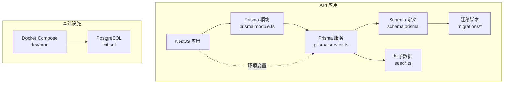
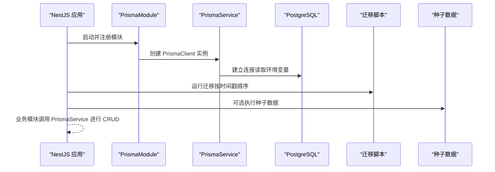
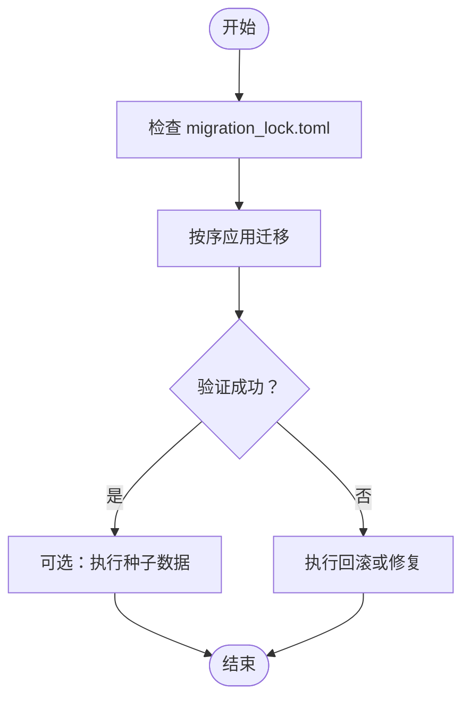
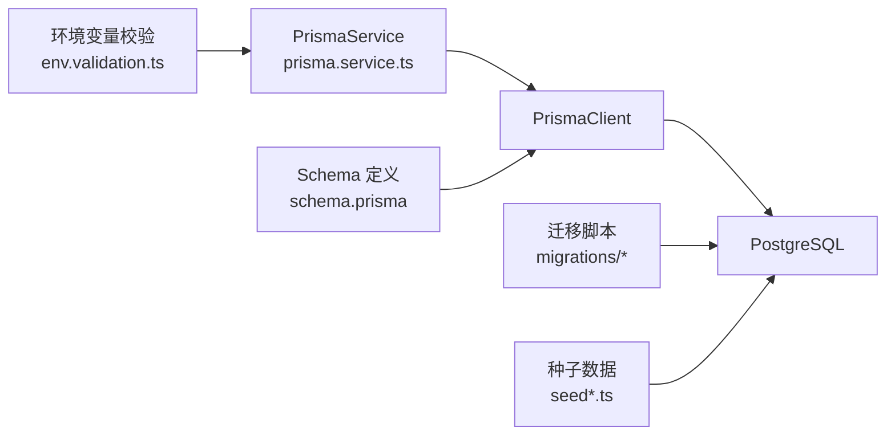

# 数据库管理

<cite>
**本文引用的文件**   
- [schema.prisma](file://apps/api/prisma/schema.prisma)
- [migration_lock.toml](file://apps/api/prisma/migrations/migration_lock.toml)
- [0_init/migration.sql](file://apps/api/prisma/migrations/0_init/migration.sql)
- [20260723110621_add_device_details/migration.sql](file://apps/api/prisma/migrations/20260723110621_add_device_details/migration.sql)
- [20260723120000_add_contact_visitor_id/migration.sql](file://apps/api/prisma/migrations/20260723120000_add_contact_visitor_id/migration.sql)
- [20260724122950_customer_visitor_id/migration.sql](file://apps/api/prisma/migrations/20260724122950_customer_visitor_id/migration.sql)
- [seed.ts](file://apps/api/prisma/seed.ts)
- [seed-content.ts](file://apps/api/prisma/seed-content.ts)
- [seed-content-media.ts](file://apps/api/prisma/seed-content-media.ts)
- [prisma.service.ts](file://apps/api/src/prisma/prisma.service.ts)
- [prisma.module.ts](file://apps/api/src/prisma/prisma.module.ts)
- [env.validation.ts](file://apps/api/src/config/env.validation.ts)
- [init.sql](file://infra/docker/postgres/init.sql)
- [docker-compose.dev.yml](file://infra/docker/docker-compose.dev.yml)
- [docker-compose.prod.yml](file://infra/docker/docker-compose.prod.yml)
- [baseline-migrations.sh](file://apps/api/scripts/baseline-migrations.sh)
- [migrate-deprecated-roles.ts](file://apps/api/scripts/migrate-deprecated-roles.ts)
- [prune-deprecated-permissions.ts](file://apps/api/scripts/prune-deprecated-permissions.ts)
- [restore-media-to-minio.mjs](file://apps/api/scripts/restore-media-to-minio.mjs)
- [audit.interceptor.ts](file://apps/api/src/common/interceptors/audit.interceptor.ts)
- [secrets-crypto.ts](file://apps/api/src/common/crypto/secrets-crypto.ts)
</cite>

## 目录
1. [简介](#简介)
2. [项目结构](#项目结构)
3. [核心组件](#核心组件)
4. [架构总览](#架构总览)
5. [详细组件分析](#详细组件分析)
6. [依赖关系分析](#依赖关系分析)
7. [性能考虑](#性能考虑)
8. [故障排查指南](#故障排查指南)
9. [结论](#结论)
10. [附录](#附录)

## 简介
本文件面向数据库管理与运维，覆盖 Prisma ORM 配置、数据模型与关系映射、迁移策略与版本控制、PostgreSQL 初始化与备份恢复、连接池与查询优化、索引策略、事务与并发控制、数据一致性保障、安全配置与审计日志等主题。文档基于仓库中的实际代码与配置文件进行梳理，旨在为开发者与运维人员提供可操作的实践指南。

## 项目结构
本项目采用多应用（admin、api、web）+ 基础设施（infra/docker）的组织方式。数据库相关能力主要集中在 api 应用的 Prisma 层与 NestJS 模块中，并通过 Docker Compose 编排 PostgreSQL 服务。

图表来源 
- [prisma.module.ts](file://apps/api/src/prisma/prisma.module.ts)
- [prisma.service.ts](file://apps/api/src/prisma/prisma.service.ts)
- [schema.prisma](file://apps/api/prisma/schema.prisma)
- [init.sql](file://infra/docker/postgres/init.sql)
- [docker-compose.dev.yml](file://infra/docker/docker-compose.dev.yml)
- [docker-compose.prod.yml](file://infra/docker/docker-compose.prod.yml)

章节来源
- [prisma.module.ts](file://apps/api/src/prisma/prisma.module.ts)
- [prisma.service.ts](file://apps/api/src/prisma/prisma.service.ts)
- [schema.prisma](file://apps/api/prisma/schema.prisma)
- [init.sql](file://infra/docker/postgres/init.sql)
- [docker-compose.dev.yml](file://infra/docker/docker-compose.dev.yml)
- [docker-compose.prod.yml](file://infra/docker/docker-compose.prod.yml)

## 核心组件
- Prisma Schema：集中定义数据模型、字段类型、约束与关联关系，是数据库结构的唯一真实来源。
- Prisma 服务与模块：在 NestJS 中以单例形式注入 PrismaClient，统一生命周期管理与连接配置。
- 迁移系统：以时间戳命名的迁移目录管理数据库演进，配合锁定文件确保一致性。
- 种子数据：用于开发/测试环境快速填充初始数据。
- 初始化脚本：PostgreSQL 容器启动时执行 init.sql，完成库/角色/权限的初始化。
- 环境变量校验：集中校验数据库连接参数，避免运行时错误。

章节来源
- [schema.prisma](file://apps/api/prisma/schema.prisma)
- [prisma.service.ts](file://apps/api/src/prisma/prisma.service.ts)
- [prisma.module.ts](file://apps/api/src/prisma/prisma.module.ts)
- [env.validation.ts](file://apps/api/src/config/env.validation.ts)
- [init.sql](file://infra/docker/postgres/init.sql)

## 架构总览
下图展示了 API 层通过 NestJS 模块注入 Prisma 客户端，访问 PostgreSQL 的整体流程，以及迁移与种子数据的执行路径。

图表来源 
- [prisma.module.ts](file://apps/api/src/prisma/prisma.module.ts)
- [prisma.service.ts](file://apps/api/src/prisma/prisma.service.ts)
- [env.validation.ts](file://apps/api/src/config/env.validation.ts)

## 详细组件分析

### Prisma ORM 配置与数据模型
- 数据源与连接器：通过 schema 指定 PostgreSQL 数据源与连接字符串，支持环境变量注入。
- 模型与关系：使用 @model/@relation/@id/@unique 等注解描述表结构与关系，生成强类型客户端。
- 生成器：构建阶段生成 TypeScript 客户端，供业务层类型安全地访问数据库。

建议关注点
- 连接字符串应包含 SSL、超时、连接池大小等关键参数。
- 对高频查询字段添加 unique/index 约束以提升性能。
- 使用枚举与默认值保证数据一致性。

章节来源
- [schema.prisma](file://apps/api/prisma/schema.prisma)

### 数据模型设计与关系映射
- 实体建模：将业务实体映射为 Prisma 模型，明确主键、外键与多对一/多对多关系。
- 关系导航：利用 Prisma 的关系查询能力简化复杂查询，减少 N+1 问题。
- 约束与校验：在模型层声明必填、唯一、长度等约束，降低脏数据风险。

章节来源
- [schema.prisma](file://apps/api/prisma/schema.prisma)

### 数据库迁移策略、版本管理与回滚
- 迁移目录：每个迁移以时间戳命名，便于排序与追踪。
- 锁定文件：migration_lock.toml 记录迁移依赖，防止不一致升级。
- 基线迁移：可通过脚本生成基线快照，加速 CI/CD 初始化。
- 回滚策略：优先使用 Prisma 提供的回滚命令；对于不可逆变更，编写反向迁移或数据修复脚本。

图表来源 
- [migration_lock.toml](file://apps/api/prisma/migrations/migration_lock.toml)
- [baseline-migrations.sh](file://apps/api/scripts/baseline-migrations.sh)

章节来源
- [migration_lock.toml](file://apps/api/prisma/migrations/migration_lock.toml)
- [baseline-migrations.sh](file://apps/api/scripts/baseline-migrations.sh)
- [0_init/migration.sql](file://apps/api/prisma/migrations/0_init/migration.sql)
- [20260723110621_add_device_details/migration.sql](file://apps/api/prisma/migrations/20260723110621_add_device_details/migration.sql)
- [20260723120000_add_contact_visitor_id/migration.sql](file://apps/api/prisma/migrations/20260723120000_add_contact_visitor_id/migration.sql)
- [20260724122950_customer_visitor_id/migration.sql](file://apps/api/prisma/migrations/20260724122950_customer_visitor_id/migration.sql)

### PostgreSQL 初始化、备份与恢复
- 初始化：容器启动时执行 init.sql，创建数据库、用户与权限。
- 备份：推荐使用 pg_dump 全量/增量备份，结合对象存储归档。
- 恢复：使用 psql 或 pg_restore 恢复到目标环境，注意权限与扩展依赖。

章节来源
- [init.sql](file://infra/docker/postgres/init.sql)
- [docker-compose.dev.yml](file://infra/docker/docker-compose.dev.yml)
- [docker-compose.prod.yml](file://infra/docker/docker-compose.prod.yml)

### 连接池配置与查询优化
- 连接池：通过 Prisma 连接字符串配置 max/min 连接数、超时与重试策略。
- 查询优化：合理使用 select/include 减少字段与关联加载；分页与过滤放在数据库侧。
- 索引策略：对高频过滤、排序与关联字段建立合适索引，避免过度索引影响写入。

章节来源
- [schema.prisma](file://apps/api/prisma/schema.prisma)
- [env.validation.ts](file://apps/api/src/config/env.validation.ts)

### 事务处理与并发控制
- 事务：使用 Prisma 的事务 API 包裹多步操作，保证原子性与一致性。
- 并发：利用行级锁（如 FOR UPDATE）解决竞态条件；合理设置隔离级别。
- 幂等性：对外部写入接口设计幂等键，避免重复提交导致的数据异常。

章节来源
- [schema.prisma](file://apps/api/prisma/schema.prisma)

### 数据一致性保障
- 约束：在模型层声明唯一、非空、外键约束，确保数据完整性。
- 校验：在服务层进行二次校验，拦截非法输入。
- 审计：通过拦截器记录关键操作，便于追溯与合规。

章节来源
- [schema.prisma](file://apps/api/prisma/schema.prisma)
- [audit.interceptor.ts](file://apps/api/src/common/interceptors/audit.interceptor.ts)

### 安全配置与访问控制
- 密钥管理：敏感信息通过加密工具或外部密钥管理服务注入。
- 最小权限：数据库用户仅授予必要权限，限制远程访问。
- 传输安全：强制启用 TLS，禁用弱加密套件。

章节来源
- [secrets-crypto.ts](file://apps/api/src/common/crypto/secrets-crypto.ts)
- [env.validation.ts](file://apps/api/src/config/env.validation.ts)

### 审计日志
- 请求审计：通过拦截器捕获关键请求与响应，记录操作人、资源与结果。
- 数据变更：对敏感表开启触发器或应用层埋点，记录增删改轨迹。
- 日志聚合：集中收集到日志平台，支持检索与告警。

章节来源
- [audit.interceptor.ts](file://apps/api/src/common/interceptors/audit.interceptor.ts)

## 依赖关系分析
Prisma 作为数据访问抽象层，向上暴露类型安全的客户端，向下对接 PostgreSQL。迁移与种子数据由脚本驱动，环境变量决定运行时行为。

图表来源 
- [env.validation.ts](file://apps/api/src/config/env.validation.ts)
- [prisma.service.ts](file://apps/api/src/prisma/prisma.service.ts)
- [schema.prisma](file://apps/api/prisma/schema.prisma)
- [0_init/migration.sql](file://apps/api/prisma/migrations/0_init/migration.sql)
- [seed.ts](file://apps/api/prisma/seed.ts)

章节来源
- [env.validation.ts](file://apps/api/src/config/env.validation.ts)
- [prisma.service.ts](file://apps/api/src/prisma/prisma.service.ts)
- [schema.prisma](file://apps/api/prisma/schema.prisma)
- [seed.ts](file://apps/api/prisma/seed.ts)

## 性能考虑
- 连接池调优：根据并发量与数据库容量设置合适的连接数与超时，避免连接耗尽或频繁握手。
- 查询计划：使用 EXPLAIN ANALYZE 分析慢查询，调整索引与 SQL 写法。
- 缓存策略：热点数据引入 Redis 缓存，减轻数据库压力。
- 读写分离：读多写少场景考虑只读副本分担查询负载。

[本节为通用指导，不直接分析具体文件]

## 故障排查指南
- 连接失败：检查环境变量、网络连通性与防火墙规则，确认用户名密码与权限。
- 迁移冲突：核对 migration_lock 与实际迁移状态，必要时清理未应用迁移后重试。
- 性能退化：定位慢查询，补充缺失索引，优化 JOIN 与子查询。
- 数据不一致：通过审计日志与事务边界回溯问题根因，必要时执行修复脚本。

章节来源
- [env.validation.ts](file://apps/api/src/config/env.validation.ts)
- [migration_lock.toml](file://apps/api/prisma/migrations/migration_lock.toml)
- [audit.interceptor.ts](file://apps/api/src/common/interceptors/audit.interceptor.ts)

## 结论
通过统一的 Prisma Schema、严格的迁移管理与完善的初始化脚本，项目在数据模型、版本控制与部署一致性方面具备良好基础。结合连接池调优、索引策略、事务与并发控制、安全与审计措施，可进一步提升稳定性与性能。建议在 CI/CD 中固化迁移与备份流程，持续监控与优化。

[本节为总结性内容，不直接分析具体文件]

## 附录
- 常用命令（示例）
  - 生成客户端：pnpm prisma generate
  - 创建迁移：pnpm prisma migrate dev --name <描述>
  - 应用迁移：pnpm prisma migrate deploy
  - 回滚迁移：pnpm prisma migrate reset（谨慎使用）
  - 执行种子：pnpm prisma db seed
- 备份与恢复（示例）
  - 备份：pg_dump -U <user> -d <db> > backup.sql
  - 恢复：psql -U <user> -d <db> < backup.sql

[本节为通用参考，不直接分析具体文件]