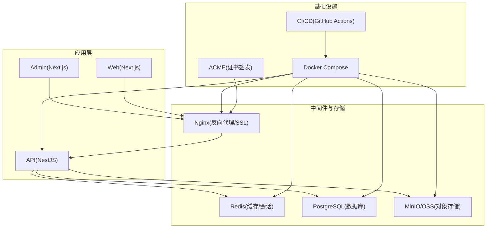
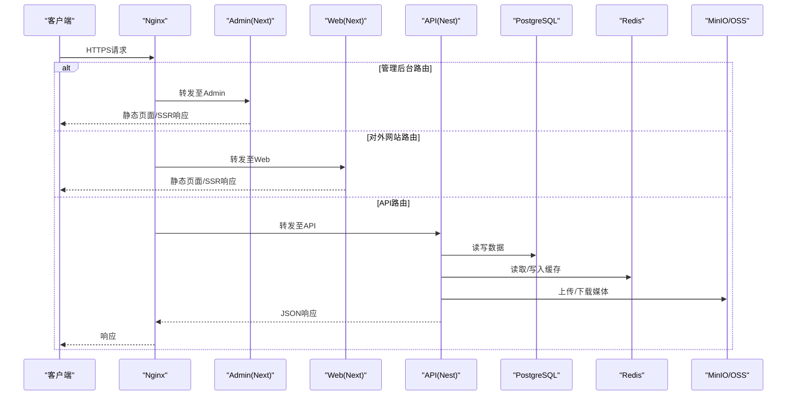
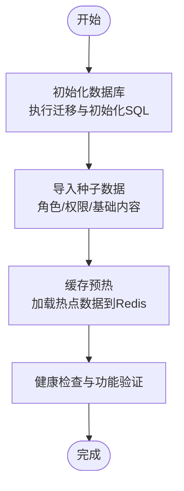
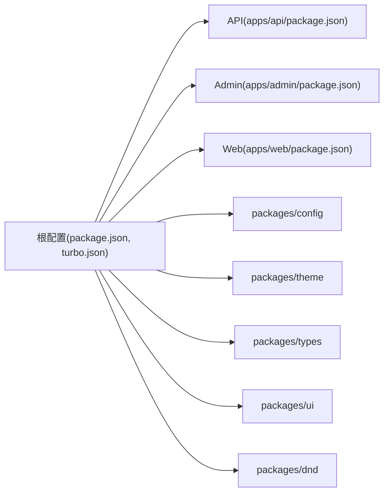

# 生产环境部署

<cite>
**本文引用的文件**   
- [README.md](file://README.md)
- [Makefile](file://Makefile)
- [package.json](file://package.json)
- [turbo.json](file://turbo.json)
- [.npmrc](file://.npmrc)
- [apps/api/package.json](file://apps/api/package.json)
- [apps/admin/package.json](file://apps/admin/package.json)
- [apps/web/package.json](file://apps/web/package.json)
- [apps/api/Dockerfile](file://apps/api/Dockerfile)
- [apps/admin/Dockerfile](file://apps/admin/Dockerfile)
- [apps/web/Dockerfile](file://apps/web/Dockerfile)
- [infra/docker/deploy.sh](file://infra/docker/deploy.sh)
- [infra/docker/deploy-local.sh](file://infra/docker/deploy-local.sh)
- [infra/docker/docker-compose.prod.yml](file://infra/docker/docker-compose.prod.yml)
- [infra/docker/docker-compose.dev.yml](file://infra/docker/docker-compose.dev.yml)
- [infra/docker/nginx/tzj.conf](file://infra/docker/nginx/tzj.conf)
- [infra/docker/nginx/templates/tzj.conf.template](file://infra/docker/nginx/templates/tzj.conf.template)
- [infra/docker/nginx/snippets/ssl.conf](file://infra/docker/nginx/snippets/ssl.conf)
- [infra/docker/acme/issue.sh](file://infra/docker/acme/issue.sh)
- [infra/docker/acme/deploy-cdn.sh](file://infra/docker/acme/deploy-cdn.sh)
- [infra/docker/postgres/init.sql](file://infra/docker/postgres/init.sql)
- [infra/docker/redis/redis.conf](file://infra/docker/redis/redis.conf)
- [infra/docker/minio/cors.xml](file://infra/docker/minio/cors.xml)
- [infra/docker/oss/cors.json](file://infra/docker/oss/cors.json)
- [apps/api/prisma/schema.prisma](file://apps/api/prisma/schema.prisma)
- [apps/api/prisma/migrations/0_init/migration.sql](file://apps/api/prisma/migrations/0_init/migration.sql)
- [apps/api/prisma/seed.ts](file://apps/api/prisma/seed.ts)
- [apps/api/src/config/env.validation.ts](file://apps/api/src/config/env.validation.ts)
- [apps/api/src/main.ts](file://apps/api/src/main.ts)
- [apps/api/src/app.module.ts](file://apps/api/src/app.module.ts)
- [apps/api/src/prisma/prisma.service.ts](file://apps/api/src/prisma/prisma.service.ts)
- [apps/api/src/storage/s3.service.ts](file://apps/api/src/storage/s3.service.ts)
- [apps/api/src/media/media.service.ts](file://apps/api/src/media/media.service.ts)
- [apps/api/src/analytics/utils/client-ip.ts](file://apps/api/src/analytics/utils/client-ip.ts)
- [apps/api/src/security/ip-ban.service.ts](file://apps/api/src/security/ip-ban.service.ts)
- [apps/api/src/support/chat.gateway.ts](file://apps/api/src/support/chat.gateway.ts)
- [apps/api/scripts/baseline-migrations.sh](file://apps/api/scripts/baseline-migrations.sh)
- [apps/api/scripts/seed-chat-mock.ts](file://apps/api/scripts/seed-chat-mock.ts)
- [apps/api/scripts/seed-contacts-mock.ts](file://apps/api/scripts/seed-contacts-mock.ts)
- [apps/api/scripts/seed-visitors-mock.ts](file://apps/api/scripts/seed-visitors-mock.ts)
- [apps/api/scripts/seed-roles.ts](file://apps/api/scripts/seed-roles.ts)
- [apps/api/scripts/restore-media-to-minio.mjs](file://apps/api/scripts/restore-media-to-minio.mjs)
- [apps/api/scripts/test-favicon.ts](file://apps/api/scripts/test-favicon.ts)
- [apps/admin/next.config.ts](file://apps/admin/next.config.ts)
- [apps/web/next.config.ts](file://apps/web/next.config.ts)
- [apps/web/lighthouserc.json](file://apps/web/lighthouserc.json)
- [apps/web/public/browser-support.js](file://apps/web/public/browser-support.js)
- [packages/config/package.json](file://packages/config/package.json)
- [packages/theme/package.json](file://packages/theme/package.json)
- [packages/types/package.json](file://packages/types/package.json)
- [packages/ui/package.json](file://packages/ui/package.json)
- [packages/dnd/package.json](file://packages/dnd/package.json)
- [.github/workflows/deploy.yml](file://.github/workflows/deploy.yml)
- [.github/workflows/deploy-ssh.yml](file://.github/workflows/deploy-ssh.yml)
- [.github/workflows/ci.yml](file://.github/workflows/ci.yml)
</cite>

## 目录
1. [简介](#简介)
2. [项目结构](#项目结构)
3. [核心组件](#核心组件)
4. [架构总览](#架构总览)
5. [详细组件分析](#详细组件分析)
6. [依赖分析](#依赖分析)
7. [性能考虑](#性能考虑)
8. [故障排查指南](#故障排查指南)
9. [结论](#结论)
10. [附录](#附录)

## 简介
本文件面向生产环境，提供端到端部署指导，涵盖服务器准备、依赖安装、系统配置、一键部署脚本使用、环境变量与密钥管理、负载均衡与SSL证书部署、域名绑定、数据库初始化与种子数据导入、缓存预热、性能基准与压力测试、容量规划、安全加固、防火墙配置与网络隔离策略等。文档基于仓库中的Docker Compose、Nginx模板、ACME脚本、Prisma迁移与种子脚本、Next/Nest应用配置以及CI/CD流水线进行说明，确保在生产环境中可重复、可审计、可扩展地交付服务。

## 项目结构
本项目采用多包（Monorepo）架构，包含三个主要应用与基础设施编排：
- apps/api：NestJS后端服务，提供REST API、WebSocket聊天、存储集成、鉴权与权限控制、分析与审计等能力。
- apps/admin：Next.js管理后台，用于内容、用户、媒体、设置等管理。
- apps/web：Next.js对外网站，支持多语言、搜索、SEO与性能优化。
- infra/docker：Docker Compose编排、Nginx反向代理与SSL模板、ACME自动签发、PostgreSQL初始化、Redis配置、MinIO/CORS与OSS CORS配置。
- packages：共享包（配置、主题、类型、UI、拖拽等）。
- scripts：开发辅助脚本。
- .github/workflows：CI/CD流水线（构建、测试、部署）。

**图表来源** 
- [infra/docker/docker-compose.prod.yml](file://infra/docker/docker-compose.prod.yml)
- [infra/docker/nginx/tzj.conf](file://infra/docker/nginx/tzj.conf)
- [apps/api/src/main.ts](file://apps/api/src/main.ts)
- [apps/admin/next.config.ts](file://apps/admin/next.config.ts)
- [apps/web/next.config.ts](file://apps/web/next.config.ts)

**章节来源**
- [README.md](file://README.md)
- [Makefile](file://Makefile)
- [package.json](file://package.json)
- [turbo.json](file://turbo.json)

## 核心组件
- 后端服务（NestJS）
  - 入口与模块装配：[apps/api/src/main.ts](file://apps/api/src/main.ts)、[apps/api/src/app.module.ts](file://apps/api/src/app.module.ts)
  - 数据库访问（Prisma）：[apps/api/src/prisma/prisma.service.ts](file://apps/api/src/prisma/prisma.service.ts)、[apps/api/prisma/schema.prisma](file://apps/api/prisma/schema.prisma)
  - 存储（S3/MinIO/OSS）：[apps/api/src/storage/s3.service.ts](file://apps/api/src/storage/s3.service.ts)
  - 媒体处理与水印：[apps/api/src/media/media.service.ts](file://apps/api/src/media/media.service.ts)
  - 分析与IP定位：[apps/api/src/analytics/utils/client-ip.ts](file://apps/api/src/analytics/utils/client-ip.ts)
  - 安全（IP封禁）：[apps/api/src/security/ip-ban.service.ts](file://apps/api/src/security/ip-ban.service.ts)
  - WebSocket聊天网关：[apps/api/src/support/chat.gateway.ts](file://apps/api/src/support/chat.gateway.ts)
  - 环境变量校验：[apps/api/src/config/env.validation.ts](file://apps/api/src/config/env.validation.ts)
- 前端应用（Next.js）
  - 管理后台：[apps/admin/next.config.ts](file://apps/admin/next.config.ts)
  - 对外网站：[apps/web/next.config.ts](file://apps/web/next.config.ts)、[apps/web/lighthouserc.json](file://apps/web/lighthouserc.json)
- 基础设施编排
  - 生产编排：[infra/docker/docker-compose.prod.yml](file://infra/docker/docker-compose.prod.yml)
  - 开发编排：[infra/docker/docker-compose.dev.yml](file://infra/docker/docker-compose.dev.yml)
  - Nginx配置与模板：[infra/docker/nginx/tzj.conf](file://infra/docker/nginx/tzj.conf)、[infra/docker/nginx/templates/tzj.conf.template](file://infra/docker/nginx/templates/tzj.conf.template)、[infra/docker/nginx/snippets/ssl.conf](file://infra/docker/nginx/snippets/ssl.conf)
  - ACME证书：[infra/docker/acme/issue.sh](file://infra/docker/acme/issue.sh)、[infra/docker/acme/deploy-cdn.sh](file://infra/docker/acme/deploy-cdn.sh)
  - 数据库初始化：[infra/docker/postgres/init.sql](file://infra/docker/postgres/init.sql)
  - Redis配置：[infra/docker/redis/redis.conf](file://infra/docker/redis/redis.conf)
  - MinIO/CORS与OSS CORS：[infra/docker/minio/cors.xml](file://infra/docker/minio/cors.xml)、[infra/docker/oss/cors.json](file://infra/docker/oss/cors.json)

**章节来源**
- [apps/api/src/main.ts](file://apps/api/src/main.ts)
- [apps/api/src/app.module.ts](file://apps/api/src/app.module.ts)
- [apps/api/src/prisma/prisma.service.ts](file://apps/api/src/prisma/prisma.service.ts)
- [apps/api/prisma/schema.prisma](file://apps/api/prisma/schema.prisma)
- [apps/api/src/storage/s3.service.ts](file://apps/api/src/storage/s3.service.ts)
- [apps/api/src/media/media.service.ts](file://apps/api/src/media/media.service.ts)
- [apps/api/src/analytics/utils/client-ip.ts](file://apps/api/src/analytics/utils/client-ip.ts)
- [apps/api/src/security/ip-ban.service.ts](file://apps/api/src/security/ip-ban.service.ts)
- [apps/api/src/support/chat.gateway.ts](file://apps/api/src/support/chat.gateway.ts)
- [apps/api/src/config/env.validation.ts](file://apps/api/src/config/env.validation.ts)
- [apps/admin/next.config.ts](file://apps/admin/next.config.ts)
- [apps/web/next.config.ts](file://apps/web/next.config.ts)
- [apps/web/lighthouserc.json](file://apps/web/lighthouserc.json)
- [infra/docker/docker-compose.prod.yml](file://infra/docker/docker-compose.prod.yml)
- [infra/docker/docker-compose.dev.yml](file://infra/docker/docker-compose.dev.yml)
- [infra/docker/nginx/tzj.conf](file://infra/docker/nginx/tzj.conf)
- [infra/docker/nginx/templates/tzj.conf.template](file://infra/docker/nginx/templates/tzj.conf.template)
- [infra/docker/nginx/snippets/ssl.conf](file://infra/docker/nginx/snippets/ssl.conf)
- [infra/docker/acme/issue.sh](file://infra/docker/acme/issue.sh)
- [infra/docker/acme/deploy-cdn.sh](file://infra/docker/acme/deploy-cdn.sh)
- [infra/docker/postgres/init.sql](file://infra/docker/postgres/init.sql)
- [infra/docker/redis/redis.conf](file://infra/docker/redis/redis.conf)
- [infra/docker/minio/cors.xml](file://infra/docker/minio/cors.xml)
- [infra/docker/oss/cors.json](file://infra/docker/oss/cors.json)

## 架构总览
生产环境通过Docker Compose编排Nginx、API、Redis、PostgreSQL、MinIO/OSS与ACME服务。Nginx作为统一入口，负责HTTPS终止、静态资源缓存、反向代理到API与前端应用；API服务通过Prisma连接PostgreSQL，使用Redis做缓存与会话，通过S3兼容接口对接MinIO或云OSS；ACME容器负责证书申请与自动续期。

**图表来源** 
- [infra/docker/nginx/tzj.conf](file://infra/docker/nginx/tzj.conf)
- [apps/api/src/main.ts](file://apps/api/src/main.ts)
- [apps/admin/next.config.ts](file://apps/admin/next.config.ts)
- [apps/web/next.config.ts](file://apps/web/next.config.ts)

**章节来源**
- [infra/docker/docker-compose.prod.yml](file://infra/docker/docker-compose.prod.yml)
- [infra/docker/nginx/tzj.conf](file://infra/docker/nginx/tzj.conf)
- [apps/api/src/main.ts](file://apps/api/src/main.ts)

## 详细组件分析

### 服务器环境准备与依赖安装
- 操作系统建议：Linux发行版（如Ubuntu LTS），内核版本满足Docker要求。
- 必备软件：
  - Docker与Docker Compose（建议使用官方源或镜像加速）
  - Git（用于拉取代码与CI/CD）
  - curl/wget（用于健康检查与脚本执行）
- 磁盘与内存：
  - PostgreSQL与对象存储需足够IOPS与容量
  - Redis内存按缓存命中率与键大小评估
  - 应用进程CPU与内存根据并发量与负载模型设定
- 网络与安全：
  - 开放端口：80/443（Nginx）、API端口（内部）、数据库与缓存端口（仅内网）
  - 防火墙规则限制外部访问敏感端口
- 依赖安装：
  - 使用pnpm工作区与Turbo进行构建与依赖管理
  - 参考根级配置文件：[package.json](file://package.json)、[turbo.json](file://turbo.json)、[.npmrc](file://.npmrc)

**章节来源**
- [package.json](file://package.json)
- [turbo.json](file://turbo.json)
- [.npmrc](file://.npmrc)

### 一键部署脚本与环境变量配置
- 一键部署脚本：
  - 生产部署：[infra/docker/deploy.sh](file://infra/docker/deploy.sh)
  - 本地部署：[infra/docker/deploy-local.sh](file://infra/docker/deploy-local.sh)
- 环境变量与密钥管理：
  - API环境变量校验：[apps/api/src/config/env.validation.ts](file://apps/api/src/config/env.validation.ts)
  - 数据库连接、Redis、S3/MinIO/OSS、JWT密钥、第三方服务密钥等应在环境变量中注入，避免硬编码
  - 建议在CI/CD中使用Secrets管理，运行时通过Compose或平台注入
- 部署流程要点：
  - 构建镜像并推送（可选）
  - 启动Compose服务（含Nginx、API、Redis、PostgreSQL、MinIO/OSS、ACME）
  - 运行数据库迁移与种子数据
  - 验证健康检查与基本功能

**章节来源**
- [infra/docker/deploy.sh](file://infra/docker/deploy.sh)
- [infra/docker/deploy-local.sh](file://infra/docker/deploy-local.sh)
- [apps/api/src/config/env.validation.ts](file://apps/api/src/config/env.validation.ts)

### 负载均衡配置、SSL证书部署与域名绑定
- 负载均衡与反向代理：
  - Nginx配置模板：[infra/docker/nginx/templates/tzj.conf.template](file://infra/docker/nginx/templates/tzj.conf.template)
  - 生产配置：[infra/docker/nginx/tzj.conf](file://infra/docker/nginx/tzj.conf)
  - SSL片段：[infra/docker/nginx/snippets/ssl.conf](file://infra/docker/nginx/snippets/ssl.conf)
- SSL证书自动化：
  - ACME申请与部署脚本：[infra/docker/acme/issue.sh](file://infra/docker/acme/issue.sh)、[infra/docker/acme/deploy-cdn.sh](file://infra/docker/acme/deploy-cdn.sh)
- 域名绑定：
  - 在Nginx模板中配置server_name与location路由
  - 将域名解析到服务器公网IP，并确保80/443端口可达

**章节来源**
- [infra/docker/nginx/templates/tzj.conf.template](file://infra/docker/nginx/templates/tzj.conf.template)
- [infra/docker/nginx/tzj.conf](file://infra/docker/nginx/tzj.conf)
- [infra/docker/nginx/snippets/ssl.conf](file://infra/docker/nginx/snippets/ssl.conf)
- [infra/docker/acme/issue.sh](file://infra/docker/acme/issue.sh)
- [infra/docker/acme/deploy-cdn.sh](file://infra/docker/acme/deploy-cdn.sh)

### 数据库初始化、种子数据导入与缓存预热
- 数据库初始化：
  - Prisma Schema：[apps/api/prisma/schema.prisma](file://apps/api/prisma/schema.prisma)
  - 初始迁移：[apps/api/prisma/migrations/0_init/migration.sql](file://apps/api/prisma/migrations/0_init/migration.sql)
  - 基线迁移脚本：[apps/api/scripts/baseline-migrations.sh](file://apps/api/scripts/baseline-migrations.sh)
  - 数据库初始化SQL：[infra/docker/postgres/init.sql](file://infra/docker/postgres/init.sql)
- 种子数据导入：
  - 主种子脚本：[apps/api/prisma/seed.ts](file://apps/api/prisma/seed.ts)
  - 角色与权限：[apps/api/scripts/seed-roles.ts](file://apps/api/scripts/seed-roles.ts)
  - 聊天与访客模拟数据：[apps/api/scripts/seed-chat-mock.ts](file://apps/api/scripts/seed-chat-mock.ts)、[apps/api/scripts/seed-visitors-mock.ts](file://apps/api/scripts/seed-visitors-mock.ts)
  - 联系人模拟数据：[apps/api/scripts/seed-contacts-mock.ts](file://apps/api/scripts/seed-contacts-mock.ts)
  - 媒体恢复工具：[apps/api/scripts/restore-media-to-minio.mjs](file://apps/api/scripts/restore-media-to-minio.mjs)
- 缓存预热：
  - 使用Redis配置：[infra/docker/redis/redis.conf](file://infra/docker/redis/redis.conf)
  - 启动后批量加载热点数据（如站点设置、常用字典、热门内容列表）
  - 可通过定时任务或启动钩子触发预热脚本

**图表来源** 
- [apps/api/prisma/schema.prisma](file://apps/api/prisma/schema.prisma)
- [apps/api/prisma/migrations/0_init/migration.sql](file://apps/api/prisma/migrations/0_init/migration.sql)
- [apps/api/scripts/baseline-migrations.sh](file://apps/api/scripts/baseline-migrations.sh)
- [infra/docker/postgres/init.sql](file://infra/docker/postgres/init.sql)
- [apps/api/prisma/seed.ts](file://apps/api/prisma/seed.ts)
- [apps/api/scripts/seed-roles.ts](file://apps/api/scripts/seed-roles.ts)
- [apps/api/scripts/seed-chat-mock.ts](file://apps/api/scripts/seed-chat-mock.ts)
- [apps/api/scripts/seed-visitors-mock.ts](file://apps/api/scripts/seed-visitors-mock.ts)
- [apps/api/scripts/seed-contacts-mock.ts](file://apps/api/scripts/seed-contacts-mock.ts)
- [apps/api/scripts/restore-media-to-minio.mjs](file://apps/api/scripts/restore-media-to-minio.mjs)
- [infra/docker/redis/redis.conf](file://infra/docker/redis/redis.conf)

**章节来源**
- [apps/api/prisma/schema.prisma](file://apps/api/prisma/schema.prisma)
- [apps/api/prisma/migrations/0_init/migration.sql](file://apps/api/prisma/migrations/0_init/migration.sql)
- [apps/api/scripts/baseline-migrations.sh](file://apps/api/scripts/baseline-migrations.sh)
- [infra/docker/postgres/init.sql](file://infra/docker/postgres/init.sql)
- [apps/api/prisma/seed.ts](file://apps/api/prisma/seed.ts)
- [apps/api/scripts/seed-roles.ts](file://apps/api/scripts/seed-roles.ts)
- [apps/api/scripts/seed-chat-mock.ts](file://apps/api/scripts/seed-chat-mock.ts)
- [apps/api/scripts/seed-visitors-mock.ts](file://apps/api/scripts/seed-visitors-mock.ts)
- [apps/api/scripts/seed-contacts-mock.ts](file://apps/api/scripts/seed-contacts-mock.ts)
- [apps/api/scripts/restore-media-to-minio.mjs](file://apps/api/scripts/restore-media-to-minio.mjs)
- [infra/docker/redis/redis.conf](file://infra/docker/redis/redis.conf)

### 性能基准测试、压力测试与容量规划
- 前端性能基准：
  - Lighthouse配置：[apps/web/lighthouserc.json](file://apps/web/lighthouserc.json)
  - 浏览器兼容性脚本：[apps/web/public/browser-support.js](file://apps/web/public/browser-support.js)
- 压力测试建议：
  - 使用wrk、ab或k6对API与Web进行并发压测
  - 关注Nginx吞吐、API响应时间、数据库连接池、Redis命中率
- 容量规划：
  - 根据QPS与P95/P99延迟目标估算CPU与内存
  - 数据库连接数与索引优化
  - 对象存储带宽与分片策略
  - 缓存命中率与键空间设计

**章节来源**
- [apps/web/lighthouserc.json](file://apps/web/lighthouserc.json)
- [apps/web/public/browser-support.js](file://apps/web/public/browser-support.js)

### 安全加固、防火墙配置与网络隔离策略
- 安全加固：
  - IP封禁服务：[apps/api/src/security/ip-ban.service.ts](file://apps/api/src/security/ip-ban.service.ts)
  - 客户端IP识别：[apps/api/src/analytics/utils/client-ip.ts](file://apps/api/src/analytics/utils/client-ip.ts)
  - 媒体访问控制与水印：[apps/api/src/media/media.service.ts](file://apps/api/src/media/media.service.ts)
  - S3/MinIO/OSS访问控制：[apps/api/src/storage/s3.service.ts](file://apps/api/src/storage/s3.service.ts)
- 防火墙与网络隔离：
  - 仅开放必要端口（80/443）
  - 数据库与缓存仅允许内网访问
  - 使用VPC或容器网络隔离不同服务
- 密钥管理：
  - 所有敏感信息通过环境变量注入，避免写入镜像或代码库
  - 定期轮换JWT密钥与第三方服务密钥

**章节来源**
- [apps/api/src/security/ip-ban.service.ts](file://apps/api/src/security/ip-ban.service.ts)
- [apps/api/src/analytics/utils/client-ip.ts](file://apps/api/src/analytics/utils/client-ip.ts)
- [apps/api/src/media/media.service.ts](file://apps/api/src/media/media.service.ts)
- [apps/api/src/storage/s3.service.ts](file://apps/api/src/storage/s3.service.ts)

### 前端与后端应用配置
- Next.js应用配置：
  - 管理后台：[apps/admin/next.config.ts](file://apps/admin/next.config.ts)
  - 对外网站：[apps/web/next.config.ts](file://apps/web/next.config.ts)
- NestJS应用配置：
  - 入口与模块：[apps/api/src/main.ts](file://apps/api/src/main.ts)、[apps/api/src/app.module.ts](file://apps/api/src/app.module.ts)
  - 数据库服务：[apps/api/src/prisma/prisma.service.ts](file://apps/api/src/prisma/prisma.service.ts)
  - WebSocket聊天网关：[apps/api/src/support/chat.gateway.ts](file://apps/api/src/support/chat.gateway.ts)

**章节来源**
- [apps/admin/next.config.ts](file://apps/admin/next.config.ts)
- [apps/web/next.config.ts](file://apps/web/next.config.ts)
- [apps/api/src/main.ts](file://apps/api/src/main.ts)
- [apps/api/src/app.module.ts](file://apps/api/src/app.module.ts)
- [apps/api/src/prisma/prisma.service.ts](file://apps/api/src/prisma/prisma.service.ts)
- [apps/api/src/support/chat.gateway.ts](file://apps/api/src/support/chat.gateway.ts)

### 容器化与镜像构建
- Dockerfile：
  - API：[apps/api/Dockerfile](file://apps/api/Dockerfile)
  - Admin：[apps/admin/Dockerfile](file://apps/admin/Dockerfile)
  - Web：[apps/web/Dockerfile](file://apps/web/Dockerfile)
- 镜像构建与发布：
  - 使用pnpm与Turbo进行多包构建
  - 在多阶段构建中分离依赖安装与产物生成，减小镜像体积

**章节来源**
- [apps/api/Dockerfile](file://apps/api/Dockerfile)
- [apps/admin/Dockerfile](file://apps/admin/Dockerfile)
- [apps/web/Dockerfile](file://apps/web/Dockerfile)

### CI/CD流水线
- GitHub Actions：
  - 通用CI：[.github/workflows/ci.yml](file://.github/workflows/ci.yml)
  - 部署流水线：[.github/workflows/deploy.yml](file://.github/workflows/deploy.yml)
  - SSH部署：[.github/workflows/deploy-ssh.yml](file://.github/workflows/deploy-ssh.yml)
- 流水线职责：
  - 代码检查、单元测试、构建镜像、推送镜像、部署到生产环境
  - 使用Secrets管理敏感信息

**章节来源**
- [.github/workflows/ci.yml](file://.github/workflows/ci.yml)
- [.github/workflows/deploy.yml](file://.github/workflows/deploy.yml)
- [.github/workflows/deploy-ssh.yml](file://.github/workflows/deploy-ssh.yml)

## 依赖分析
- 工作区与包管理：
  - pnpm工作区与Turbo协调多包构建与依赖提升
  - 根级配置：[package.json](file://package.json)、[turbo.json](file://turbo.json)、[.npmrc](file://.npmrc)
- 应用依赖：
  - API依赖：[apps/api/package.json](file://apps/api/package.json)
  - Admin依赖：[apps/admin/package.json](file://apps/admin/package.json)
  - Web依赖：[apps/web/package.json](file://apps/web/package.json)
- 共享包：
  - 配置、主题、类型、UI、拖拽等：[packages/config/package.json](file://packages/config/package.json)、[packages/theme/package.json](file://packages/theme/package.json)、[packages/types/package.json](file://packages/types/package.json)、[packages/ui/package.json](file://packages/ui/package.json)、[packages/dnd/package.json](file://packages/dnd/package.json)

**图表来源** 
- [package.json](file://package.json)
- [turbo.json](file://turbo.json)
- [apps/api/package.json](file://apps/api/package.json)
- [apps/admin/package.json](file://apps/admin/package.json)
- [apps/web/package.json](file://apps/web/package.json)
- [packages/config/package.json](file://packages/config/package.json)
- [packages/theme/package.json](file://packages/theme/package.json)
- [packages/types/package.json](file://packages/types/package.json)
- [packages/ui/package.json](file://packages/ui/package.json)
- [packages/dnd/package.json](file://packages/dnd/package.json)

**章节来源**
- [package.json](file://package.json)
- [turbo.json](file://turbo.json)
- [.npmrc](file://.npmrc)
- [apps/api/package.json](file://apps/api/package.json)
- [apps/admin/package.json](file://apps/admin/package.json)
- [apps/web/package.json](file://apps/web/package.json)
- [packages/config/package.json](file://packages/config/package.json)
- [packages/theme/package.json](file://packages/theme/package.json)
- [packages/types/package.json](file://packages/types/package.json)
- [packages/ui/package.json](file://packages/ui/package.json)
- [packages/dnd/package.json](file://packages/dnd/package.json)

## 性能考虑
- 前端性能优化：
  - 启用Next.js增量静态再生成与缓存策略
  - 图片与媒体资源使用CDN与懒加载
  - Lighthouse指标监控与持续改进
- 后端性能优化：
  - 数据库连接池与查询优化
  - Redis缓存热点数据与分布式锁
  - 对象存储分片与并行上传
- 系统级优化：
  - Nginx缓冲与gzip压缩
  - 内核参数调优（TCP窗口、文件句柄）
  - 容器资源限制与弹性扩缩容

[本节为通用性能指导，不直接分析具体文件]

## 故障排查指南
- 常见问题定位：
  - 查看容器日志与Nginx错误日志
  - 检查环境变量与密钥是否正确注入
  - 验证数据库连接与迁移状态
  - 确认Redis连通性与缓存命中率
  - 检查对象存储CORS与访问权限
- 诊断工具：
  - docker logs、docker exec进入容器调试
  - curl与健康检查端点验证服务状态
  - 使用浏览器开发者工具与Lighthouse分析前端问题

**章节来源**
- [apps/api/src/config/env.validation.ts](file://apps/api/src/config/env.validation.ts)
- [apps/api/prisma/schema.prisma](file://apps/api/prisma/schema.prisma)
- [infra/docker/nginx/tzj.conf](file://infra/docker/nginx/tzj.conf)
- [infra/docker/redis/redis.conf](file://infra/docker/redis/redis.conf)
- [infra/docker/minio/cors.xml](file://infra/docker/minio/cors.xml)
- [infra/docker/oss/cors.json](file://infra/docker/oss/cors.json)

## 结论
通过本部署文档，可在生产环境中以Docker Compose与Nginx为核心，结合ACME自动证书、Prisma数据库管理与对象存储，实现稳定、安全、可扩展的部署方案。配合CI/CD流水线与性能基准测试，可保障服务质量与持续交付效率。建议在生产前进行充分压测与容量规划，并在上线后持续监控与优化。

[本节为总结性内容，不直接分析具体文件]

## 附录
- 相关脚本与配置路径汇总：
  - 部署脚本：[infra/docker/deploy.sh](file://infra/docker/deploy.sh)、[infra/docker/deploy-local.sh](file://infra/docker/deploy-local.sh)
  - 编排文件：[infra/docker/docker-compose.prod.yml](file://infra/docker/docker-compose.prod.yml)、[infra/docker/docker-compose.dev.yml](file://infra/docker/docker-compose.dev.yml)
  - Nginx配置：[infra/docker/nginx/tzj.conf](file://infra/docker/nginx/tzj.conf)、[infra/docker/nginx/templates/tzj.conf.template](file://infra/docker/nginx/templates/tzj.conf.template)、[infra/docker/nginx/snippets/ssl.conf](file://infra/docker/nginx/snippets/ssl.conf)
  - ACME脚本：[infra/docker/acme/issue.sh](file://infra/docker/acme/issue.sh)、[infra/docker/acme/deploy-cdn.sh](file://infra/docker/acme/deploy-cdn.sh)
  - 数据库与缓存：[infra/docker/postgres/init.sql](file://infra/docker/postgres/init.sql)、[infra/docker/redis/redis.conf](file://infra/docker/redis/redis.conf)
  - 对象存储CORS：[infra/docker/minio/cors.xml](file://infra/docker/minio/cors.xml)、[infra/docker/oss/cors.json](file://infra/docker/oss/cors.json)
  - 应用配置：[apps/api/src/main.ts](file://apps/api/src/main.ts)、[apps/admin/next.config.ts](file://apps/admin/next.config.ts)、[apps/web/next.config.ts](file://apps/web/next.config.ts)
  - 性能基准：[apps/web/lighthouserc.json](file://apps/web/lighthouserc.json)

[本节为附录汇总，不直接分析具体文件]