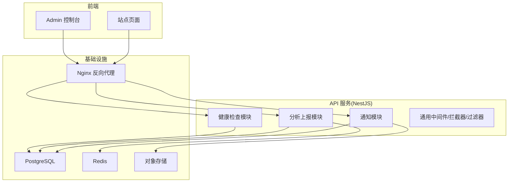
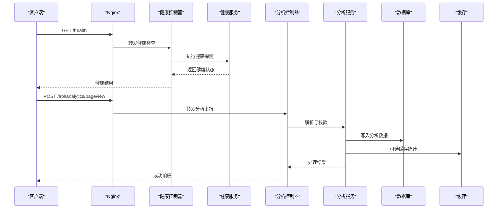
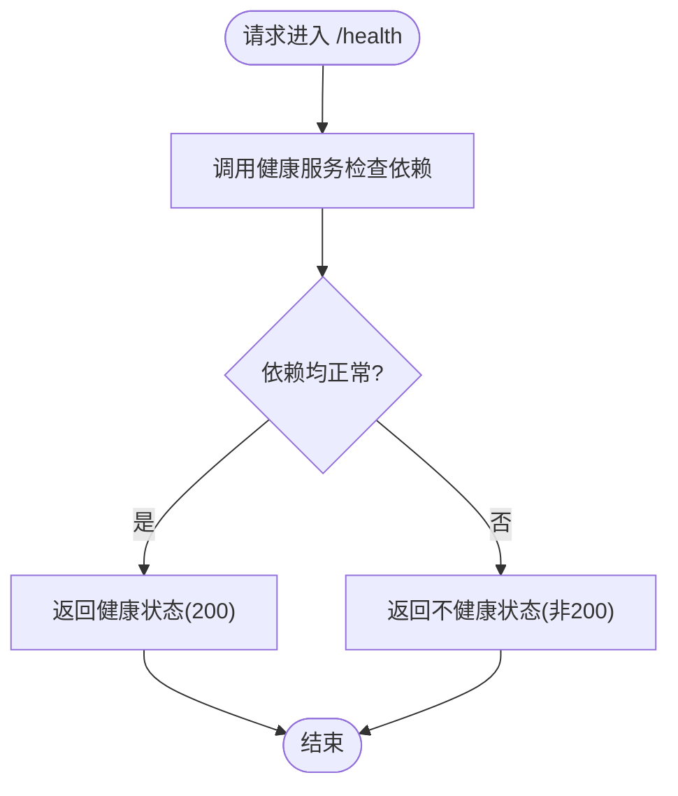
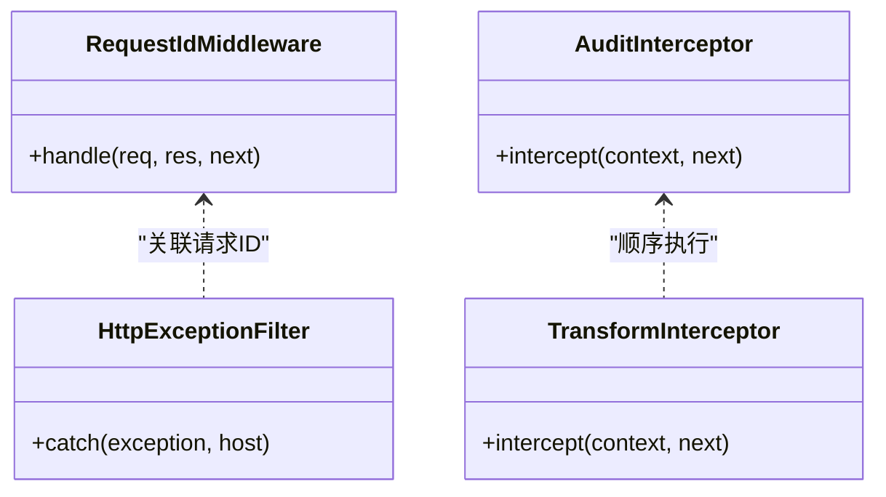
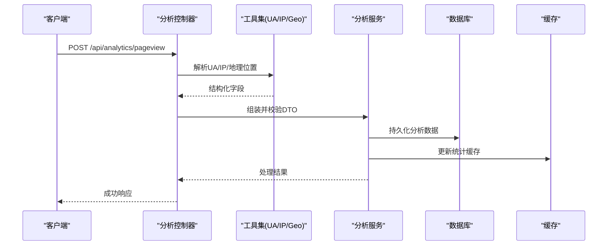
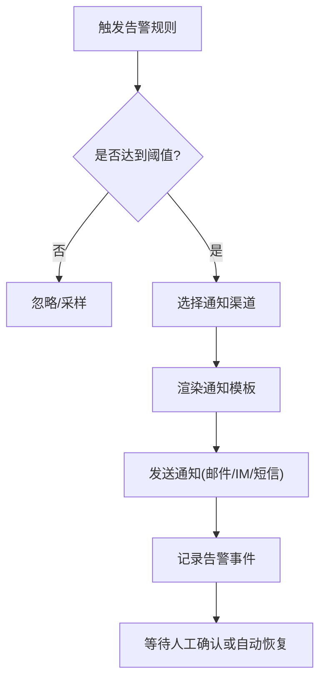
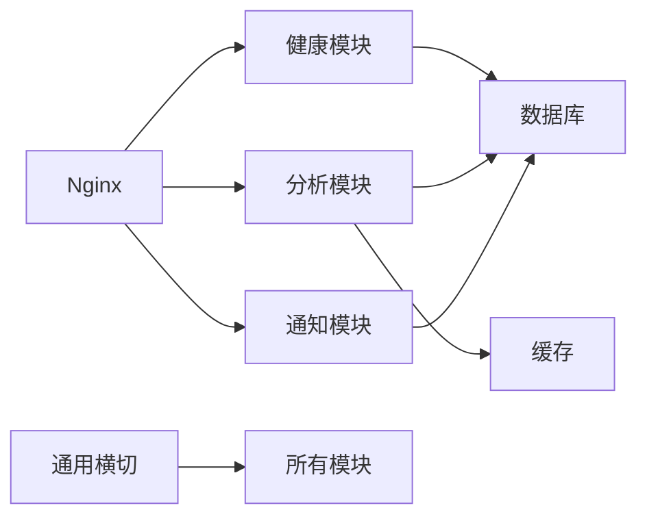

# 监控与告警

<cite>
**本文引用的文件**   
- [health.controller.ts](file://apps/api/src/health/health.controller.ts)
- [health.service.ts](file://apps/api/src/health/health.service.ts)
- [health.module.ts](file://apps/api/src/health/health.module.ts)
- [app.module.ts](file://apps/api/src/app.module.ts)
- [main.ts](file://apps/api/src/main.ts)
- [http-exception.filter.ts](file://apps/api/src/common/filters/http-exception.filter.ts)
- [audit.interceptor.ts](file://apps/api/src/common/interceptors/audit.interceptor.ts)
- [transform.interceptor.ts](file://apps/api/src/common/interceptors/transform.interceptor.ts)
- [request-id.middleware.ts](file://apps/api/src/common/middleware/request-id.middleware.ts)
- [analytics.controller.ts](file://apps/api/src/analytics/analytics.controller.ts)
- [analytics.service.ts](file://apps/api/src/analytics/analytics.service.ts)
- [collect-pageview.dto.ts](file://apps/api/src/analytics/dto/collect-pageview.dto.ts)
- [identify.dto.ts](file://apps/api/src/analytics/dto/identify.dto.ts)
- [client-ip.ts](file://apps/api/src/analytics/utils/client-ip.ts)
- [geo-ip.ts](file://apps/api/src/analytics/utils/geo-ip.ts)
- [geo-label.ts](file://apps/api/src/analytics/utils/geo-label.ts)
- [geo-reverse.ts](file://apps/api/src/analytics/utils/geo-reverse.ts)
- [key-pages.ts](file://apps/api/src/analytics/utils/key-pages.ts)
- [last-ip.ts](file://apps/api/src/analytics/utils/last-ip.ts)
- [traffic-source.ts](file://apps/api/src/analytics/utils/traffic-source.ts)
- [ua-parser.ts](file://apps/api/src/analytics/utils/ua-parser.ts)
- [settings-notifications.defaults.ts](file://apps/api/src/settings/settings-notifications.defaults.ts)
- [settings-notifications.schema.ts](file://apps/api/src/settings/settings-notifications.schema.ts)
- [notification.controller.ts](file://apps/api/src/notifications/notification.controller.ts)
- [notification.service.ts](file://apps/api/src/notifications/notification.service.ts)
- [email/templates/contact.templates.ts](file://apps/api/src/notifications/email/templates/contact.templates.ts)
- [docker-compose.prod.yml](file://infra/docker/docker-compose.prod.yml)
- [tzj.conf.template](file://infra/docker/nginx/templates/tzj.conf.template)
- [deploy.sh](file://infra/docker/deploy.sh)
- [ci.yml](file://.github/workflows/ci.yml)
</cite>

## 目录
1. [简介](#简介)
2. [项目结构](#项目结构)
3. [核心组件](#核心组件)
4. [架构总览](#架构总览)
5. [详细组件分析](#详细组件分析)
6. [依赖关系分析](#依赖关系分析)
7. [性能考量](#性能考量)
8. [故障排查指南](#故障排查指南)
9. [结论](#结论)
10. [附录](#附录)

## 简介
本文件面向“监控与告警”主题，围绕应用健康检查端点、系统状态监控与服务可用性检测；日志收集策略、结构化日志格式与日志聚合方案；性能指标采集、关键业务指标定义与阈值设置；告警规则配置、通知渠道集成与故障响应流程；以及监控面板搭建、可视化展示与容量规划指导进行系统化说明。文档内容基于仓库中现有代码与基础设施配置进行提炼与扩展建议，帮助读者快速落地可观测性与告警体系。

## 项目结构
本项目采用前后端分离与多模块组织：
- 前端（admin/web）：提供管理控制台与站点页面，包含访问分析与用户交互相关能力。
- API（NestJS）：核心后端服务，包含健康检查、分析数据上报、通知、存储、权限等模块。
- 基础设施（infra）：Docker Compose、Nginx 模板、部署脚本与 CI 流水线。

图表来源
- [app.module.ts](file://apps/api/src/app.module.ts)
- [health.module.ts](file://apps/api/src/health/health.module.ts)
- [analytics.controller.ts](file://apps/api/src/analytics/analytics.controller.ts)
- [notification.controller.ts](file://apps/api/src/notifications/notification.controller.ts)
- [docker-compose.prod.yml](file://infra/docker/docker-compose.prod.yml)

章节来源
- [app.module.ts](file://apps/api/src/app.module.ts)
- [docker-compose.prod.yml](file://infra/docker/docker-compose.prod.yml)

## 核心组件
- 健康检查与健康服务：提供进程级与依赖依赖（数据库、缓存等）的可用性探测，便于编排平台进行存活/就绪探针。
- 分析上报：接收页面浏览与识别事件，解析客户端信息、地理位置与流量来源，持久化到数据库并可选写入缓存。
- 通知模块：支持邮件模板渲染与发送，为后续告警通知提供基础能力。
- 通用横切能力：请求 ID 注入、统一异常过滤、审计与响应转换拦截器，提升可观测性与一致性。

章节来源
- [health.controller.ts](file://apps/api/src/health/health.controller.ts)
- [health.service.ts](file://apps/api/src/health/health.service.ts)
- [analytics.controller.ts](file://apps/api/src/analytics/analytics.controller.ts)
- [analytics.service.ts](file://apps/api/src/analytics/analytics.service.ts)
- [notification.controller.ts](file://apps/api/src/notifications/notification.controller.ts)
- [notification.service.ts](file://apps/api/src/notifications/notification.service.ts)
- [request-id.middleware.ts](file://apps/api/src/common/middleware/request-id.middleware.ts)
- [http-exception.filter.ts](file://apps/api/src/common/filters/http-exception.filter.ts)
- [audit.interceptor.ts](file://apps/api/src/common/interceptors/audit.interceptor.ts)
- [transform.interceptor.ts](file://apps/api/src/common/interceptors/transform.interceptor.ts)

## 架构总览
下图展示了从外部请求进入 Nginx，路由至 NestJS 各模块，再到数据存储与缓存的端到端链路，同时标注了健康检查与分析上报的关键路径。

图表来源
- [health.controller.ts](file://apps/api/src/health/health.controller.ts)
- [health.service.ts](file://apps/api/src/health/health.service.ts)
- [analytics.controller.ts](file://apps/api/src/analytics/analytics.controller.ts)
- [analytics.service.ts](file://apps/api/src/analytics/analytics.service.ts)
- [docker-compose.prod.yml](file://infra/docker/docker-compose.prod.yml)

## 详细组件分析

### 健康检查与服务可用性检测
- 健康控制器暴露健康检查端点，供编排平台或负载均衡器进行存活/就绪探测。
- 健康服务负责检查关键依赖（如数据库连接、缓存可达性），汇总返回整体健康状态。
- 建议在容器编排中使用该端点作为 liveness/readiness 探针，结合 Nginx 健康检查实现自动摘流。

图表来源
- [health.controller.ts](file://apps/api/src/health/health.controller.ts)
- [health.service.ts](file://apps/api/src/health/health.service.ts)

章节来源
- [health.controller.ts](file://apps/api/src/health/health.controller.ts)
- [health.service.ts](file://apps/api/src/health/health.service.ts)
- [health.module.ts](file://apps/api/src/health/health.module.ts)

### 系统状态监控与日志采集
- 请求 ID 中间件为每个请求生成唯一标识，贯穿日志与追踪，便于问题定位。
- 统一异常过滤器捕获未处理异常，输出标准化错误信息与上下文。
- 审计拦截器记录关键操作审计日志，配合响应转换拦截器统一响应体结构。
- 建议将结构化日志输出到标准输出，由容器日志驱动采集至集中式日志系统（如 ELK/Loki）。

图表来源
- [request-id.middleware.ts](file://apps/api/src/common/middleware/request-id.middleware.ts)
- [http-exception.filter.ts](file://apps/api/src/common/filters/http-exception.filter.ts)
- [audit.interceptor.ts](file://apps/api/src/common/interceptors/audit.interceptor.ts)
- [transform.interceptor.ts](file://apps/api/src/common/interceptors/transform.interceptor.ts)

章节来源
- [request-id.middleware.ts](file://apps/api/src/common/middleware/request-id.middleware.ts)
- [http-exception.filter.ts](file://apps/api/src/common/filters/http-exception.filter.ts)
- [audit.interceptor.ts](file://apps/api/src/common/interceptors/audit.interceptor.ts)
- [transform.interceptor.ts](file://apps/api/src/common/interceptors/transform.interceptor.ts)

### 性能指标采集与关键业务指标
- 分析上报接口接收页面浏览与用户识别事件，解析 UA、IP、地理位置与流量来源，形成关键业务指标的基础数据。
- 建议对以下指标进行采集与聚合：
  - 请求量与成功率（按端点维度）
  - 响应时延分布（P50/P95/P99）
  - 错误率（按 HTTP 状态码与业务错误码）
  - 分析事件吞吐（pageview/identify 速率）
  - 下游依赖健康（数据库连接池、缓存命中率）
- 在 NestJS 层可通过拦截器埋点，或在网关/Nginx 层采集入口指标，结合 Prometheus/Grafana 进行可视化。

图表来源
- [analytics.controller.ts](file://apps/api/src/analytics/analytics.controller.ts)
- [analytics.service.ts](file://apps/api/src/analytics/analytics.service.ts)
- [collect-pageview.dto.ts](file://apps/api/src/analytics/dto/collect-pageview.dto.ts)
- [identify.dto.ts](file://apps/api/src/analytics/dto/identify.dto.ts)
- [client-ip.ts](file://apps/api/src/analytics/utils/client-ip.ts)
- [ua-parser.ts](file://apps/api/src/analytics/utils/ua-parser.ts)
- [geo-ip.ts](file://apps/api/src/analytics/utils/geo-ip.ts)
- [geo-label.ts](file://apps/api/src/analytics/utils/geo-label.ts)
- [geo-reverse.ts](file://apps/api/src/analytics/utils/geo-reverse.ts)
- [key-pages.ts](file://apps/api/src/analytics/utils/key-pages.ts)
- [last-ip.ts](file://apps/api/src/analytics/utils/last-ip.ts)
- [traffic-source.ts](file://apps/api/src/analytics/utils/traffic-source.ts)

章节来源
- [analytics.controller.ts](file://apps/api/src/analytics/analytics.controller.ts)
- [analytics.service.ts](file://apps/api/src/analytics/analytics.service.ts)
- [collect-pageview.dto.ts](file://apps/api/src/analytics/dto/collect-pageview.dto.ts)
- [identify.dto.ts](file://apps/api/src/analytics/dto/identify.dto.ts)
- [client-ip.ts](file://apps/api/src/analytics/utils/client-ip.ts)
- [ua-parser.ts](file://apps/api/src/analytics/utils/ua-parser.ts)
- [geo-ip.ts](file://apps/api/src/analytics/utils/geo-ip.ts)
- [geo-label.ts](file://apps/api/src/analytics/utils/geo-label.ts)
- [geo-reverse.ts](file://apps/api/src/analytics/utils/geo-reverse.ts)
- [key-pages.ts](file://apps/api/src/analytics/utils/key-pages.ts)
- [last-ip.ts](file://apps/api/src/analytics/utils/last-ip.ts)
- [traffic-source.ts](file://apps/api/src/analytics/utils/traffic-source.ts)

### 告警规则配置与通知渠道集成
- 通知模块提供邮件模板与发送能力，可作为告警通知的基础通道。
- 建议将告警规则与通知渠道解耦，通过配置中心或环境变量动态调整，避免硬编码。
- 常见通知渠道包括邮件、企业微信/钉钉机器人、短信与电话，可按严重级别分级推送。

图表来源
- [notification.controller.ts](file://apps/api/src/notifications/notification.controller.ts)
- [notification.service.ts](file://apps/api/src/notifications/notification.service.ts)
- [email/templates/contact.templates.ts](file://apps/api/src/notifications/email/templates/contact.templates.ts)
- [settings-notifications.defaults.ts](file://apps/api/src/settings/settings-notifications.defaults.ts)
- [settings-notifications.schema.ts](file://apps/api/src/settings/settings-notifications.schema.ts)

章节来源
- [notification.controller.ts](file://apps/api/src/notifications/notification.controller.ts)
- [notification.service.ts](file://apps/api/src/notifications/notification.service.ts)
- [email/templates/contact.templates.ts](file://apps/api/src/notifications/email/templates/contact.templates.ts)
- [settings-notifications.defaults.ts](file://apps/api/src/settings/settings-notifications.defaults.ts)
- [settings-notifications.schema.ts](file://apps/api/src/settings/settings-notifications.schema.ts)

### 监控面板搭建与可视化展示
- 指标采集建议：
  - 应用层：NestJS 拦截器埋点（请求耗时、错误率、QPS）
  - 网关层：Nginx 访问日志与状态码统计
  - 依赖层：数据库连接池、慢查询、缓存命中率
- 可视化建议：
  - Grafana 仪表盘：总体健康、错误率、延迟分布、分析事件趋势
  - 分端点视图：热点接口与异常热点
  - 资源视图：CPU/内存/磁盘/网络使用率
- 数据源：Prometheus（指标）、Loki/ELK（日志）、OpenTelemetry（分布式追踪）

[本节为概念性指导，不直接分析具体文件]

### 容量规划指导
- 容量评估维度：
  - QPS 峰值与平均负载
  - 数据库连接数与慢查询比例
  - 缓存命中率与内存占用
  - 对象存储带宽与 IOPS
- 扩容策略：
  - 水平扩展 API 实例，配合负载均衡与健康检查
  - 读写分离与连接池调优
  - 缓存分层（本地+分布式）与热点键保护
  - 异步化处理高耗时任务（消息队列）

[本节为概念性指导，不直接分析具体文件]

## 依赖关系分析
- 模块耦合：
  - 健康模块低耦合，仅依赖基础运行时与依赖探测
  - 分析模块依赖工具集（UA/IP/Geo）与数据持久化
  - 通知模块依赖模板与配置，可扩展多渠道
- 外部依赖：
  - PostgreSQL、Redis、MinIO 等基础设施
  - Nginx 反向代理与证书管理

图表来源
- [app.module.ts](file://apps/api/src/app.module.ts)
- [health.module.ts](file://apps/api/src/health/health.module.ts)
- [analytics.controller.ts](file://apps/api/src/analytics/analytics.controller.ts)
- [notification.controller.ts](file://apps/api/src/notifications/notification.controller.ts)
- [docker-compose.prod.yml](file://infra/docker/docker-compose.prod.yml)

章节来源
- [app.module.ts](file://apps/api/src/app.module.ts)
- [docker-compose.prod.yml](file://infra/docker/docker-compose.prod.yml)

## 性能考量
- 建议措施：
  - 在拦截器中采集请求耗时与错误率，避免在热路径中进行重计算
  - 分析数据批量写入与异步落库，降低主链路阻塞
  - 合理设置超时与重试策略，避免雪崩
  - 使用连接池与缓存减少数据库压力
  - 对大对象与媒体资源走对象存储与 CDN 加速

[本节为通用性能建议，不直接分析具体文件]

## 故障排查指南
- 快速定位：
  - 通过请求 ID 关联日志与追踪，快速定位问题链路
  - 查看健康检查端点判断依赖可用性
  - 关注统一异常过滤器输出的错误上下文
- 常见问题：
  - 数据库连接失败：检查连接池配置与网络连通性
  - 缓存不可用：检查缓存服务状态与密钥配置
  - 通知发送失败：检查模板渲染与渠道配置
- 建议实践：
  - 建立标准排障手册与演练流程
  - 引入自动化巡检与自愈机制

章节来源
- [request-id.middleware.ts](file://apps/api/src/common/middleware/request-id.middleware.ts)
- [http-exception.filter.ts](file://apps/api/src/common/filters/http-exception.filter.ts)
- [health.controller.ts](file://apps/api/src/health/health.controller.ts)
- [notification.service.ts](file://apps/api/src/notifications/notification.service.ts)

## 结论
通过健康检查端点、结构化日志、指标采集与告警通知，构建完整的可观测性与告警闭环。结合监控面板与容量规划，持续提升系统稳定性与用户体验。建议持续完善指标覆盖、告警规则与自动化响应，形成稳定可靠的运维体系。

[本节为总结性内容，不直接分析具体文件]

## 附录
- 部署与发布：
  - 使用 Docker Compose 编排生产环境，确保服务间依赖与端口映射正确
  - Nginx 模板统一管理反向代理与 SSL 配置
  - CI/CD 流水线保障构建、测试与发布的自动化

章节来源
- [docker-compose.prod.yml](file://infra/docker/docker-compose.prod.yml)
- [tzj.conf.template](file://infra/docker/nginx/templates/tzj.conf.template)
- [deploy.sh](file://infra/docker/deploy.sh)
- [ci.yml](file://.github/workflows/ci.yml)