# 部署与运维

<cite>
**本文引用的文件**   
- [ci.yml](file://.github/workflows/ci.yml)
- [deploy.yml](file://.github/workflows/deploy.yml)
- [deploy-ssh.yml](file://.github/workflows/deploy-ssh.yml)
- [docker-compose.dev.yml](file://infra/docker/docker-compose.dev.yml)
- [docker-compose.prod.yml](file://infra/docker/docker-compose.prod.yml)
- [docker-compose.acme.override.yml](file://infra/docker/docker-compose.acme.override.yml)
- [nginx/tzj.conf](file://infra/docker/nginx/tzj.conf)
- [nginx/tzj-bootstrap.conf](file://infra/docker/nginx/tzj-bootstrap.conf)
- [nginx/snippets/proxy-docker.conf](file://infra/docker/nginx/snippets/proxy-docker.conf)
- [nginx/snippets/ssl.conf](file://infra/docker/nginx/snippets/ssl.conf)
- [nginx/templates/tzj.conf.template](file://infra/docker/nginx/templates/tzj.conf.template)
- [acme/Dockerfile](file://infra/docker/acme/Dockerfile)
- [acme/issue.sh](file://infra/docker/acme/issue.sh)
- [acme/deploy-cdn.sh](file://infra/docker/acme/deploy-cdn.sh)
- [postgres/init.sql](file://infra/docker/postgres/init.sql)
- [redis/redis.conf](file://infra/docker/redis/redis.conf)
- [minio/cors.xml](file://infra/docker/minio/cors.xml)
- [oss/apply-cors.sh](file://infra/docker/oss/apply-cors.sh)
- [oss/cors.json](file://infra/docker/oss/cors.json)
- [deploy-local.sh](file://infra/docker/deploy-local.sh)
- [deploy.sh](file://infra/docker/deploy.sh)
- [setup-docker-mirror.sh](file://infra/docker/setup-docker-mirror.sh)
- [apps/api/Dockerfile](file://apps/api/Dockerfile)
- [apps/admin/Dockerfile](file://apps/admin/Dockerfile)
- [apps/web/Dockerfile](file://apps/web/Dockerfile)
- [apps/api/src/main.ts](file://apps/api/src/main.ts)
- [apps/api/src/app.module.ts](file://apps/api/src/app.module.ts)
- [apps/api/src/health/health.controller.ts](file://apps/api/src/health/health.controller.ts)
- [apps/api/src/health/health.service.ts](file://apps/api/src/health/health.service.ts)
- [apps/api/prisma/schema.prisma](file://apps/api/prisma/schema.prisma)
- [apps/api/scripts/baseline-migrations.sh](file://apps/api/scripts/baseline-migrations.sh)
- [apps/api/scripts/migrate-deprecated-roles.ts](file://apps/api/scripts/migrate-deprecated-roles.ts)
- [apps/api/scripts/seed-roles.ts](file://apps/api/scripts/seed-roles.ts)
- [apps/api/scripts/restore-media-to-minio.mjs](file://apps/api/scripts/restore-media-to-minio.mjs)
- [apps/api/src/config/env.validation.ts](file://apps/api/src/config/env.validation.ts)
- [apps/api/src/storage/s3.service.ts](file://apps/api/src/storage/s3.service.ts)
- [apps/api/src/media/media-guard.service.ts](file://apps/api/src/media/media-guard.service.ts)
- [apps/api/src/integrations/integrations.service.ts](file://apps/api/src/integrations/integrations.service.ts)
- [apps/api/src/support/chat.gateway.ts](file://apps/api/src/support/chat.gateway.ts)
- [apps/api/src/support/chat-presence.store.ts](file://apps/api/src/support/chat-presence.store.ts)
- [apps/api/src/auth/guards/jwt-auth.guard.ts](file://apps/api/src/auth/guards/jwt-auth.guard.ts)
- [apps/api/src/common/filters/http-exception.filter.ts](file://apps/api/src/common/filters/http-exception.filter.ts)
- [apps/api/src/common/interceptors/audit.interceptor.ts](file://apps/api/src/common/interceptors/audit.interceptor.ts)
- [apps/api/src/common/middleware/request-id.middleware.ts](file://apps/api/src/common/middleware/request-id.middleware.ts)
- [apps/api/src/analytics/utils/client-ip.ts](file://apps/api/src/analytics/utils/client-ip.ts)
- [apps/api/src/security/ip-ban.guard.ts](file://apps/api/src/security/ip-ban.guard.ts)
- [apps/api/src/settings/settings.service.ts](file://apps/api/src/settings/settings.service.ts)
- [apps/api/src/system/system.controller.ts](file://apps/api/src/system/system.controller.ts)
- [apps/api/src/system/system.service.ts](file://apps/api/src/system/system.service.ts)
- [apps/api/src/notifications/notification.service.ts](file://apps/api/src/notifications/notification.service.ts)
- [apps/api/src/prisma/prisma.service.ts](file://apps/api/src/prisma/prisma.service.ts)
- [apps/api/src/prisma/lib/sync-content-media.ts](file://apps/api/src/prisma/lib/sync-content-media.ts)
- [apps/api/src/media/site-static-paths.ts](file://apps/api/src/media/site-static-paths.ts)
- [apps/api/src/media/watermark.service.ts](file://apps/api/src/media/watermark.service.ts)
- [apps/api/src/media/media.controller.ts](file://apps/api/src/media/media.controller.ts)
- [apps/api/src/media/media.service.ts](file://apps/api/src/media/media.service.ts)
- [apps/api/src/storage/storage.controller.ts](file://apps/api/src/storage/storage.controller.ts)
- [apps/api/src/storage/storage.module.ts](file://apps/api/src/storage/storage.module.ts)
- [apps/api/src/integrations/integrations.controller.ts](file://apps/api/src/integrations/integrations.controller.ts)
- [apps/api/src/integrations/integrations.schema.ts](file://apps/api/src/integrations/integrations.schema.ts)
- [apps/api/src/integrations/integration.registry.ts](file://apps/api/src/integrations/integration.registry.ts)
- [apps/api/src/integrations/integration.testers.ts](file://apps/api/src/integrations/integration.testers.ts)
- [apps/api/src/integrations/aliyun-captcha.service.ts](file://apps/api/src/integrations/aliyun-captcha.service.ts)
- [apps/api/src/integrations/aliyun-dm.service.ts](file://apps/api/src/integrations/aliyun-dm.service.ts)
- [apps/api/src/users/users.controller.ts](file://apps/api/src/users/users.controller.ts)
- [apps/api/src/users/users.service.ts](file://apps/api/src/users/users.service.ts)
- [apps/api/src/access/access.controller.ts](file://apps/api/src/access/access.controller.ts)
- [apps/api/src/access/access.service.ts](file://apps/api/src/access/access.service.ts)
- [apps/api/src/access/roles.service.ts](file://apps/api/src/access/roles.service.ts)
- [apps/api/src/auth/auth.controller.ts](file://apps/api/src/auth/auth.controller.ts)
- [apps/api/src/auth/auth.service.ts](file://apps/api/src/auth/auth.service.ts)
- [apps/api/src/auth/strategies/jwt.strategy.ts](file://apps/api/src/auth/strategies/jwt.strategy.ts)
- [apps/api/src/auth/decorators/current-user.decorator.ts](file://apps/api/src/auth/decorators/current-user.decorator.ts)
- [apps/api/src/auth/decorators/public.decorator.ts](file://apps/api/src/auth/decorators/public.decorator.ts)
- [apps/api/src/auth/decorators/require-permissions.decorator.ts](file://apps/api/src/auth/decorators/require-permissions.decorator.ts)
- [apps/api/src/auth/decorators/roles.decorator.ts](file://apps/api/src/auth/decorators/roles.decorator.ts)
- [apps/api/src/common/enums/content-status.enum.ts](file://apps/api/src/common/enums/content-status.enum.ts)
- [apps/api/src/common/utils/markdown.ts](file://apps/api/src/common/utils/markdown.ts)
- [apps/api/src/common/utils/read-time.ts](file://apps/api/src/common/utils/read-time.ts)
- [apps/api/src/common/utils/sanitize.ts](file://apps/api/src/common/utils/sanitize.ts)
- [apps/api/src/common/utils/slug.ts](file://apps/api/src/common/utils/slug.ts)
- [apps/api/src/common/utils/list-sort.ts](file://apps/api/src/common/utils/list-sort.ts)
- [apps/api/src/common/utils/document-summary.ts](file://apps/api/src/common/utils/document-summary.ts)
- [apps/api/src/common/utils/content-metadata.ts](file://apps/api/src/common/utils/content-metadata.ts)
- [apps/api/src/common/utils/content-query.ts](file://apps/api/src/common/utils/content-query.ts)
- [apps/api/src/common/utils/content-author.ts](file://apps/api/src/common/utils/content-author.ts)
- [apps/api/src/common/utils/client-ip.ts](file://apps/api/src/common/utils/client-ip.ts)
- [apps/api/src/common/validators/password.validator.ts](file://apps/api/src/common/validators/password.validator.ts)
- [apps/api/src/common/crypto/secrets-crypto.ts](file://apps/api/src/common/crypto/secrets-crypto.ts)
- [apps/api/src/analytics/analytics.controller.ts](file://apps/api/src/analytics/analytics.controller.ts)
- [apps/api/src/analytics/analytics.service.ts](file://apps/api/src/analytics/analytics.service.ts)
- [apps/api/src/analytics/ip-location.service.ts](file://apps/api/src/analytics/ip-location.service.ts)
- [apps/api/src/analytics/dto/collect-pageview.dto.ts](file://apps/api/src/analytics/dto/collect-pageview.dto.ts)
- [apps/api/src/analytics/dto/identify.dto.ts](file://apps/api/src/analytics/dto/identify.dto.ts)
- [apps/api/src/analytics/utils/geo-ip.ts](file://apps/api/src/analytics/utils/geo-ip.ts)
- [apps/api/src/analytics/utils/geo-label.ts](file://apps/api/src/analytics/utils/geo-label.ts)
- [apps/api/src/analytics/utils/geo-reverse.ts](file://apps/api/src/analytics/utils/geo-reverse.ts)
- [apps/api/src/analytics/utils/key-pages.ts](file://apps/api/src/analytics/utils/key-pages.ts)
- [apps/api/src/analytics/utils/last-ip.ts](file://apps/api/src/analytics/utils/last-ip.ts)
- [apps/api/src/analytics/utils/traffic-source.ts](file://apps/api/src/analytics/utils/traffic-source.ts)
- [apps/api/src/analytics/utils/ua-parser.ts](file://apps/api/src/analytics/utils/ua-parser.ts)
- [apps/api/src/analytics/utils/analytics-list.ts](file://apps/api/src/analytics/utils/analytics-list.ts)
- [apps/api/src/audit/audit.controller.ts](file://apps/api/src/audit/audit.controller.ts)
- [apps/api/src/audit/audit.service.ts](file://apps/api/src/audit/audit.service.ts)
- [apps/api/src/blogs/blogs.controller.ts](file://apps/api/src/blogs/blogs.controller.ts)
- [apps/api/src/blogs/blogs.service.ts](file://apps/api/src/blogs/blogs.service.ts)
- [apps/api/src/cases/cases.controller.ts](file://apps/api/src/cases/cases.controller.ts)
- [apps/api/src/cases/cases.service.ts](file://apps/api/src/cases/cases.service.ts)
- [apps/api/src/contact/contact.controller.ts](file://apps/api/src/contact/contact.controller.ts)
- [apps/api/src/contact/contact.service.ts](file://apps/api/src/contact/contact.service.ts)
- [apps/api/src/customers/customers.controller.ts](file://apps/api/src/customers/customers.controller.ts)
- [apps/api/src/customers/customers.service.ts](file://apps/api/src/customers/customers.service.ts)
- [apps/api/src/documents/documents.controller.ts](file://apps/api/src/documents/documents.controller.ts)
- [apps/api/src/documents/documents.service.ts](file://apps/api/src/documents/documents.service.ts)
- [apps/api/src/documents/doc-folders.service.ts](file://apps/api/src/documents/doc-folders.service.ts)
- [apps/api/src/documents/doc-tags.service.ts](file://apps/api/src/documents/doc-tags.service.ts)
- [apps/api/src/documents/document-permissions.service.ts](file://apps/api/src/documents/document-permissions.service.ts)
- [apps/api/src/news/news.controller.ts](file://apps/api/src/news/news.controller.ts)
- [apps/api/src/news/news.service.ts](file://apps/api/src/news/news.service.ts)
- [apps/api/src/pages/pages.controller.ts](file://apps/api/src/pages/pages.controller.ts)
- [apps/api/src/pages/pages.service.ts](file://apps/api/src/pages/pages.service.ts)
- [apps/api/src/publishing/publishing.service.ts](file://apps/api/src/publishing/publishing.service.ts)
- [apps/api/src/security/security.controller.ts](file://apps/api/src/security/security.controller.ts)
- [apps/api/src/security/security.service.ts](file://apps/api/src/security/security.service.ts)
- [apps/api/src/support/support.controller.ts](file://apps/api/src/support/support.controller.ts)
- [apps/api/src/support/support.service.ts](file://apps/api/src/support/support.service.ts)
- [apps/api/src/support/chat-room.controller.ts](file://apps/api/src/support/chat-room.controller.ts)
- [apps/api/src/support/chat-room.service.ts](file://apps/api/src/support/chat-room.service.ts)
- [apps/api/src/support/message-search.service.ts](file://apps/api/src/support/message-search.service.ts)
- [apps/api/src/support/chat-auth.service.ts](file://apps/api/src/support/chat-auth.service.ts)
- [apps/api/src/support/chat-attachment-cleanup.service.ts](file://apps/api/src/support/chat-attachment-cleanup.service.ts)
- [apps/api/src/trade-shows/trade-shows.controller.ts](file://apps/api/src/trade-shows/trade-shows.controller.ts)
- [apps/api/src/trade-shows/trade-shows.service.ts](file://apps/api/src/trade-shows/trade-shows.service.ts)
- [apps/api/src/settings/settings.controller.ts](file://apps/api/src/settings/settings.controller.ts)
- [apps/api/src/settings/settings.defaults.ts](file://apps/api/src/settings/settings.defaults.ts)
- [apps/api/src/settings/settings.schema.ts](file://apps/api/src/settings/settings.schema.ts)
- [apps/api/src/settings/settings-notifications.defaults.ts](file://apps/api/src/settings/settings-notifications.defaults.ts)
- [apps/api/src/settings/settings-notifications.schema.ts](file://apps/api/src/settings/settings-notifications.schema.ts)
- [apps/api/src/settings/settings-media.defaults.ts](file://apps/api/src/settings/settings-media.defaults.ts)
- [apps/api/src/settings/settings-media.schema.ts](file://apps/api/src/settings/settings-media.schema.ts)
- [apps/api/src/site-settings/favicon.controller.ts](file://apps/api/src/site-settings/favicon.controller.ts)
- [apps/api/src/site-settings/favicon.service.ts](file://apps/api/src/site-settings/favicon.service.ts)
- [apps/api/src/system/system.controller.ts](file://apps/api/src/system/system.controller.ts)
- [apps/api/src/system/system.service.ts](file://apps/api/src/system/system.service.ts)
- [apps/api/src/seed/seed.ts](file://apps/api/src/seed/seed.ts)
- [apps/api/src/seed/upload-media.ts](file://apps/api/src/seed/upload-media.ts)
- [apps/api/prisma/seed.ts](file://apps/api/prisma/seed.ts)
- [apps/api/prisma/seed-content.ts](file://apps/api/prisma/seed-content.ts)
- [apps/api/prisma/seed-content-media.ts](file://apps/api/prisma/seed-content-media.ts)
- [apps/api/prisma/migration_lock.toml](file://apps/api/prisma/migration_lock.toml)
- [apps/api/prisma/migrations/0_init/migration.sql](file://apps/api/prisma/migrations/0_init/migration.sql)
- [apps/api/prisma/migrations/20260723110621_add_device_details/migration.sql](file://apps/api/prisma/migrations/20260723110621_add_device_details/migration.sql)
- [apps/api/prisma/migrations/20260723120000_add_contact_visitor_id/migration.sql](file://apps/api/prisma/migrations/20260723120000_add_contact_visitor_id/migration.sql)
- [apps/api/prisma/migrations/20260724122950_customer_visitor_id/migration.sql](file://apps/api/prisma/migrations/20260724122950_customer_visitor_id/migration.sql)
- [apps/api/nest-cli.json](file://apps/api/nest-cli.json)
- [apps/api/package.json](file://apps/api/package.json)
- [apps/api/tsconfig.build.json](file://apps/api/tsconfig.build.json)
- [apps/api/tsconfig.json](file://apps/api/tsconfig.json)
- [apps/admin/package.json](file://apps/admin/package.json)
- [apps/admin/next.config.ts](file://apps/admin/next.config.ts)
- [apps/admin/postcss.config.mjs](file://apps/admin/postcss.config.mjs)
- [apps/admin/tsconfig.json](file://apps/admin/tsconfig.json)
- [apps/web/package.json](file://apps/web/package.json)
- [apps/web/next.config.ts](file://apps/web/next.config.ts)
- [apps/web/postcss.config.mjs](file://apps/web/postcss.config.mjs)
- [apps/web/tsconfig.json](file://apps/web/tsconfig.json)
- [apps/web/lighthouserc.json](file://apps/web/lighthouserc.json)
- [Makefile](file://Makefile)
- [package.json](file://package.json)
- [turbo.json](file://turbo.json)
- [pnpm-workspace.yaml](file://pnpm-workspace.yaml)
- [.npmrc](file://.npmrc)
- [AGENTS.md](file://AGENTS.md)
- [README.md](file://README.md)
</cite>

## 目录
1. [简介](#简介)
2. [项目结构](#项目结构)
3. [核心组件](#核心组件)
4. [架构总览](#架构总览)
5. [详细组件分析](#详细组件分析)
6. [依赖分析](#依赖分析)
7. [性能考虑](#性能考虑)
8. [故障排查指南](#故障排查指南)
9. [结论](#结论)
10. [附录](#附录)

## 简介
本文件面向运维与SRE团队，提供从容器化构建、CI/CD流水线到生产环境管理的完整实践指南。内容涵盖Docker镜像构建、服务编排（Compose）、负载均衡与SSL证书自动化（ACME/Nginx）、配置中心与环境管理、日志收集、健康检查与告警、数据库备份与灾难恢复、容量规划与成本优化等。文档以仓库现有实现为依据，结合最佳实践给出可操作建议。

## 项目结构
本项目采用多应用（Monorepo）结构：
- apps/api：NestJS后端服务，包含业务模块、中间件、拦截器、健康检查、存储集成、安全策略等。
- apps/admin：Next.js管理后台，提供运营与系统管理能力。
- apps/web：Next.js对外站点，负责SEO与用户访问入口。
- infra/docker：容器编排与基础设施脚本，包括Nginx、Postgres、Redis、MinIO、ACME证书签发与部署、Compose模板等。
- .github/workflows：GitHub Actions CI/CD流水线定义。
- scripts与Makefile：本地开发、构建与部署辅助命令。

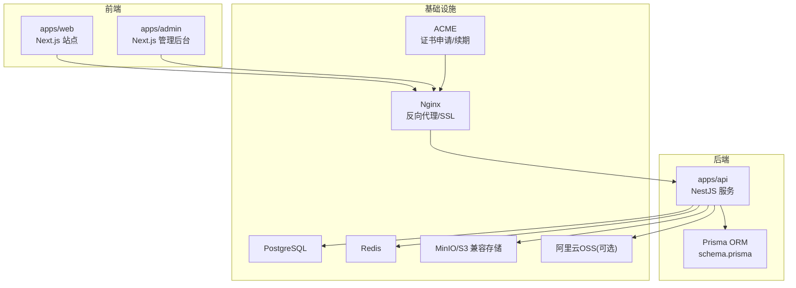

**图表来源** 
- [docker-compose.dev.yml](file://infra/docker/docker-compose.dev.yml)
- [docker-compose.prod.yml](file://infra/docker/docker-compose.prod.yml)
- [nginx/tzj.conf](file://infra/docker/nginx/tzj.conf)
- [nginx/snippets/ssl.conf](file://infra/docker/nginx/snippets/ssl.conf)
- [acme/Dockerfile](file://infra/docker/acme/Dockerfile)
- [apps/api/src/app.module.ts](file://apps/api/src/app.module.ts)
- [apps/api/prisma/schema.prisma](file://apps/api/prisma/schema.prisma)

**章节来源**
- [docker-compose.dev.yml](file://infra/docker/docker-compose.dev.yml)
- [docker-compose.prod.yml](file://infra/docker/docker-compose.prod.yml)
- [nginx/tzj.conf](file://infra/docker/nginx/tzj.conf)
- [apps/api/src/app.module.ts](file://apps/api/src/app.module.ts)
- [apps/api/prisma/schema.prisma](file://apps/api/prisma/schema.prisma)

## 核心组件
- 容器镜像构建
  - 后端API：基于Node的NestJS应用，使用Dockerfile进行多阶段构建与运行镜像打包。
  - 前端Web与管理后台：Next.js应用，分别通过各自Dockerfile构建静态资源或SSR镜像。
- 服务编排
  - Docker Compose：提供开发与生产两套编排模板，统一启动Nginx、API、DB、缓存、对象存储等。
  - Nginx：作为反向代理与TLS终止点，按域名路由至各服务，并启用SSL与安全头。
- 证书与负载均衡
  - ACME：自动申请与续期HTTPS证书，配合Nginx动态加载证书。
  - Nginx负载均衡：支持上游服务多实例与健康检查。
- 配置与环境管理
  - 环境变量校验：后端在启动时校验关键配置，确保运行环境一致性。
  - 配置中心：通过环境变量注入敏感信息，结合Nginx模板生成最终配置。
- 健康检查与监控
  - 健康检查端点：暴露健康探针接口，供编排平台与负载均衡器探测。
  - 指标与日志：建议接入Prometheus/Grafana与集中式日志（如ELK/Loki）。
- 存储与媒体
  - S3兼容存储：MinIO用于本地/私有云；阿里云OSS用于公有云场景。
  - 媒体水印与权限控制：对上传媒体进行水印处理与访问鉴权。

**章节来源**
- [apps/api/Dockerfile](file://apps/api/Dockerfile)
- [apps/admin/Dockerfile](file://apps/admin/Dockerfile)
- [apps/web/Dockerfile](file://apps/web/Dockerfile)
- [docker-compose.dev.yml](file://infra/docker/docker-compose.dev.yml)
- [docker-compose.prod.yml](file://infra/docker/docker-compose.prod.yml)
- [nginx/tzj.conf](file://infra/docker/nginx/tzj.conf)
- [nginx/snippets/ssl.conf](file://infra/docker/nginx/snippets/ssl.conf)
- [acme/Dockerfile](file://infra/docker/acme/Dockerfile)
- [apps/api/src/config/env.validation.ts](file://apps/api/src/config/env.validation.ts)
- [apps/api/src/health/health.controller.ts](file://apps/api/src/health/health.controller.ts)
- [apps/api/src/storage/s3.service.ts](file://apps/api/src/storage/s3.service.ts)
- [apps/api/src/media/media-guard.service.ts](file://apps/api/src/media/media-guard.service.ts)

## 架构总览
下图展示请求从浏览器经Nginx进入API服务，再访问数据库、缓存与对象存储的整体流程，以及ACME证书自动化的交互。

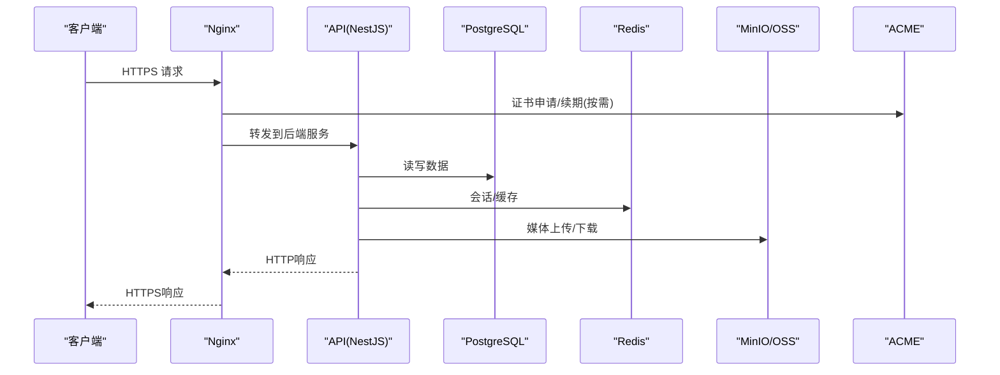

**图表来源** 
- [nginx/tzj.conf](file://infra/docker/nginx/tzj.conf)
- [nginx/snippets/proxy-docker.conf](file://infra/docker/nginx/snippets/proxy-docker.conf)
- [acme/issue.sh](file://infra/docker/acme/issue.sh)
- [apps/api/src/app.module.ts](file://apps/api/src/app.module.ts)
- [apps/api/prisma/schema.prisma](file://apps/api/prisma/schema.prisma)
- [apps/api/src/storage/s3.service.ts](file://apps/api/src/storage/s3.service.ts)

## 详细组件分析

### 容器镜像构建与多阶段优化
- 后端API镜像
  - 构建阶段：安装依赖、编译TypeScript、生成Prisma客户端。
  - 运行阶段：仅包含运行时依赖与产物，减小镜像体积。
- 前端镜像
  - Next.js应用构建静态资源或SSR产物，使用轻量基础镜像运行。
- 构建缓存与并行
  - 利用pnpm工作区与Turbo加速依赖安装与构建。
  - GitHub Actions中缓存node_modules与构建输出。

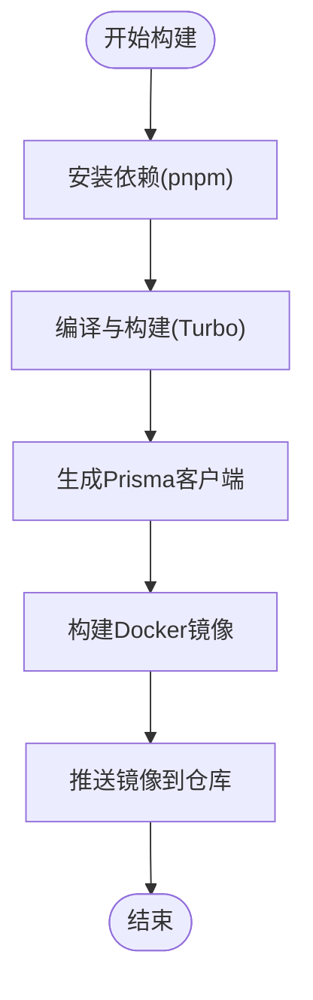

**图表来源** 
- [apps/api/Dockerfile](file://apps/api/Dockerfile)
- [apps/admin/Dockerfile](file://apps/admin/Dockerfile)
- [apps/web/Dockerfile](file://apps/web/Dockerfile)
- [turbo.json](file://turbo.json)
- [pnpm-workspace.yaml](file://pnpm-workspace.yaml)

**章节来源**
- [apps/api/Dockerfile](file://apps/api/Dockerfile)
- [apps/admin/Dockerfile](file://apps/admin/Dockerfile)
- [apps/web/Dockerfile](file://apps/web/Dockerfile)
- [turbo.json](file://turbo.json)
- [pnpm-workspace.yaml](file://pnpm-workspace.yaml)

### 服务编排与网络拓扑
- Compose编排
  - 开发环境：包含API、Nginx、Postgres、Redis、MinIO、ACME等。
  - 生产环境：增加健康检查、重启策略、资源限制与滚动更新。
- Nginx配置
  - 反向代理：将不同域名与路径路由到对应服务。
  - SSL：启用TLS与安全头，支持HTTP/2与HSTS。
  - 负载均衡：上游服务多实例与权重分配。

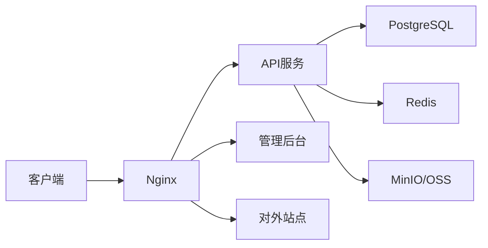

**图表来源** 
- [docker-compose.dev.yml](file://infra/docker/docker-compose.dev.yml)
- [docker-compose.prod.yml](file://infra/docker/docker-compose.prod.yml)
- [nginx/tzj.conf](file://infra/docker/nginx/tzj.conf)
- [nginx/snippets/proxy-docker.conf](file://infra/docker/nginx/snippets/proxy-docker.conf)

**章节来源**
- [docker-compose.dev.yml](file://infra/docker/docker-compose.dev.yml)
- [docker-compose.prod.yml](file://infra/docker/docker-compose.prod.yml)
- [nginx/tzj.conf](file://infra/docker/nginx/tzj.conf)
- [nginx/snippets/proxy-docker.conf](file://infra/docker/nginx/snippets/proxy-docker.conf)

### 负载均衡与SSL证书配置
- 负载均衡
  - Nginx upstream定义多个API实例，支持健康检查与故障转移。
  - 连接池与超时参数调优，提升吞吐与稳定性。
- SSL证书
  - ACME自动申请与续期，证书挂载到Nginx卷。
  - 定时任务检测证书有效期并触发续期。
  - Nginx ssl.conf集中管理加密套件与安全头。

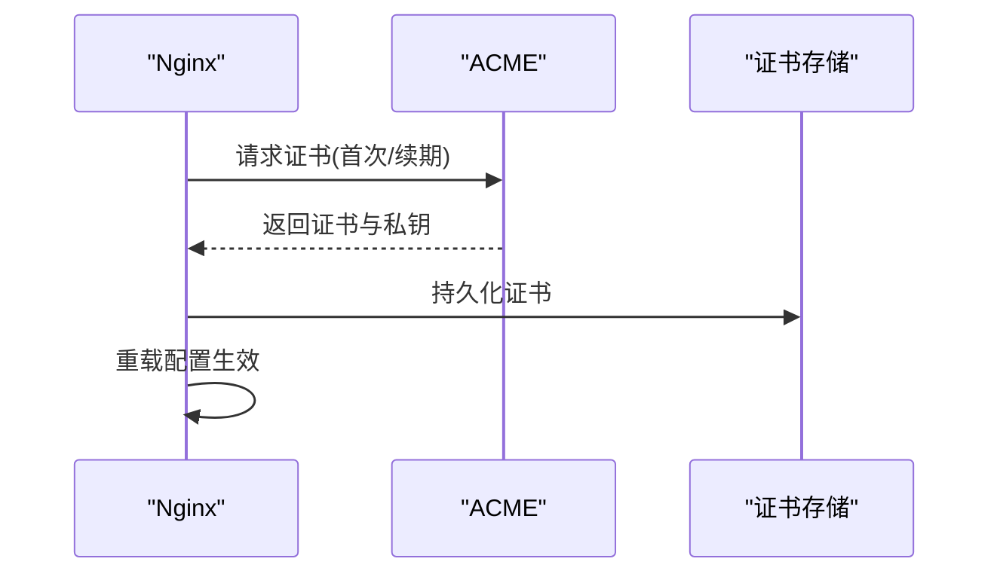

**图表来源** 
- [nginx/snippets/ssl.conf](file://infra/docker/nginx/snippets/ssl.conf)
- [acme/issue.sh](file://infra/docker/acme/issue.sh)
- [acme/deploy-cdn.sh](file://infra/docker/acme/deploy-cdn.sh)

**章节来源**
- [nginx/snippets/ssl.conf](file://infra/docker/nginx/snippets/ssl.conf)
- [acme/issue.sh](file://infra/docker/acme/issue.sh)
- [acme/deploy-cdn.sh](file://infra/docker/acme/deploy-cdn.sh)

### 自动化部署流程（CI/CD）
- GitHub Actions流水线
  - CI：代码检查、单元测试、构建镜像、推送镜像仓库。
  - Deploy：拉取最新镜像、执行数据库迁移、滚动更新服务。
  - SSH部署：通过SSH远程执行部署脚本，适用于无容器平台的传统服务器。
- 环境管理
  - 分支策略：develop/test/staging/prod对应不同环境。
  - 环境变量：通过GitHub Secrets注入敏感配置。
  - 回滚策略：保留历史镜像版本，快速回滚。

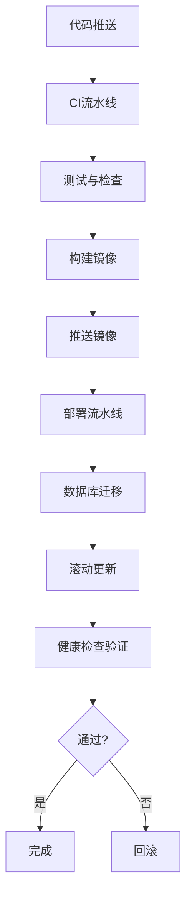

**图表来源** 
- [ci.yml](file://.github/workflows/ci.yml)
- [deploy.yml](file://.github/workflows/deploy.yml)
- [deploy-ssh.yml](file://.github/workflows/deploy-ssh.yml)

**章节来源**
- [ci.yml](file://.github/workflows/ci.yml)
- [deploy.yml](file://.github/workflows/deploy.yml)
- [deploy-ssh.yml](file://.github/workflows/deploy-ssh.yml)

### 配置中心与环境管理
- 环境变量校验
  - 后端启动时校验必需变量，缺失则拒绝启动。
- 配置模板
  - Nginx模板根据环境变量生成最终配置，避免硬编码。
- 敏感信息管理
  - 密钥与令牌通过环境变量或外部密钥管理服务注入。
- 配置热更新
  - Nginx支持配置热重载，无需重启服务。

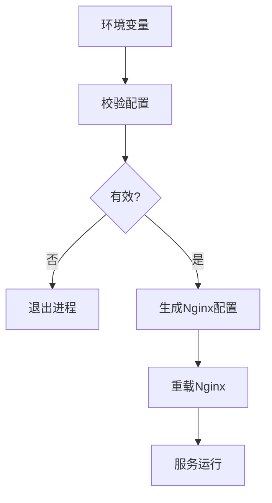

**图表来源** 
- [apps/api/src/config/env.validation.ts](file://apps/api/src/config/env.validation.ts)
- [nginx/templates/tzj.conf.template](file://infra/docker/nginx/templates/tzj.conf.template)

**章节来源**
- [apps/api/src/config/env.validation.ts](file://apps/api/src/config/env.validation.ts)
- [nginx/templates/tzj.conf.template](file://infra/docker/nginx/templates/tzj.conf.template)

### 日志收集与审计
- 结构化日志
  - 请求ID中间件为每个请求附加唯一ID，便于追踪。
  - 审计拦截器记录关键操作与变更。
- 日志聚合
  - 建议将容器日志输出到标准输出，由编排平台收集到集中式日志系统。
- 安全审计
  - 登录、权限变更、媒体访问等关键事件记录审计日志。

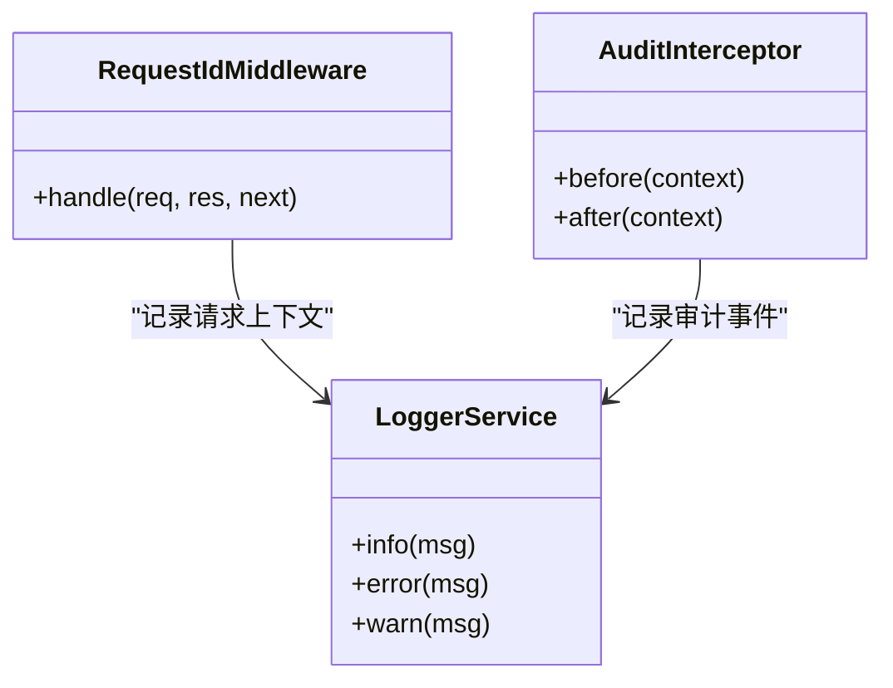

**图表来源** 
- [apps/api/src/common/middleware/request-id.middleware.ts](file://apps/api/src/common/middleware/request-id.middleware.ts)
- [apps/api/src/common/interceptors/audit.interceptor.ts](file://apps/api/src/common/interceptors/audit.interceptor.ts)

**章节来源**
- [apps/api/src/common/middleware/request-id.middleware.ts](file://apps/api/src/common/middleware/request-id.middleware.ts)
- [apps/api/src/common/interceptors/audit.interceptor.ts](file://apps/api/src/common/interceptors/audit.interceptor.ts)

### 健康检查与告警机制
- 健康检查端点
  - 暴露健康探针接口，返回服务状态与依赖健康情况。
- 告警规则
  - 基于健康检查失败率、错误率、延迟阈值设置告警。
  - 结合Prometheus与Alertmanager实现自动化告警。
- 自愈策略
  - 编排平台自动重启失败实例，流量切换至健康节点。

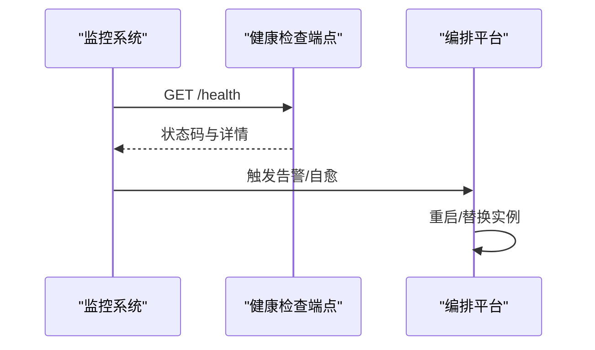

**图表来源** 
- [apps/api/src/health/health.controller.ts](file://apps/api/src/health/health.controller.ts)
- [apps/api/src/health/health.service.ts](file://apps/api/src/health/health.service.ts)

**章节来源**
- [apps/api/src/health/health.controller.ts](file://apps/api/src/health/health.controller.ts)
- [apps/api/src/health/health.service.ts](file://apps/api/src/health/health.service.ts)

### 数据库备份与灾难恢复
- 备份策略
  - 定期全量与增量备份，保留多份副本。
  - 备份数据加密传输与存储。
- 恢复流程
  - 制定恢复演练计划，验证恢复时间目标（RTO）与恢复点目标（RPO）。
  - 一键恢复脚本与回滚方案。
- 数据迁移
  - Prisma迁移脚本在部署时自动执行，确保Schema一致性。

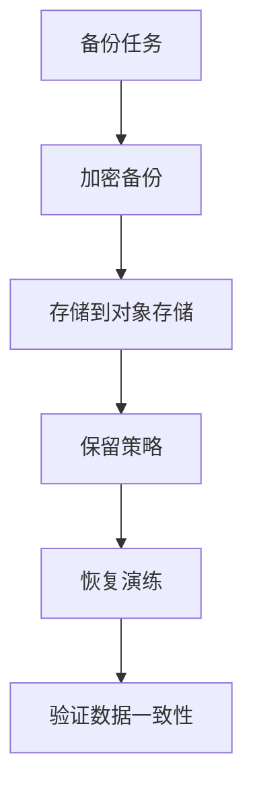

**图表来源** 
- [apps/api/prisma/schema.prisma](file://apps/api/prisma/schema.prisma)
- [apps/api/scripts/baseline-migrations.sh](file://apps/api/scripts/baseline-migrations.sh)

**章节来源**
- [apps/api/prisma/schema.prisma](file://apps/api/prisma/schema.prisma)
- [apps/api/scripts/baseline-migrations.sh](file://apps/api/scripts/baseline-migrations.sh)

### 容量规划与成本优化
- 容量规划
  - 基于CPU、内存、磁盘I/O与网络带宽评估资源需求。
  - 水平扩展API服务实例，垂直扩展数据库与缓存。
- 成本优化
  - 使用Spot实例与非高峰时段批处理任务。
  - 对象存储分层存储（热/冷数据），减少存储成本。
  - 镜像瘦身与构建缓存优化，降低带宽与存储费用。

[本节为通用指导，不直接分析具体文件]

### 性能监控与指标采集
- 指标采集
  - 应用层暴露Prometheus指标，包括QPS、延迟、错误率、GC等。
  - 基础设施层采集CPU、内存、磁盘、网络等指标。
- 可视化与告警
  - Grafana仪表盘展示关键指标，设置阈值告警。
  - 结合日志系统进行根因分析。

[本节为通用指导，不直接分析具体文件]

## 依赖分析
- 组件耦合
  - API服务依赖数据库、缓存、对象存储与第三方集成。
  - Nginx作为网关，解耦前端与后端，提供统一入口。
- 外部依赖
  - Prisma ORM与数据库驱动。
  - S3兼容存储SDK与阿里云OSS SDK。
  - JWT认证与权限控制。
- 潜在循环依赖
  - 模块间通过接口与依赖注入避免循环依赖。

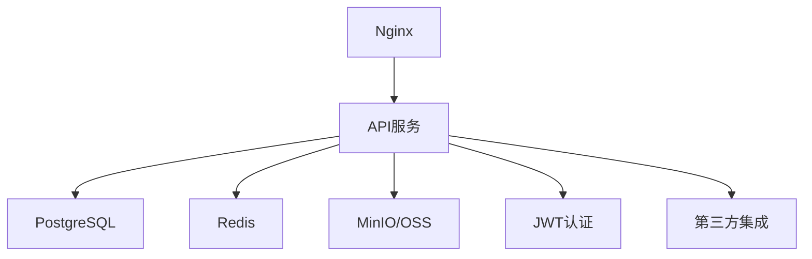

**图表来源** 
- [apps/api/src/app.module.ts](file://apps/api/src/app.module.ts)
- [apps/api/src/storage/s3.service.ts](file://apps/api/src/storage/s3.service.ts)
- [apps/api/src/auth/guards/jwt-auth.guard.ts](file://apps/api/src/auth/guards/jwt-auth.guard.ts)
- [apps/api/src/integrations/integrations.service.ts](file://apps/api/src/integrations/integrations.service.ts)

**章节来源**
- [apps/api/src/app.module.ts](file://apps/api/src/app.module.ts)
- [apps/api/src/storage/s3.service.ts](file://apps/api/src/storage/s3.service.ts)
- [apps/api/src/auth/guards/jwt-auth.guard.ts](file://apps/api/src/auth/guards/jwt-auth.guard.ts)
- [apps/api/src/integrations/integrations.service.ts](file://apps/api/src/integrations/integrations.service.ts)

## 性能考虑
- 连接池与超时
  - 数据库连接池大小与超时时间调优。
  - Redis连接池与缓存过期策略。
- 缓存策略
  - 热点数据缓存，减少数据库压力。
  - CDN缓存静态资源，提升前端性能。
- 异步处理
  - 消息队列处理耗时任务，提升响应速度。
- 资源限制
  - 容器资源限制与请求限流，防止雪崩。

[本节为通用指导，不直接分析具体文件]

## 故障排查指南
- 常见问题
  - 证书失效：检查ACME任务与Nginx证书路径。
  - 数据库连接失败：检查环境变量与网络连通性。
  - 媒体访问403：检查媒体守卫与存储权限。
- 诊断工具
  - 查看容器日志与系统日志。
  - 使用健康检查端点与服务探针。
  - 网络抓包与端口扫描定位问题。
- 恢复步骤
  - 回滚到上一个稳定版本。
  - 重建镜像与重新部署。
  - 数据恢复与一致性校验。

**章节来源**
- [apps/api/src/common/filters/http-exception.filter.ts](file://apps/api/src/common/filters/http-exception.filter.ts)
- [apps/api/src/security/ip-ban.guard.ts](file://apps/api/src/security/ip-ban.guard.ts)
- [apps/api/src/media/media-guard.service.ts](file://apps/api/src/media/media-guard.service.ts)

## 结论
本指南基于仓库现有实现，提供了从容器化构建、CI/CD流水线到生产环境管理的全面实践。通过合理的架构设计、自动化部署、健康检查与监控告警、备份恢复与容量规划，确保系统在高性能、高可用与低成本下稳定运行。建议持续优化监控体系与自动化能力，提升运维效率与系统韧性。

[本节为总结性内容，不直接分析具体文件]

## 附录
- 常用命令
  - 本地开发：使用Makefile与scripts快速启动开发环境。
  - 构建镜像：使用Docker Compose或CI流水线构建与推送镜像。
  - 部署服务：通过GitHub Actions或SSH脚本执行部署。
- 参考文档
  - Docker官方文档与最佳实践。
  - Nginx配置与性能调优指南。
  - PostgreSQL备份与恢复手册。
  - MinIO与阿里云OSS使用指南。

[本节为补充信息，不直接分析具体文件]