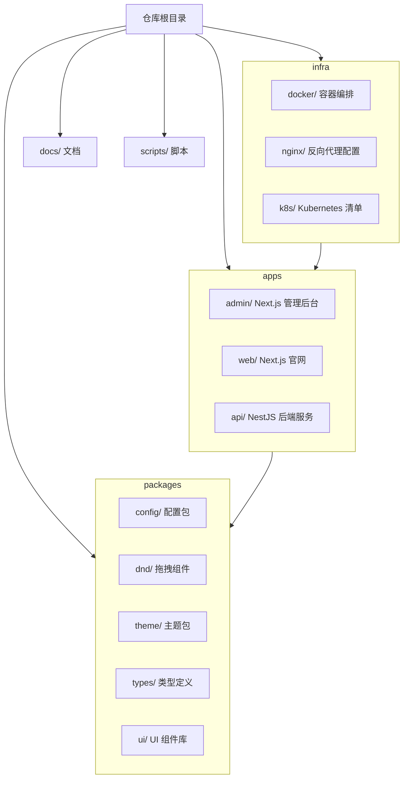
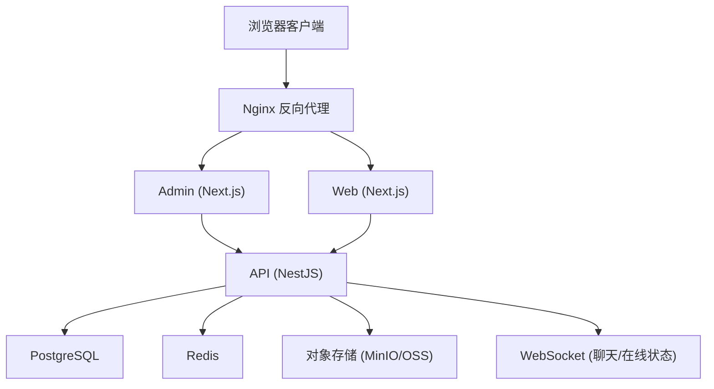
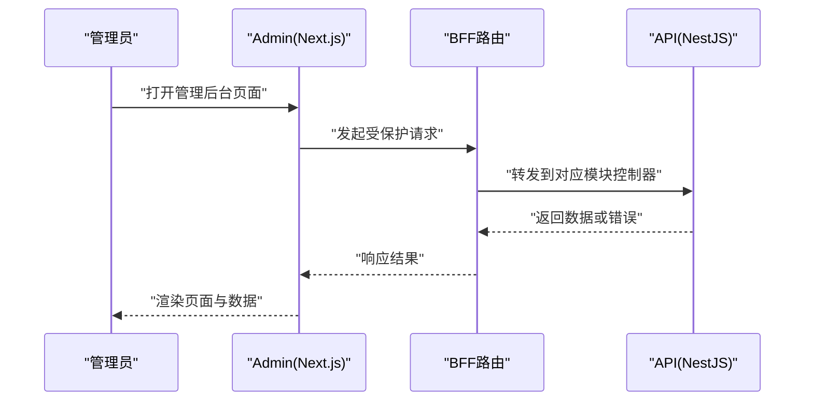
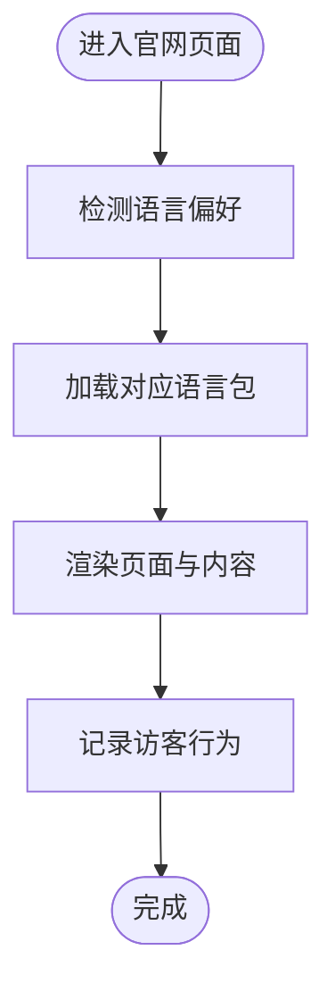
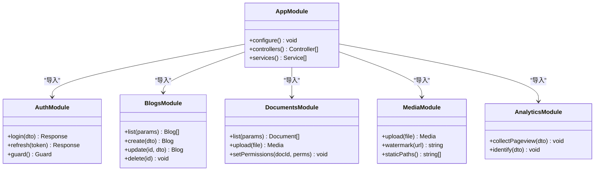
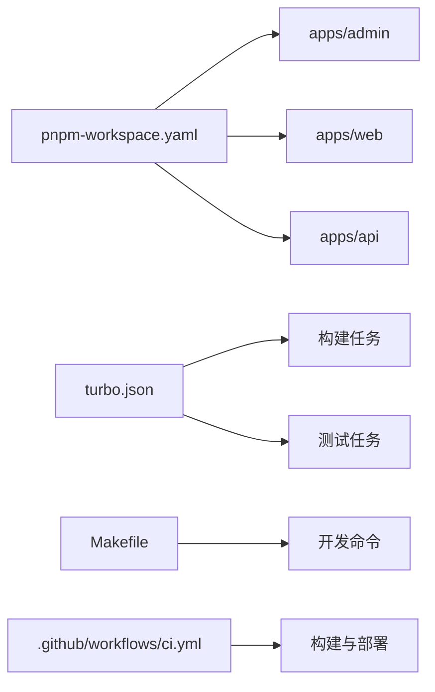

# 项目概览

<cite>
**本文引用的文件**   
- [package.json](file://package.json)
- [pnpm-workspace.yaml](file://pnpm-workspace.yaml)
- [turbo.json](file://turbo.json)
- [tsconfig.base.json](file://tsconfig.base.json)
- [apps/admin/package.json](file://apps/admin/package.json)
- [apps/admin/next.config.ts](file://apps/admin/next.config.ts)
- [apps/web/package.json](file://apps/web/package.json)
- [apps/web/next.config.ts](file://apps/web/next.config.ts)
- [apps/api/package.json](file://apps/api/package.json)
- [apps/api/nest-cli.json](file://apps/api/nest-cli.json)
- [apps/api/src/main.ts](file://apps/api/src/main.ts)
- [apps/api/src/app.module.ts](file://apps/api/src/app.module.ts)
- [apps/api/prisma/schema.prisma](file://apps/api/prisma/schema.prisma)
- [infra/docker/docker-compose.dev.yml](file://infra/docker/docker-compose.dev.yml)
- [infra/docker/nginx/tzj.conf](file://infra/docker/nginx/tzj.conf)
- [.github/workflows/ci.yml](file://.github/workflows/ci.yml)
- [.github/workflows/deploy.yml](file://.github/workflows/deploy.yml)
- [Makefile](file://Makefile)
</cite>

## 目录
1. [简介](#简介)
2. [项目结构](#项目结构)
3. [核心组件](#核心组件)
4. [架构总览](#架构总览)
5. [详细组件分析](#详细组件分析)
6. [依赖关系分析](#依赖关系分析)
7. [性能考量](#性能考量)
8. [故障排查指南](#故障排查指南)
9. [结论](#结论)
10. [附录](#附录)

## 简介
本文件为 TZJ 网站重构项目的全面概览，面向初学者与有经验的开发者。项目采用前后端分离的架构模式：Next.js 构建 admin 管理后台与 web 官网前端，NestJS 提供统一的 API 后端服务；通过 Monorepo（pnpm workspaces + Turborepo）统一管理多应用与共享包。文档涵盖整体架构、技术栈选择、Monorepo 设计、核心业务职责划分、开发环境搭建、依赖管理与构建流程、多语言支持与国际化配置、以及部署策略，并辅以架构图与流程图帮助理解。

## 项目结构
仓库采用 Monorepo 组织方式，根目录包含工作区配置、脚本与工具链，apps 下分别放置 admin、web、api 三个应用，packages 存放共享代码，infra 提供容器化与基础设施编排，docs 存放设计与决策文档，scripts 提供通用脚本。

**图表来源** 
- [pnpm-workspace.yaml](file://pnpm-workspace.yaml)
- [turbo.json](file://turbo.json)
- [apps/admin/package.json](file://apps/admin/package.json)
- [apps/web/package.json](file://apps/web/package.json)
- [apps/api/package.json](file://apps/api/package.json)

**章节来源**
- [pnpm-workspace.yaml](file://pnpm-workspace.yaml)
- [turbo.json](file://turbo.json)
- [package.json](file://package.json)

## 核心组件
- 管理后台（admin）：基于 Next.js App Router，提供内容管理、用户与权限、媒体资源、访客与线索、聊天、审计日志、系统设置等能力。通过 BFF 路由与 API 后端交互，支持登录鉴权与角色权限控制。
- 官网（web）：基于 Next.js App Router，支持多语言（en、zh-CN、zh-TW），提供产品、解决方案、案例、新闻、资源中心、搜索、联系与社交渠道等功能，集成访客追踪与 SEO 优化。
- 后端（api）：基于 NestJS 模块化架构，提供认证授权、内容 CRUD、媒体存储、安全与访问控制、分析采集、通知、系统集成、聊天与会话、站点设置等接口；使用 Prisma 进行数据建模与迁移。

**章节来源**
- [apps/admin/package.json](file://apps/admin/package.json)
- [apps/web/package.json](file://apps/web/package.json)
- [apps/api/package.json](file://apps/api/package.json)
- [apps/api/src/app.module.ts](file://apps/api/src/app.module.ts)
- [apps/api/prisma/schema.prisma](file://apps/api/prisma/schema.prisma)

## 架构总览
前后端分离，API 作为统一服务边界，admin 与 web 通过 HTTP/WebSocket 调用 API。Nginx 作为反向代理与静态资源入口，Docker Compose 编排数据库、缓存、对象存储等依赖。CI/CD 流水线负责构建与部署。

**图表来源** 
- [infra/docker/nginx/tzj.conf](file://infra/docker/nginx/tzj.conf)
- [apps/api/src/main.ts](file://apps/api/src/main.ts)
- [apps/api/src/app.module.ts](file://apps/api/src/app.module.ts)
- [apps/admin/next.config.ts](file://apps/admin/next.config.ts)
- [apps/web/next.config.ts](file://apps/web/next.config.ts)

**章节来源**
- [infra/docker/docker-compose.dev.yml](file://infra/docker/docker-compose.dev.yml)
- [apps/api/src/main.ts](file://apps/api/src/main.ts)
- [apps/api/src/app.module.ts](file://apps/api/src/app.module.ts)

## 详细组件分析

### 管理后台（admin）
- 技术栈：Next.js App Router、TypeScript、React、Tailwind 与自定义 UI 组件。
- 关键特性：
  - 路由与页面：按功能域组织（dashboard、blog、cases、documents、users、settings 等）。
  - 鉴权与权限：JWT 登录、角色与权限装饰器、BFF 中间路由。
  - 数据交互：集中式 API Client、重试与令牌刷新、查询缓存。
  - 编辑器与媒体：Markdown 编辑器、媒体选择与预览、水印与缩略图。
  - 分析与审计：访问统计、设备信息、操作审计日志。
  - 聊天与会话：实时消息、在线状态、访客转线索。

**图表来源** 
- [apps/admin/src/app/api/bff/[...path]/route.ts](file://apps/admin/src/app/api/bff/[...path]/route.ts)
- [apps/admin/src/lib/apiClient.ts](file://apps/admin/src/lib/apiClient.ts)
- [apps/admin/src/features/access.ts](file://apps/admin/src/features/access.ts)

**章节来源**
- [apps/admin/package.json](file://apps/admin/package.json)
- [apps/admin/next.config.ts](file://apps/admin/next.config.ts)
- [apps/admin/src/app/(dashboard)/layout.tsx](file://apps/admin/src/app/(dashboard)/layout.tsx)
- [apps/admin/src/lib/auth.ts](file://apps/admin/src/lib/auth.ts)
- [apps/admin/src/lib/fetch-retry.ts](file://apps/admin/src/lib/fetch-retry.ts)
- [apps/admin/src/lib/tokenRefresh.ts](file://apps/admin/src/lib/tokenRefresh.ts)

### 官网（web）
- 技术栈：Next.js App Router、多语言 i18n、SEO 优化、媒体懒加载、搜索与内容列表。
- 关键特性：
  - 多语言：按 locale 路由（[locale]）、语言切换组件、消息文件（en、zh-CN、zh-TW）。
  - 内容与导航：产品目录、解决方案、案例、新闻、资源中心、搜索建议与分析。
  - 媒体与性能：图片/视频懒加载、OSS 图像 loader、Lighthouse 优化。
  - 访客追踪：埋点与事件上报、社交渠道展示与二维码卡片。

**图表来源** 
- [apps/web/src/app/[locale]/layout.tsx](file://apps/web/src/app/[locale]/layout.tsx)
- [apps/web/src/i18n/navigation.ts](file://apps/web/src/i18n/navigation.ts)
- [apps/web/src/messages/en.json](file://apps/web/src/messages/en.json)
- [apps/web/src/messages/zh-CN.json](file://apps/web/src/messages/zh-CN.json)
- [apps/web/src/messages/zh-TW.json](file://apps/web/src/messages/zh-TW.json)

**章节来源**
- [apps/web/package.json](file://apps/web/package.json)
- [apps/web/next.config.ts](file://apps/web/next.config.ts)
- [apps/web/src/app/[locale]/page.tsx](file://apps/web/src/app/[locale]/page.tsx)
- [apps/web/src/lib/analytics.ts](file://apps/web/src/lib/analytics.ts)
- [apps/web/src/components/search/SearchBar.tsx](file://apps/web/src/components/search/SearchBar.tsx)

### 后端（api）
- 技术栈：NestJS、Prisma、TypeScript、JWT 鉴权、WebSocket、Redis、对象存储。
- 关键模块：
  - 认证与授权：JWT Strategy、角色守卫、权限装饰器。
  - 内容管理：博客、案例、新闻、页面、文档与标签、文件夹与权限。
  - 媒体与存储：上传、水印、路径映射、静态路径白名单。
  - 安全与访问控制：IP 封禁、请求 ID、异常过滤、审计拦截器。
  - 分析采集：页面浏览、设备信息、地理位置、流量来源。
  - 通知与集成：邮件模板、阿里云验证码与邮件、集成注册表与测试。
  - 聊天与支持：房间、消息、在线状态、会话生命周期。
  - 系统与设置：站点设置、默认值与 Schema、健康检查。

**图表来源** 
- [apps/api/src/app.module.ts](file://apps/api/src/app.module.ts)
- [apps/api/src/auth/auth.module.ts](file://apps/api/src/auth/auth.module.ts)
- [apps/api/src/blogs/blogs.module.ts](file://apps/api/src/blogs/blogs.module.ts)
- [apps/api/src/documents/documents.module.ts](file://apps/api/src/documents/documents.module.ts)
- [apps/api/src/media/media.module.ts](file://apps/api/src/media/media.module.ts)
- [apps/api/src/analytics/analytics.module.ts](file://apps/api/src/analytics/analytics.module.ts)

**章节来源**
- [apps/api/package.json](file://apps/api/package.json)
- [apps/api/nest-cli.json](file://apps/api/nest-cli.json)
- [apps/api/src/main.ts](file://apps/api/src/main.ts)
- [apps/api/src/app.module.ts](file://apps/api/src/app.module.ts)
- [apps/api/prisma/schema.prisma](file://apps/api/prisma/schema.prisma)

## 依赖关系分析
- 工作区与包管理：pnpm workspaces 管理多应用与共享包，Turborepo 协调任务执行与缓存。
- TypeScript 配置：根级 tsconfig.base.json 提供基础编译选项，各应用继承扩展。
- 构建与脚本：Makefile 封装常用命令，scripts/dev.mjs 启动本地开发环境。
- CI/CD：GitHub Actions 定义构建、测试与部署流程。

**图表来源** 
- [pnpm-workspace.yaml](file://pnpm-workspace.yaml)
- [turbo.json](file://turbo.json)
- [Makefile](file://Makefile)
- [.github/workflows/ci.yml](file://.github/workflows/ci.yml)

**章节来源**
- [pnpm-workspace.yaml](file://pnpm-workspace.yaml)
- [turbo.json](file://turbo.json)
- [tsconfig.base.json](file://tsconfig.base.json)
- [Makefile](file://Makefile)
- [.github/workflows/ci.yml](file://.github/workflows/ci.yml)

## 性能考量
- 前端性能：
  - Next.js 服务端渲染与静态生成结合，按需加载与代码分割。
  - 媒体懒加载与 OSS 图像 loader，减少首屏体积。
  - Lighthouse 指标监控与优化建议。
- 后端性能：
  - NestJS 模块化与依赖注入提升可维护性与可扩展性。
  - Redis 缓存热点数据，降低数据库压力。
  - WebSocket 用于聊天与在线状态，避免轮询开销。
- 网络与代理：
  - Nginx 反向代理与静态资源缓存，提高响应速度。
  - 压缩与 Gzip/Brotli 启用（由 Nginx 配置决定）。
- 构建与缓存：
  - Turborepo 增量构建与远程缓存，缩短 CI 时间。
  - pnpm 严格依赖树与符号链接，减少磁盘占用与安装时间。

[本节为通用指导，不直接分析具体文件]

## 故障排查指南
- 常见问题定位：
  - 登录失败与权限问题：检查 JWT 策略、角色守卫与权限装饰器配置。
  - 媒体上传失败：确认对象存储配置、CORS 与水印服务可用性。
  - 聊天连接中断：验证 WebSocket 网关与在线状态存储（Redis）。
  - 多语言缺失：检查 messages 文件与语言路由配置。
- 调试与日志：
  - 请求 ID 中间件用于链路追踪。
  - 异常过滤器统一错误格式，便于前端处理。
  - 审计拦截器记录关键操作，辅助问题回溯。
- 环境与依赖：
  - Docker Compose 启动依赖服务（PostgreSQL、Redis、MinIO/OSS）。
  - 环境变量校验与默认值，确保服务正确初始化。

**章节来源**
- [apps/api/src/common/middleware/request-id.middleware.ts](file://apps/api/src/common/middleware/request-id.middleware.ts)
- [apps/api/src/common/filters/http-exception.filter.ts](file://apps/api/src/common/filters/http-exception.filter.ts)
- [apps/api/src/common/interceptors/audit.interceptor.ts](file://apps/api/src/common/interceptors/audit.interceptor.ts)
- [apps/api/src/config/env.validation.ts](file://apps/api/src/config/env.validation.ts)
- [infra/docker/docker-compose.dev.yml](file://infra/docker/docker-compose.dev.yml)

## 结论
本项目以 Monorepo 为基础，将管理后台、官网与 API 清晰分层，借助 Next.js 与 NestJS 的优势实现高效开发与稳定运行。通过完善的鉴权、媒体管理、分析采集、聊天与安全能力，满足企业级网站的多场景需求。配合 Docker 与 CI/CD，实现从开发到部署的全链路自动化。建议在后续迭代中持续优化性能指标与可观测性，完善单元测试与集成测试覆盖率，提升系统的健壮性与可维护性。

[本节为总结性内容，不直接分析具体文件]

## 附录
- 开发环境搭建：
  - 安装 pnpm 与 Node.js 版本要求（参考 package.json 引擎约束）。
  - 使用 Makefile 或 pnpm 脚本启动本地开发环境。
  - 通过 Docker Compose 启动数据库、缓存与对象存储。
- 依赖管理：
  - 使用 pnpm workspaces 管理跨包依赖，避免重复安装。
  - Turborepo 协调构建与测试任务，利用缓存加速。
- 构建流程：
  - 前端：Next.js 构建产物输出至 dist 或 .next。
  - 后端：NestJS 编译为 JavaScript 并打包。
  - 镜像构建：Dockerfile 定义运行时环境与依赖。
- 多语言支持：
  - 官网按 [locale] 路由组织页面，messages 文件提供翻译。
  - 管理后台通过 vditor-i18n-zh-cn 等本地化资源支持中文编辑体验。
- 部署策略：
  - GitHub Actions 执行 CI/CD 流水线，构建与推送镜像。
  - Nginx 反向代理分发流量，HTTPS 证书由 ACME 自动签发。
  - 生产环境可通过 K8s 或传统服务器部署，依据 infra/k8s 与 docker-compose.prod.yml。

**章节来源**
- [package.json](file://package.json)
- [Makefile](file://Makefile)
- [apps/admin/Dockerfile](file://apps/admin/Dockerfile)
- [apps/web/Dockerfile](file://apps/web/Dockerfile)
- [apps/api/Dockerfile](file://apps/api/Dockerfile)
- [.github/workflows/deploy.yml](file://.github/workflows/deploy.yml)
- [infra/docker/docker-compose.prod.yml](file://infra/docker/docker-compose.prod.yml)
- [apps/web/src/i18n/routing.ts](file://apps/web/src/i18n/routing.ts)
- [apps/admin/src/lib/vditor-i18n-zh-cn.ts](file://apps/admin/src/lib/vditor-i18n-zh-cn.ts)