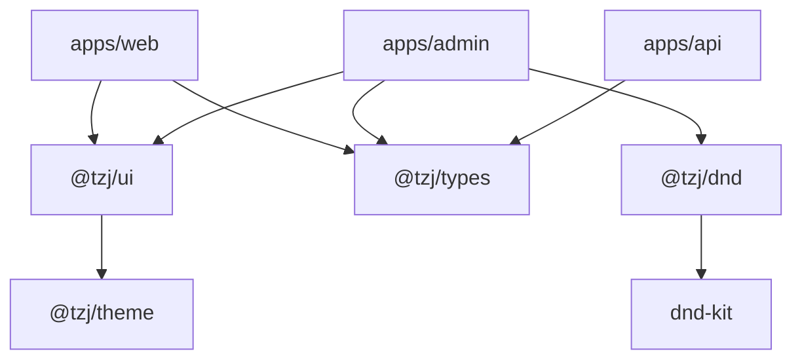
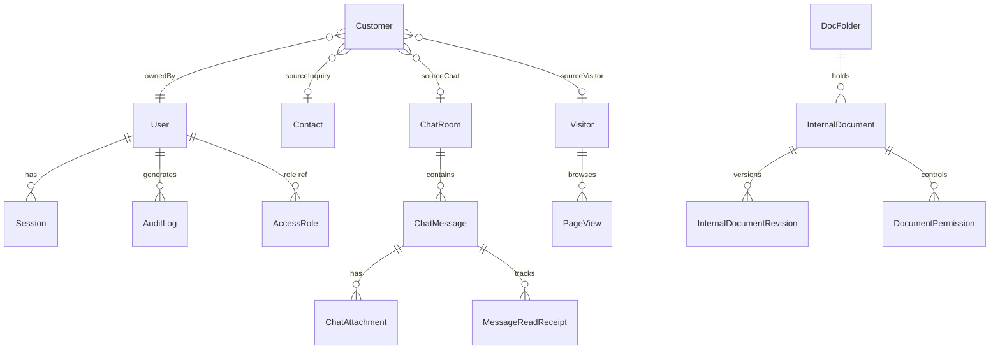

# TZJ Monorepo 系统性架构分析

> 基于代码仓库实际配置与源码的全栈架构分析文档。
> 生成时间：2026-07-27 | 技术术语保留英文原形。

---

## 1. 项目概述

**业务背景**：TZJ（拓之迹）是一家应急救援训练装备制造商，产品涵盖固定训练塔、模块化塔、燃烧室、配件等品类，面向消防、武警、军队、景区、学校等客群。

**产品组成**：

| 应用 | 定位 | 端口 |
|------|------|------|
| apps/web | C 端多语言官网（zh-CN / zh-TW / en） | 3001 |
| apps/admin | B 端管理后台（内容/客户/客服/分析） | 3002 |
| apps/api | REST API + WebSocket 服务 | 4000 |

**设计理念**：小而美团队（后台用户 ≤ 100），以「防止过度设计、保持简洁实用」为第一约束。单体 API + 单 ECS 部署，不引入微服务/K8s 等重量级方案。

---

## 2. 整体架构图

```
┌──────────────────────────────────────────────────────────────────┐
│                         浏览器 / 客户端                            │
└──────────┬───────────────────────────────────┬───────────────────┘
           │ HTTPS                              │ HTTPS
┌──────────▼──────────┐          ┌─────────────▼─────────────┐
│   apps/web          │          │   apps/admin               │
│   Next.js 16        │          │   Next.js 16               │
│   SSR/ISR + i18n    │          │   CSR + BFF Proxy          │
│   React 19          │          │   React 19 + React Query   │
└──────────┬──────────┘          └─────────────┬─────────────┘
           │ REST (SSR fetch)                   │ REST (BFF /api/*)
           └──────────────────┬─────────────────┘
                              │
┌─────────────────────────────▼─────────────────────────────────────┐
│                        apps/api (NestJS 11)                        │
│  JWT RS256 · RBAC · Throttle · IP Guard · Socket.IO (Chat)        │
├───────────────────┬───────────────────┬───────────────────────────┤
│   Prisma ORM 7    │   @aws-sdk/s3     │   Socket.IO Server        │
└────────┬──────────┘────────┬──────────┘───────────────────────────┘
         │                   │
┌────────▼────────┐  ┌──────▼──────────┐
│  PostgreSQL 16  │  │ MinIO / 阿里 OSS │
│  + pg_trgm      │  │ (S3 协议)        │
└─────────────────┘  └─────────────────┘
```

**层次划分**：

| 层 | 组成 |
|----|------|
| 展示层 | apps/web, apps/admin |
| 应用层 | apps/api（REST + WebSocket） |
| 共享包层 | @tzj/ui, @tzj/types, @tzj/config, @tzj/theme, @tzj/dnd |
| 基础设施层 | Docker Compose, Nginx, ACME, CI/CD |

---

## 3. 技术栈总表

| 分类 | 技术 | 版本 | 用途 |
|------|------|------|------|
| 语言 | TypeScript | 6.x | 全栈统一语言，strict mode |
| 前端框架 | Next.js (App Router) | 16.x | SSR/ISR + RSC |
| UI 库 | React | 19.x | 组件渲染 |
| 组件系统 | Radix UI + Shadcn/ui | latest | 无障碍原子组件 |
| 样式 | Tailwind CSS | 4.x | 原子化 CSS |
| 后端框架 | NestJS | 11.x | 模块化 IoC |
| ORM | Prisma | 7.x | 类型安全数据访问 |
| 数据库 | PostgreSQL | 16.x | 主数据存储 |
| 全文搜索 | pg_trgm + GIN | — | 模糊/相似度搜索 |
| 实时通信 | Socket.IO | 4.8 | 客服聊天 |
| 对象存储 | MinIO / 阿里云 OSS | S3 协议 | 媒体文件 |
| 构建编排 | Turborepo | 2.x | 并行构建 + 远程缓存 |
| 包管理 | pnpm workspace | 11.x | Monorepo 依赖 |
| 代码质量 | Biome | 2.x | Lint + Format 统一 |
| 容器化 | Docker (Alpine) | node:22 | 生产镜像 |
| 网关 | Nginx | latest | 反向代理 + TLS |
| CI/CD | 云效 Flow + GitHub Actions | — | 双路径部署 |

---

## 4. Monorepo 工程结构

### 4.1 目录总览

```
tzj-website-reconstruction/
├── apps/
│   ├── api/          — NestJS REST API + WebSocket 服务
│   ├── admin/        — Next.js 管理后台
│   └── web/          — Next.js 多语言官网
├── packages/
│   ├── ui/           — Shadcn/Radix 共享组件库
│   ├── types/        — 业务实体 TypeScript 类型定义
│   ├── config/       — Zod 环境模式 + TSConfig 基础配置
│   ├── theme/        — 设计令牌（Design Tokens）
│   └── dnd/          — 基于 dnd-kit 的可排序树组件
├── infra/
│   ├── docker/       — Compose 编排、Nginx、部署脚本
│   ├── k8s/          — Kubernetes 清单（备用）
│   └── yunxiao/      — 云效 Flow 流水线配置
├── docs/             — API/品牌/设计/ADR/排障文档
├── scripts/          — Monorepo 级开发脚本
└── 根配置文件         — package.json, turbo.json, pnpm-workspace.yaml, biome.json...
```

### 4.2 包依赖关系



**依赖方向约束**：`apps/*` → `packages/*` 单向依赖；`apps/` 之间禁止直接依赖；`packages/types` 无运行时依赖。

### 4.3 pnpm catalog 集中版本管理

`pnpm-workspace.yaml` 的 `catalog` 段统一声明 web/admin 共享依赖版本，应用以 `"catalog:"` 引用：

```yaml
catalog:
  next: ^16.2.9
  react: ^19.2.7
  tailwindcss: ^4.3.1
  zod: ^4.4.3
  "@tanstack/react-query": ^5.101.2
  # ...
```

### 4.4 Turborepo 任务编排

| 任务 | dependsOn | cache | 说明 |
|------|-----------|-------|------|
| build | ^build | outputs: .next, dist | 拓扑构建 |
| dev | — | false, persistent | 并行 dev server |
| typecheck | ^build | inputs: src/** | 类型检查 |
| test | ^build | outputs: coverage | 单元测试 |
| lint | — | false | Biome 检查 |

---

## 5. 应用详解

### 5.1 apps/api — NestJS 后端

**模块分组（34 模块）**：

| 分组 | 模块 |
|------|------|
| 认证与权限 | auth, access, users |
| 内容管理 | blogs, cases, news, trade-shows, pages, categories, products, solutions, publishing |
| 客户与线索 | customers, contact |
| 在线客服 | support（ChatRoom, ChatGateway, ChatPresence, ChatAuth, ChatNotification） |
| 分析与安全 | analytics, security, audit |
| 媒体与存储 | media, storage |
| 文档中心 | documents |
| 系统基础 | config, prisma, health, system, settings, site-settings, integrations, notifications, schedule, cleanup |
| 辅助 | common, types, preview, seed |

**核心中间件/守卫**：
- `JwtAuthGuard` — RS256 签名验证
- `RolesGuard` + `@RequirePermissions()` — RBAC 权限控制
- `ThrottlerGuard` — 请求限流
- `IpBanGuard` — IP 封禁（HTTP + WebSocket 双通道）
- `helmet` + `compression` + `cookie-parser` — 安全头 / 压缩 / Cookie

**实时聊天架构**：单实例内存模式（≤100 用户），ChatPresenceStore 维护在线状态，Socket.IO 事件驱动消息收发、已读回执、坐席分配。

### 5.2 apps/admin — 管理后台

**路由结构**：`app/(dashboard)/` 分组路由，包含：
- 仪表盘、内容资源（博客/案例/新闻/展会）、客户管理、客服聊天控制台
- 文档中心、访客分析、用户/角色/安全、站点设置、系统集成

**Features 域划分**：
```
features/
├── chat/           — Socket.IO 客服面板
├── contacts/       — 询盘管理
├── resources/      — 博客/案例/新闻/展会 CRUD
├── analytics/      — 流量与访客分析
├── documents/      — 文档管理 hooks
├── hooks/          — 通用 useList/useRemove
└── system-status/  — 系统状态监控
```

**数据层**：`@tanstack/react-query` 管理服务端状态；`apiClient` 统一封装 fetch + token 刷新；BFF 代理 (`app/api/*`) 转发请求到后端 API。

### 5.3 apps/web — 多语言官网

**路由结构**：`app/[locale]/` 动态前缀支持 zh-CN / zh-TW / en 三语。

**核心特性**：
- SSR/ISR 内容渲染（案例/新闻/博客/展会）
- 产品目录路由（固定塔/模块化塔/燃烧室/配件/塔楼）
- 全站搜索（Route Handler + 多源聚合）
- 访客聊天面板（Socket.IO 客户端）
- SEO 优化（JSON-LD、sitemap、robots）
- next-intl 国际化 + next-view-transitions 页面过渡

---

## 6. 数据模型概览

### 6.1 模型分组（31 个 Prisma Model）

| 域 | 模型 |
|----|------|
| 内容 | Case, News, Blog, TradeShow, Page |
| 用户与认证 | User, Session, TwoFactorRecoveryCode, AccessRole |
| CRM | Customer, Contact |
| 在线客服 | ChatRoom, ChatMessage, ChatAttachment, ChatPendingUpload, MessageReadReceipt, Ticket, Comment |
| 访客分析 | Visitor, PageView, BlockedIp |
| 媒体 | MediaAsset |
| 文档 | DocFolder, InternalDocument, InternalDocumentRevision, DocumentPermission, DocTag |
| 系统 | AuditLog, Setting, Integration, NotificationLog |

### 6.2 核心关系简图



### 6.3 关键索引策略

- **pg_trgm GIN**：`ChatMessage.content` 上的三元组索引，加速 ILIKE 子串搜索与 `similarity()` 排序
- **复合索引**：`ChatRoom(status, lastActivity)` 游标分页；`PageView(path, createdAt)` 时间序列查询
- **软删除过滤**：`deletedAt` 独立索引，列表查询统一 `WHERE deletedAt IS NULL`

---

## 7. 数据流与通信

### 7.1 HTTP 请求流

```
[C 端浏览器]
    │ SSR fetch (Server Component)
    ▼
[apps/web Next.js Server]
    │ fetch('API_URL/api/v1/...')
    ▼
[apps/api NestJS]
    │ Prisma query
    ▼
[PostgreSQL]

[B 端浏览器]
    │ CSR fetch
    ▼
[apps/admin BFF: /api/*]
    │ proxy → API_URL
    ▼
[apps/api NestJS]
```

- 统一响应格式：`{ code, message, data, pagination? }`
- 全局前缀：`/api/v1`
- Swagger 文档：`/api/docs`

### 7.2 WebSocket 实时流（客服聊天）

```
[访客浏览器] ←→ Socket.IO ←→ [apps/api ChatGateway]
[坐席浏览器] ←→ Socket.IO ←→     ↕ ChatPresenceStore (内存 Map)
                                   ↕ ChatRoomService → Prisma → DB
```

关键事件：`send-message`、`mark-read`、`join-room`、`leave-room`、`typing`、`register-agent`

### 7.3 认证流

1. 登录 → API 返回 `accessToken`(15min) + `refreshToken`(7d, httpOnly cookie)
2. 请求 → JWT RS256 验证签名 + 过期
3. 过期 → 前端自动 refresh，后端轮换 token 并设宽限期（防并发竞态误判盗用）
4. 2FA 用户 → Session 需 `twoFactorVerifiedAt` 才允许 refresh

### 7.4 访客分析转化链路

```
PageView(anonymousId=_tzj_vid) → Visitor(匿名画像)
    ↓ 提交询盘 / 聊天转客户
Contact / ChatRoom → Customer(visitorId 锚定)
    ↓ B 端「访客中心」反查
Visitor ← Customer.visitorId
```

---

## 8. 对象存储与媒体管理

### 8.1 双环境架构

| 环境 | 服务 | 端点 |
|------|------|------|
| 本地开发 | MinIO | localhost:9000 (API), localhost:9001 (Console) |
| 生产 | 阿里云 OSS | oss-cn-*.aliyuncs.com (S3 兼容) |

统一 SDK：`@aws-sdk/client-s3`，零代码切换。

### 8.2 Bucket 目录结构

```
tzj-uploads-dev/
├── products/           — 品牌产品图
├── images/{YYYYMM}/    — 自有内容素材
├── statics/            — Logo、UI 图标
├── videos/             — Hero 背景、产品演示
├── uploads/            — 用户上传
└── chat/{YYYYMM}/{roomId}/ — 聊天附件
```

### 8.3 上传链路

1. 客户端请求 `POST /api/v1/chat-rooms/:roomId/attachments/presign`
2. API 创建 `ChatPendingUpload` 记录，返回 presigned PUT URL
3. 客户端直传 S3
4. 发送消息时，API 将 pending 转为正式 `ChatAttachment`
5. 定时任务回收过期未发送的 pending 文件

---

## 9. 部署架构

### 9.1 生产拓扑

```
┌─────────────────────── 阿里云 ECS ───────────────────────┐
│                                                           │
│  ┌─────────┐    ┌──────────┐  ┌───────┐  ┌───────────┐  │
│  │  Nginx  │───▶│ tzj-web  │  │tzj-api│  │ tzj-admin │  │
│  │ Gateway │───▶│ :3000    │  │ :4000 │  │ :3000     │  │
│  │ :80/443 │───▶│          │  │       │  │           │  │
│  └─────────┘    └──────────┘  └───┬───┘  └───────────┘  │
│       │                           │                       │
│  ┌────▼────┐               ┌─────▼──────┐                │
│  │  ACME   │               │ PostgreSQL │                │
│  │ Let's   │               │   :5432    │                │
│  │ Encrypt │               └────────────┘                │
│  └─────────┘                                             │
└───────────────────────────────────────────────────────────┘
         │
    ┌────▼──────────┐
    │ 阿里云 OSS     │
    │ (媒体存储)     │
    └───────────────┘
```

### 9.2 多阶段 Docker 构建

| 应用 | 策略 | 镜像体积优化 |
|------|------|-------------|
| API | `pnpm deploy --prod` 打包 + Prisma engine 复制 | 仅生产依赖 |
| Web | Next.js Standalone 输出 | 自动 tree-shake |
| Admin | Next.js Standalone 输出 | 自动 tree-shake |

共同特征：`node:22-alpine` 基础镜像、非 root 用户运行、HEALTHCHECK 探针。

### 9.3 滚动部署流程

```
deploy.sh <service> <tag>
    │
    ├── 1. 持久化 IMAGE_TAG 到 .env.prod.local
    ├── 2. docker compose pull（拉取新镜像）
    ├── 3. [API only] prisma migrate deploy
    ├── 4. docker compose up -d <service>
    ├── 5. 等待 HEALTHCHECK 通过
    ├── 6. Nginx gateway 重建 + reload
    └── 7. Smoke test（curl 验证可访问性）
```

---

## 10. CI/CD 流水线

### 10.1 双路径策略

| 路径 | 触发 | 说明 |
|------|------|------|
| 云效 Flow（主） | Codeup push | 日常发布，北京构建集群 |
| GitHub Actions（备） | workflow_dispatch | 跨境构建 + SSH 部署 / 回滚 |

### 10.2 GitHub Actions 流水线阶段

```
┌─────────┐    ┌───────────┐    ┌─────────┐    ┌──────────────┐
│  Build  │───▶│   Test    │───▶│ Docker  │───▶│   Deploy     │
│ & Lint  │    │Lighthouse │    │ & Trivy │    │  (SSH ECS)   │
└─────────┘    └───────────┘    └─────────┘    └──────────────┘
```

- **Build & Test**：pnpm install → `biome check` → `turbo typecheck` → `turbo build`
- **Lighthouse CI**：Web 应用性能评分
- **Docker & Trivy**：三应用并行构建镜像 → Trivy 扫描 CRITICAL/HIGH 漏洞 → SARIF 上传
- **Dependency Audit**：`pnpm audit --audit-level=high`
- **Deploy**：构建推送 ACR → SSH 执行 `deploy.sh all <sha>`

### 10.3 安全门禁

- Docker 镜像 Trivy 漏洞扫描（结果上传 GitHub Security）
- 依赖审计（允许失败但记录）
- 镜像签名：git SHA 作为不可变 tag

---

## 11. 安全策略

### 11.1 认证体系

- **JWT RS256**：非对称签名，access token 15 分钟有效
- **Refresh Token 轮换**：7 天有效，使用后立即废弃并签发新 token
- **宽限期机制**：轮换时设 `graceUntil`（60s），防止并发请求误判为 token 盗用
- **2FA TOTP**：可选启用，secret 以 AES-256-GCM 加密存储；Session 需验证后方可 refresh
- **恢复码**：一次一密，SHA-256(salt || code) 存储，不保留明文

### 11.2 RBAC 权限模型

- `AccessRole` 表存储角色与权限数组（如 `blogs.create`, `customers.view`）
- 控制器使用 `@RequirePermissions('resource.action')` 声明式守卫
- 前端 `<Can permission="...">` 组件条件渲染

### 11.3 IP 封禁

- `BlockedIp` 表仅存 ipHash（SHA-256），展示用 ipMasked（192.168.*.*）
- `IpBanGuard` 同时覆盖 HTTP 请求和 WebSocket 连接
- 支持临时封禁（expiresAt）

### 11.4 数据安全

- Prisma ORM 参数化查询 → 防 SQL 注入
- `class-validator` + `class-transformer` → DTO 输入校验
- `sanitize-html` → 富文本 XSS 过滤
- `helmet` → 安全响应头（CSP、X-Frame-Options 等）
- 环境变量 Zod 启动校验 → fail-fast，不启动于非法状态

### 11.5 敏感信息管理

- 第三方集成凭证（`Integration.secretsEnc`）：AES-256-GCM 加密存储
- `SECRETS_ENCRYPTION_KEY`：≥32 字符，仅存于 `.env.prod.local`（gitignore）
- 会话 refresh token：仅存 SHA-256 hash，不保留明文
- `.env.prod.local` 隔离部署密钥，不入仓库

---

## 12. 开发工作流

### 12.1 环境搭建

```bash
# 1. 启动本地基础设施（PostgreSQL + MinIO）
pnpm db:up

# 2. 安装依赖
pnpm install

# 3. 初始化数据库
pnpm --filter @tzj/api prisma:migrate
pnpm --filter @tzj/api prisma:seed

# 4. 启动全部开发服务
pnpm dev
```

### 12.2 常用命令速查

| 命令 | 说明 |
|------|------|
| `pnpm dev` | 并行启动三个 dev server |
| `pnpm build` | Turborepo 全量构建 |
| `pnpm typecheck` | 全仓类型检查 |
| `pnpm run check` | Biome lint + format 检查 |
| `pnpm db:up` / `db:down` | 启停本地 Docker 基础设施 |
| `pnpm --filter @tzj/api prisma:studio` | Prisma Studio 数据浏览器 |
| `pnpm --filter @tzj/api prisma:migrate` | 执行数据库迁移 |
| `pnpm --filter @tzj/api test` | 运行 API 单元测试 |
| `make dev` | Makefile 快捷启动 |
| `make prod-deploy` | 本地触发生产部署 |

### 12.3 端口分配

| 服务 | 端口 |
|------|------|
| apps/api (NestJS) | 4000 |
| apps/web (Next.js) | 3001 |
| apps/admin (Next.js) | 3002 |
| PostgreSQL | 5432 |
| MinIO API | 9000 |
| MinIO Console | 9001 |
| Prisma Studio | 5555 |

### 12.4 环境变量分层

```
.env                    — 全仓共享（DB URL、S3 配置等）
apps/api/.env.local     — API 私有覆盖
apps/admin/.env.local   — Admin 构建期常量
apps/web/.env.local     — Web 构建期常量
```

加载优先级（API 侧）：`.env.local` > `.env` > `../../.env`

---

## 附录：版本与引擎要求

| 约束 | 值 |
|------|-----|
| Node.js | >= 22.0.0 |
| pnpm | >= 9.0.0（锁定 11.9.0） |
| TypeScript | strict: true, ES2022 target |
| Prisma Engine | debian-openssl-3.0.x (Alpine) |
