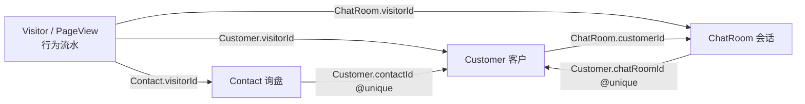

# 跨模块删除体系设计方案（询盘 / 客户 / 访客 / 在线客服）

> 状态：**已定稿（v2，按小团队标准精简）**
> 日期：2026-07-26
> 前提：小而美团队，短期内后台用户 ≤ 100 人；以「防止过度设计、保持简洁实用」为第一约束
> 范围：询盘管理（Contact）、我的客户/公海客户（Customer）、访客中心（Visitor/PageView）、在线客服（ChatRoom/ChatMessage）
> 参考：Salesforce/HubSpot 回收站、GA4/Leadfeeder 数据保留策略、GDPR「被遗忘权」/《个人信息保护法》删除权、Intercom/Zendesk 会话生命周期
>
> v2 变更摘要：砍掉 `delete-impact` 预检 API（改前端文案）、访客保留期设置与滚动清理（进 Backlog）、合规抹除产品化（降级为 runbook）、影子字段（锚点直接置空）、细粒度 purge 权限（收敛 admin-only）。总工期 5~8 天 → 4~6 天。

---

## 1. 现状盘点

| 模块 | 实体 | 删除现状 | 删除方式 | 权限 | 问题 |
|------|------|---------|---------|------|------|
| 询盘管理 | `Contact` | ✅ 有删除 | **硬删除**（`prisma.contact.delete`） | `contacts.delete` | 不可恢复；不处理关联 |
| 我的客户/公海客户 | `Customer` | ✅ 有删除 | **硬删除**（`prisma.customer.delete`） | `customers.delete` | 不可恢复；删除后访客「转化状态」静默回退 |
| 访客中心 | `Visitor` + `PageView` | ❌ 无删除 | — | — | 无任何清理手段（含合规抹除） |
| 在线客服 | `ChatRoom`（级联 `ChatMessage`/`ChatAttachment`） | ⚠️ 已有**批量软删除**（勾选模式，`deletedAt` 打标） | 软删除，物理清理未落地 | `chat.delete` | 无单会话删除入口；无恢复入口；附件对象无清理 |
| 媒体库（参照系） | `MediaAsset` | ✅ 回收站完整闭环 | 软删除 → 恢复 / 彻底删除（purge 清 OSS 对象） | `media.delete` / `media.purge` | **本仓库内的最佳实践样板** |

### 1.1 实体关联（全部为弱引用，无数据库外键）



关键事实：

- `Customer.contactId / chatRoomId / visitorId` 均为**弱引用**（无 FK 约束），删除上游不报错、只留悬空指针。
- 访客中心「转化状态」由归因计算得出（`visitorConvertedFlagSql` / `loadVisitorLeadStatuses`）：行身份键命中 `Customer.visitorId / contactId / 客户源询盘 visitorId / email` 任一即视为已转化。**删除 Customer 或 Contact 会直接改变访客中心的转化口径**。
- `ChatMessage`/`ChatAttachment` 对 `ChatRoom` 是数据库级 `onDelete: Cascade`——一旦物理删会话，聊天记录与附件行瞬间蒸发（但 S3/OSS 上的附件对象**不会**被清理，成为孤儿文件）。

### 1.2 当前硬删除引发的联动缺陷

| 操作 | 静默副作用 |
|------|-----------|
| 删除已转化的**询盘** | 客户档案「关联询盘」锚点 404；访客中心 `latestContactId`/`touchedContact` 消失；若客户仅靠 `contactId` 归因，访客转化状态回退为「未转化」 |
| 删除**客户** | 访客中心该访客回退「未转化」，操作列重新出现「转为客户线索」，可再次转化（幂等锚点已失效，会产生新客户记录）；询盘列表「已转客户」徽标消失 |
| 删除**会话**（软删） | `Customer.chatRoomId` 悬空（客户档案「来源会话」不可达）；列表过滤后消息实际仍在库中，无生命周期终点 |
| 任何删除 | 均无影响预警、无恢复通道（会话除外）、审计仅有全局拦截器的请求级记录，无被删实体快照 |

---

## 2. 业内最佳实践综述（结论保留，实现按团队规模裁剪）

1. **CRM 类（Salesforce / HubSpot）：软删除 + 回收站 + 保留期自动清理。** 删除进回收站（Salesforce 15 天 / HubSpot 90 天），期间可恢复；到期后台任务物理清理。→ **采纳主线。**
2. **行为分析类（GA4 / Mixpanel）：不提供逐行删除**，只有保留策略 + 用户级合规删除。→ 采纳"不做行级删除"的边界；保留策略与合规删除按本团队数据量级降级（见 §3.2-D）。
3. **会话类（Intercom / Zendesk）：删除 ≠ 第一动作。** 生命周期 关闭 → 归档 →（保留期后）删除。本项目已实现前两级，与此对齐。
4. **合规（GDPR Art.17 / 个保法第 47 条）**：要求的是"能删、有记录"，**不要求"有按钮"**。ToB 官网收到被遗忘权请求的实际频率极低，用文档化的人工流程满足即可。
5. **通用工程实践**：删除前让操作者知情、删除时快照入审计、悬空引用显式置空——这三条与规模无关，必须做。

---

## 3. 总体设计

### 3.1 四条原则

1. **业务实体（询盘/客户/会话）→ 软删除 + 回收站 + 30 天自动清理。** 复用媒体库已验证的 `deletedAt` + restore + purge 闭环与 UX；Cron 基础设施现成（`@nestjs/schedule` 已在 chat 附件清理等任务中使用）。三类实体的到期清理**合并为一个每日任务**顺序处理，不各写一个调度器。
2. **行为流水（Visitor/PageView）→ 不做任何删除功能。** 小公司官网的 PageView 量级 Postgres 长期无压力；合规抹除走 runbook（§3.2-D）。
3. **删除必先知情，但不建预检 API。** 删除确认弹窗用**前端已有数据 + 固定文案**说明联动后果：询盘列表已有「已转客户」徽标（转化关系数据已在前端），客户删除的后果本身就是固定文案。
4. **引用一致性显式化。** 软删阶段引用天然保留（可恢复）；**物理清理时**按「联动矩阵」（§3.3）逐边处理：置空悬空指针 + 写审计快照，绝不静默悬空。唯一例外：客户的 `contactId/chatRoomId` 受 `@unique` 约束所迫，在**软删时**即置空（原值入审计快照），见 §3.2-B。

### 3.2 分模块方案

#### A. 询盘管理（Contact）—— 硬删除改软删除

- `Contact` 增加 `deletedAt DateTime?`（+ 索引），`remove()` 改打标；列表/统计/归因查询默认排除 `deletedAt != null`。
- 回收站视图（复用媒体库回收站交互）：恢复 / 彻底删除；30 天到期由 Cron 物理清理。
- **删除确认文案（前端实现）**：行数据已含转化标记 → 已转化的询盘弹窗提示"该询盘已转化为客户，删除后客户档案中的关联询盘链接将失效，客户记录本身保留"。
- **物理清理时**：将命中的 `Customer.contactId` 置空，并在客户 `notes` 追加一行系统备注（"关联询盘已删除，原 id=xxx"），保住溯源语义。

#### B. 客户管理（Customer）—— 硬删除改软删除

- 同上：`deletedAt` + 回收站 + 30 天清理。私海客户仅 owner 与管理员可删；公海客户需 `customers.delete` 权限。
- **删除确认文案（固定文案，无需查询）**："删除后，访客中心该访客将回退为「未转化」，且可被再次转化"。这是预期行为（软删期内恢复客户即恢复转化状态），但必须让操作者知情。
- **物理清理时**：`ChatRoom.customerId` 命中者置空；访客转化归因实时计算，自然回退，无需额外处理。
- **唯一锚点处理（已拍板）**：`contactId/chatRoomId` 是 `@unique`，软删行仍占用唯一约束 → **软删时直接置空原字段**（写入删除审计快照留痕），允许原询盘/会话重新转化。恢复后锚点不回填——同一询盘极端情况下可能再转出一个新客户，小团队人工可辨，不为此建影子字段与合并流程。

#### C. 在线客服（ChatRoom）—— 补齐既有软删除的闭环

- 后端已有软删（`deletedAt`）与 `chat.delete` 权限，缺的是：
  1. **单会话删除入口**（会话详情「⋯」菜单），批量删除保留现状；
  2. **回收站桶**：会话列表增加「已删除」桶（仅 `chat.delete` 权限可见），支持恢复；
  3. **物理清理任务**：deletedAt 超 30 天 → 删 `ChatRoom`（级联消息）+ **同事务前先删 S3/OSS 附件对象**（复用 `ChatAttachment.key` 清单），并置空命中的 `Customer.chatRoomId`。
- 与既有生命周期串联：`waiting/active → closed → archived → deleted(软) → purged(物理)`；仅 closed/archived 状态允许删除（正在对话的会话已有跳过保护，保留该逻辑）。

#### D. 访客中心（Visitor/PageView）—— 不做任何产品化删除

- **不做行级删除**（业内共识，破坏统计口径）。
- **不做保留期设置与滚动清理**：数据量前提不成立，进 Backlog（§8），触发条件见该节。
- **合规抹除 → runbook**：在 `docs/security/` 编写《访客数据合规抹除操作手册》，内容包括：
  1. 按访客标识定位散落数据的 SQL（`PageView`、`Visitor`、关联 `ChatRoom` 及其消息/附件对象 key 清单、`Contact.visitorId` / `Customer.visitorId` 置空语句）；
  2. `NotificationLog` 中含该访客 PII 的询盘邮件内容一并抹除；
  3. Contact/Customer 行本身**不自动删除**（属企业业务记录，删除决策独立作出，如需删除走各自回收站流程）；
  4. 操作留痕要求：执行前后在审计日志/运维记录中登记访客标识哈希、操作者、时间（记录"删过"而非"删了什么"）。
- 收到删除请求时由管理员照手册人工执行。出现频率上升（如 > 1 次/季度）再评估产品化。

### 3.3 删除联动矩阵（物理清理阶段的引用处理）

| 被删实体 | 受影响引用 | 处理 |
|---------|-----------|------|
| Contact | `Customer.contactId` | 置空 + 客户 notes 追加系统备注 |
| Contact | 访客归因 `latestContactId/touchedContact` | 实时计算，自然消失，无需处理 |
| Customer | `ChatRoom.customerId` | 置空 |
| Customer | 访客「转化状态」 | 实时计算，自然回退（确认弹窗已告知） |
| ChatRoom | `ChatMessage/ChatAttachment` 行 | 数据库级 Cascade（现状保留） |
| ChatRoom | S3/OSS 附件对象 | 清理任务先删对象再删行 |
| ChatRoom | `Customer.chatRoomId` | 置空 |

### 3.4 权限矩阵（已拍板：不新增权限点）

| 操作 | 权限 | 说明 |
|------|------|------|
| 询盘 软删 / 恢复 | `contacts.delete` | 现有权限复用 |
| 客户 软删 / 恢复 | `customers.delete`（私海另限 owner 或 admin） | 现有权限复用 |
| 会话 软删 / 恢复 | `chat.delete` | 现有权限复用 |
| 回收站视图可见性（三者） | 各自 `*.delete` 权限 | 能软删即能看到回收站并恢复；purge 按钮仅 admin 可见 |
| 回收站「彻底删除」（三者） | **admin-only** | 小团队角色少，不新增 `*.purge` 细粒度权限；媒体库 `media.purge` 维持现状不动 |
| 访客合规抹除 | runbook 人工流程 | 不进产品，无权限点 |

### 3.5 API 设计（增量）

```
# 询盘 / 客户（新语义，路由不变）
DELETE /contact/:id                # 改为软删除
DELETE /customers/:id              # 改为软删除

# 回收站（三类实体同构）
GET    /contact?deleted=true       # 回收站列表（复用列表接口 + deleted 过滤）
POST   /contact/:id/restore
DELETE /contact/:id/purge          # 立即物理清理（含联动矩阵处理，admin-only）
（customers / chat-rooms 同构，chat-rooms 已有软删只补 restore/purge）
```

已砍掉（v2）：`GET */delete-impact`（前端文案替代）、`DELETE /analytics/visitors/:id/erase` 及 `erase-impact`（runbook 替代）、`retention.visitorDataMonths` 设置项（Backlog）。

### 3.6 数据模型变更

```prisma
model Contact {
  deletedAt DateTime?   // 软删除标记
  @@index([deletedAt])
}
model Customer {
  deletedAt DateTime?
  @@index([deletedAt])
}
// ChatRoom.deletedAt 已存在，无需变更
```

迁移：`prisma migrate dev`（开发库可重置）；生产走 `migrate deploy`，均为加列 + 加索引，无破坏性。

**工作量主体与最大风险**：所有 `contact/customer` 的列表、统计、导出、归因查询（含 `visitorConvertedFlagSql`、`loadConvertedContactIds`、仪表盘 KPI）补 `deletedAt IS NULL` 条件。两条纪律：

1. 归因链路是 raw SQL，Prisma 中间件/扩展覆盖不了——**不引入全局拦截方案**（对 raw SQL 是假安全感），全部查询点逐处人工核对；
2. 动手前先 grep 出 `contact`/`customer` 全部查询点列成清单，验收时用"软删一条已转化询盘 → 核对列表 / 看板 KPI / 访客转化状态 / 导出"整条链做回归。

### 3.7 审计

- 软删 / 恢复 / 彻底删除均经现有 `AuditInterceptor` 记录；彻底删除额外在 payload 写入**被删实体快照摘要**（id、name、关联键，不含消息正文），满足"能追责、不留敏感内容"。
- 客户软删置空唯一锚点时，原 `contactId/chatRoomId` 值写入该次删除的审计快照，保留追溯线索。

---

## 4. 各模块最终形态一览

| 模块 | 删除入口 | 语义 | 恢复 | 物理清理 |
|------|---------|------|------|---------|
| 询盘管理 | 行内删除（现有） | 软删 → 回收站 | 30 天内可恢复 | 到期 Cron / 手动 purge |
| 我的客户/公海客户 | 行内删除（现有） | 软删 → 回收站 | 同上 | 同上 |
| 在线客服 | 批量删除（现有）+ 单会话删除（新增） | 软删 →「已删除」桶 | 同上 | 到期 Cron（含附件对象） |
| 访客中心 | 无产品化入口；合规抹除走 runbook | 人工硬抹除 | 不可恢复 | 人工执行 |

---

## 5. 实施分期（v2 调整后，总计 4~6 天）

- **P0（1 小时，纯前端）**：询盘/客户删除确认弹窗补联动后果文案（询盘用行内已有转化标记判断，客户用固定文案）。
- **P1（核心，2~3 天）**：Contact/Customer 软删除 + 回收站 + 30 天清理 Cron + 存量查询补 `deletedAt` 过滤 + 联动矩阵置空逻辑（锚点直接置空版）。
- **P2（补齐，1~2 天）**：在线客服单会话删除 + 已删除桶恢复 + 物理清理任务（含 S3 附件回收）。
- **runbook（半天，文档）**：《访客数据合规抹除操作手册》（含 NotificationLog PII），落在 `docs/security/`。

---

## 6. 不做什么（明确边界，v2 扩充）

- ❌ 访客中心逐行删除访客/PageView——破坏统计口径，业内无此先例。
- ❌ 删除询盘/会话时级联删除客户（或反向）——跨实体删除决策必须由人分别做出，系统只负责置空引用与提示。
- ❌ 回收站内数据参与统计/归因/搜索——软删行为对业务视图完全隐身。
- ❌ `delete-impact` 预检 API——联动后果用前端已有数据 + 固定文案表达，不为此建接口。
- ❌ 访客数据保留期设置与滚动清理——数据量前提不成立，见 Backlog。
- ❌ 合规抹除产品化（按钮/API/双重确认）——频率≈0 的高危操作做成产品是负资产（多一个攻击面），runbook 覆盖。
- ❌ 唯一锚点影子字段与恢复合并流程——双重边缘场景，人工可辨，不值得建机制。
- ❌ 新增 `*.purge` 细粒度权限——彻底删除收敛 admin-only。
- ❌ Prisma 全局软删中间件/扩展——raw SQL 归因链路覆盖不了，逐处显式过滤更诚实。

## 7. 已拍板决策（原开放问题）

| # | 问题 | 决策 | 理由 |
|---|------|------|------|
| 1 | 客户软删时唯一锚点处理 | **直接置空**（原值入审计快照） | 影子字段服务的是"软删期内重新转化 + 又恢复旧客户"双重边缘场景，≤100 人规模一年难遇一次，人工可辨 |
| 2 | 「彻底删除」权限 | **admin-only**，不新增权限点 | 小团队角色两三种，细粒度权限是百人以上组织的需求 |
| 3 | 回收站保留期 | **固定 30 天**，不做配置 | 介于 Salesforce 15 天与 HubSpot 90 天之间，够用即可 |
| 4 | NotificationLog PII 抹除 | **并入合规 runbook** | 随人工流程处理，不进产品 |

## 8. Backlog（记录触发条件，暂不实施）

| 项 | 触发条件 |
|----|---------|
| 访客数据保留期 + 每日滚动清理 | `PageView` 表行数达到百万级，或访客分析查询出现可感知变慢；届时先做固定保留期（如 24 个月），仍不做设置 UI |
| 合规抹除产品化 | 被遗忘权请求频率 > 1 次/季度 |
| 回收站保留期可配置 | 出现真实的业务诉求（如法务要求延长留存） |
